```{r setup, include=FALSE}
knitr::opts_chunk$set(echo = FALSE)
knitr::opts_chunk$set(message = FALSE, warning = FALSE)
knitr::opts_chunk$set(fig.width = 6.5, fig.height = 3.6, out.width = "70%", fig.align = "center", dev = "cairo_pdf")
```


# Ejemplos de redes para imágenes


## Clasificación 

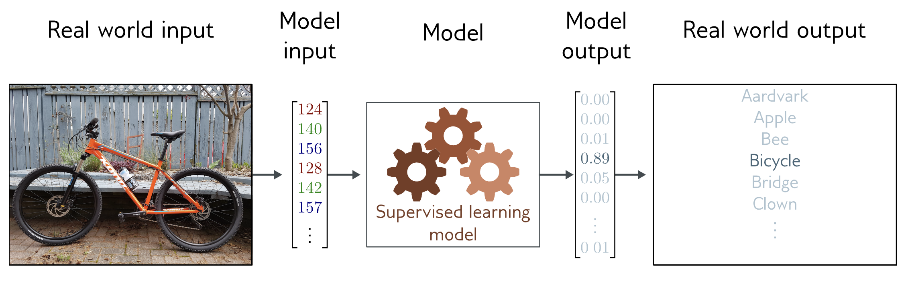{fig-align="center" width="80%"}


## Detección de Objetos 

{fig-align="center" width="80%"}


## Segmentación de Imágenes

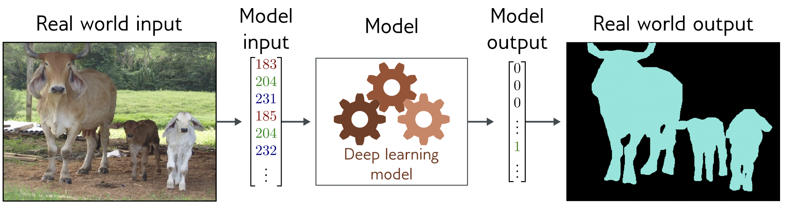{fig-align="center" width="80%"}


## Redes para imágenes 

- Vamos a tener problemas si usamos redes completamente conectadas 
- Las imágenes normalmente son RGB's de 224x224 que son 150,528 dimensiones 
- Por lo general las capas intermedias que usamos son más grandes que el input
- Una capa oculta tendria 150 mil x 150 mil pesos $\sim$ 22 billones en ingles osea 22 mil millones solo de pesos en 1 capa
- Esto no aprovecha el hecho que las imágenes tienen características particulares distintas a otros tipos de datos
    - pixeles cercanos están relacionados estadísticamente 
    - son estables a transformaciones


## Redes convolucionales 
- Las CNNs son una manera creativa en la que ML va a aprovechar la estructura natural de las imágenes: 

1. Van a procesar cada región de la imagen de manera independiente 
2. Van a compartir parámetros a lo largo de la imagen 

- ¿Por qué esto es bueno?

1. Menos parámetros 
2. Explota la relación entre pixeles 
3. No re-aprenden la interpretación de los pixeles mas de una vez


## Inspiración: ¿Dónde está Wally?

{fig-align="center" width="80%"}


## Inspiración: ¿Dónde está Wally?
- Si creamos una red que detecte a Wally 
- No le debería de importar en que parte de la imagen aparece 
- Podríamos recorrer la imagen pixel por pixel o región por región y asignar a cada pedazo la probabilidad de que ahí este Wally 
- La mayoría de las redes que manejan imágenes van a funcionar como este ejemplo

## ¿Qué tipo de redes van a cumplir esto?
1. En las primeras capas la red debe de comportarse de manera similar a las mismas regiones de la imagen, independientemente de en que parte se encuentren
2. Las primeras capas se enfocan en regiones locales y eventualmente se agregan para predecir sobre toda la imagen 
3. Las capas mas profundas deberian de capturar características de mayor alcance de la imagen, parecido a la visión a nivel superior en la naturaleza.


# Invariancia y Equivariancia

## Invariancia
- Una función $f(x)$ es invariante a una transformación $t[]$ si:
$$f(t[x]) = f(x)$$

- El resultado de la función es el mismo después de aplicar la transformación 


## ¿Por qué queremos que esto se cumpla? 
- Una foto de un perro sigue siendo un perro si la volteamos
- Si estamos reconociendo personas nos debería de dar igual si esta en la parte de arriba o en la parte de abajo de nuestra imagen 


## Invariancia
- Si queremos clasificar esto como una montaña nevada, mover la imagen unos cuantos pixeles a la derecha o izquierda no cambia nada 

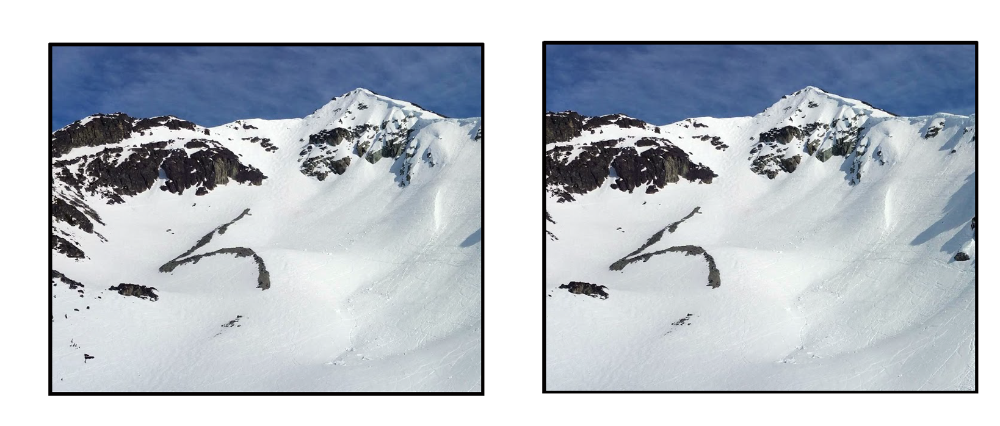{fig-align="center" width="80%"}


## Equivariancia
- Una función $f(x)$ es equivariante a una transformación $t[]$ si:
$$f(t[x]) = t[f(x)]$$

- El resultado se transforma de la misma manera que el input 


## Equivariancia
- Trasladamos la imagen original y queremos que la segmentación también se traslade 


{fig-align="center" width="80%"}


# Convoluciones 


## Representación de la red 
- Inputs imágenes de dos dimensiones X
- Representación de la capa intermedia que sigue H
- Con X y H con las mismas dimensiones 
- Podemos referirnos al pixel en $(i,j)$ como $X_{i,j}$ y $H_{i,j}$
- Y con un tensor de 4 dimensiones $W$ como pesos entonces:  

$$H_{i,j,d} = U_{i,j} +\sum_k\sum_l W_{i,j,k,l}X_{k,l}$$

## Representación de la red 
- Podemos reescribir esta representación de la siguiente manera 
$$H_{i,j} = U_{i,j} + \sum_a\sum_b V_{i,j,a,b}X_{i+a,j+b}$$

- ¿Cómo hicimos esto? reindexando de la siguiente manera
-  $k = i + a$ y $l = j + b$
- a y b van a tener valores positivos y negativos de manera que vamos a recorrer toda la imagen 


## Representación de la red 
- Para cada ubicación $(i,j)$ en la capa itermedia $H$ su valor va a ser una suma ponderada (usando V) de todos los pixeles de X centrados en $(i,j)$
- Si tenemos imágenes de milxmil (1 megapixel) entonces H es de las mismas dimensiones y vamos a necesitar $10^{12}$ parametros!!


## Invarianza a la translación
- Ya sabemos que es esto, lo vamos a escribir en términos de la red 
- Un movimiento en X debería de implicar un movimiento en H
- Solo va a pasar esto si $V$ y $U$ no dependen de la ubicación del pixel, osea de $(i,j)$

$$H_{i,j} = u + \sum_a\sum_b V_{a,b}X_{i+a,j+b}$$

- Esto es una convolución! 
- Solo nos importan los pixeles en la vecindad $(i+a,b+j)$


## Localidad 
- Dadas las propiedades de las imágenes no deberíamos de ver los pixeles tan lejos de $(i,j)$

$$H_{i,j} = u + \sum_{a = -\Delta}^{\Delta}\sum_{b = \Delta}^{\Delta} V_{a,b}X_{i+a,j+b}$$

- Normalmente $\Delta < 10$
- V es el kernel convolucional o el filtro 
- Ahora solo necesitamos $4\Delta^2$


## ¿Por qué se llama Convolución?
- En matemáticas una convolución entre dos funciones es 

$$(f*g)(x) = \int f(z)g(x-z)dz$$

- Esto mide que tanto se traslapan la función f y g, cuando una de las funciones esta volteada 
- Discretamente seria: $(f*g)(x) = \sum_a f(a)g(i-a)$


## ¿Por qué se llama Convolución?
- Para tensores de dos dimensiones:

$$(f*g)(i,j) = \sum_{a}\sum_bf(a,b)g(i-a,j-b)$$

- En muchos frameworks de DL la operación implementada es cross-correlation (no se invierte el kernel). 
- La diferencia es solo formal, pero la denominación “convolución” se mantiene por tradición.


## Canales 
- En general las imagen consisten de tres canales: rojo, verde y azul 
- Las imágenes no son bidimensionales sino tensores de 3 dimensiones con forma $1024×1024×3$
- El ultimo eje de esto le asigna una representación multidimensional a cada pixel
- Entonces $X_{i,j,k}$ y $V_{a,b,c}$
- En vez de tener una sola representación en la capa intermedia para cada ubicación espacial, vamos a tener un vector de representaciones dependiendo del número de canales


## Canales 
$$H_{i,j} = \sum_{a = -\Delta}^{\Delta}\sum_{b= -\Delta}^{\Delta} \sum_c V_{a,b,c,d}X_{i+a,j+b,c}$$

- Donde d es el indice de los canales del output


## Operación de correlación cruzada 
- Vamos a ignorar los canales por ahora 
- Si tenemos un ventana de kernel (ventana de convolución) de $2x2$
- La operación de correlación cruzada hace lo siguiente
- Lo que hacemos en DL es correlación cruzada pero lo llamamos convolución

{fig-align="center" width="60%"}


## Operación de correlación cruzada 
- Observemos que el tamaño del output depende del kernel y va a ser

$$(n_h - k_h + 1)x(n_w - k_w + 1)$$

- Por definición el output va a ser más pequeño que el input 


## Padding 
- El problema con las capas convoluciones es que vamos a perder los pixeles de los bordes 

{fig-align="center" width="60%"}


## Padding 
- Una manera sencilla de resolver esto es agregar pixeles extras en los border, para preservar el tamaño del input 

{fig-align="center" width="60%"}


## Padding 
- Si agregamos $p_h$ filas (la mitad arriba y la mitad abajo) y $p_w$ columnas (la mitad de un lado y la mitad del otro)
- Ahora tendremos un output con las siguientes dimensiones

$$(n_h - k_h + p_h + 1)x(n_w - k_w + p_w + 1)$$

- En muchos casos vamos a usar $p_h = k_h -1$ y $p_w = k_w -1$ asi el input y el output van a tener las mismas dimensiones 


## Stride 
- Cuando calculamos la convolución comenzamos en el pixel en la esquina superior derecha y luego movemos el kernel sobre toda la imagen 
- Hasta ahora hemos pensado en este paso como tamaño 1, me paro en cada pixel y uso la ventana para calcular la convolución
- Pero a veces vamos a querer mover la ventana mas de un elemento a la vez 
- Saltandonos algunos pixeles intermedios 


## Stride 
- El número de filas o columnas recorridas por la ventana se llama stride o paso 
- Esta imagen muestra un paso de 2 horizontal y de 3 vertical


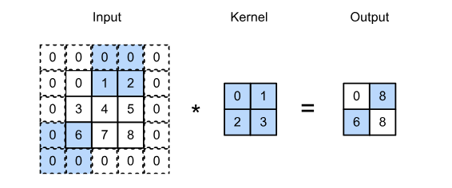{fig-align="center" width="60%"}


## Stride 
- Si definimos los strides como $s_h$ y $s_w$
- Entonces el tamaño del output va a ser
$$\lfloor{(n_h - k_h +p_h + s_h)/s_h}\rfloor x \lfloor{(n_w - k_w +p_w + s_w)/s_w}\rfloor$$

- Si definimos $p_h = k_h - 1$ y $p_w = k_w - 1$, entonces $\lfloor{(n_h +  s_h - 1)/s_h}\rfloor \times \lfloor{(n_w + s_w - 1)/s_w}\rfloor$


# Receptive Fields 


## Feature Maps y Receptive Fields 
- A veces nos vamos a referir al resultado de una capa convolucional como feature map 
- ¿Por qué? porque es una representación aprendida en las dimensiones espaciales de la capa anterior 
- Receptive Field: para un elemento x de alguna capa, el campo receptor va a ser todos los elementos de las capas anteriores que afectan el valor de x durante la propagación hacia adelante


## Receptive Field
- Input de 11 dimensiones que va a una capa intermedia con 3 canales y un kernel convolucional de tamaño 3 
- Acá el receptive field van a ser los puntos/pixeles en X que afectan la creación de estas tres neuronas 

{fig-align="center" width="50%"}


## Receptive Field
- La pre-activación de las 4 neuronas en H2 viene de una suma ponderada de los 3 canales de la capa H1
- Cada neurona en la capa H1 viene de una suma ponderada de las tres posiciones más cercanas
- Así que el receptive field son los 5 pixeles en X que afectan estas cuatro neuronas en H2


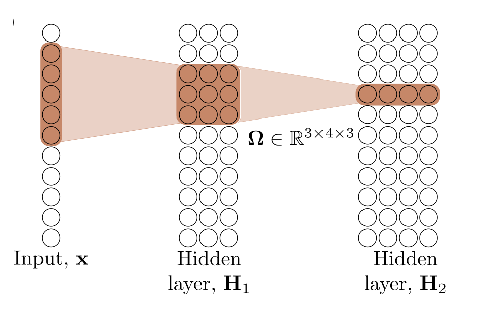{fig-align="center" width="50%"}


## Receptive Field
- Ahora el receptive field es de 7 
- La última capa oculta tiene un kernel de tamaño 3 y de paso 2 


{fig-align="center" width="50%"}


## Receptive Field
- Cuando agregamos una cuarta capa el receptive field es de todo el input 

{fig-align="center" width="50%"}


# Canales Múltiples 

## Canales múltiples: input 
- Si los datos de entrada contienen múltiples canales
- Necesitamos construir un kernel convolucional con el mismo número de canales que los datos de entrada 
- El número de canales de los inputs es $c_i$ 
- Si $c_i > 1$ necesitamos un kernel que contenga un tensor de tamaño $k_h x k_w$ para cada canal!
- Concatenando estos $c_i$ juntos nos lleva a un kernel convolucional de $c_i x k_h x k_w$
- Podemos sumar todos los canales juntos para terminar con un tensor 
- Si la entrada tiene $c_i$ canales y queremos $c_o$ canales de salida, el kernel va a tener la forma $(c_o, c_i, k_h, k_w)$
- Los parámetros totales para esa capa son $c_o*c_i*k_h*k_w$ más biases 


## Canales múltiples: input 

{fig-align="center" width="50%"}


## Canales múltiples: output 
- Normalmente vamos a querer que las capas intermedias y el output tengan mas de un canal 
- Intuitivamente podemos pensar en los canales como respondiendo a diferentes features 
- Pero los canales no van a aprender por separado sino que van a ser optimizados para ser útiles juntos 
- El número de canales del input es $c_i$ y el número de canales del output es $c_o$
- Para crear un output con muchos canales necesitamos un kernel de tamaño $c_i x k_h x k_w$ para cada canal en el output 
- Los concatenamos sobre la dimensión del canal de manera que la dimensión del kernel convolucional es $c_o x c_i x k_h x k_w$
- El resultado de cada canal de salida se calcula del kernel convolucional correspondiente a ese canal de salida y toma como entrada el input de todos los canales 


## Capas convolucionales de 1x1
- Parece que una convolución así no tiene mucho sentido 
- Pero son populares y están en muchas arquitecturas modernas 
- Una ventana de $1x1$ va a perder la habilidad de reconocer patrones entre pixeles adyacentes 
- Cada elemento del output va a ser una combinación lineal de los elementos en la misma posición a través de distintos canales 
- Podemos pensar en estas convoluciones como una capa completamente conectada aplicada a cada pixel para transformar $c_i$ canales a $c_o$ canales  
- Necesitamos $c_i x c_o$ pesos 
- Generalmente incluiremos una no linealidad después de esta capa sino solo seria una combinación lineal del input y esto no nos ayuda mucho!!


## Capas convolucionales de 1x1

{fig-align="center" width="50%"}


# Pooling 

## Pooling 
- Por lo general en los problemas de DL relacionados con imágenes queremos contestar algo como: esta imagen tiene un perro?
- Así que la última capa debería de ser sensible a todo el input 
- Las capas convolucionales consiguen esto 
- Entre más avanzamos en la red, más grande es el receptive field
- Las capas de pooling van a mitigar la sensibilidad de las capas convolucionales a la ubicación de los pixeles (localidad) y va a reducir las representaciones 


## Pooling 
- Consisten en una ventana que se mueve a través de la imagen de acuerdo a su stride y calcula una sola cantidad para cada ubicación recorrida 
- Esta capa no va a contener parámetros, son operaciones determinísticas 
- Las tipicas son sacar la media o el máximo de todos los elementos dentro de la ventana de pooling 

## Pooling 
- Average pooling: parecido a reducir la resolución de una imagen, sacamos la media de un conjunto de pixeles adyacentes para crear una imagen una mejor relación señal-ruido combinando la info de varios pixeles
- Max-pooling: en vez de la media sacamos el máximo, preservar los pixeles de manera jerárquica ayuda a reconocer objetos 


## Pooling 

{fig-align="center" width="50%"}

## Características del pooling
- Padding: igual que con una capa convolucional podemos agregar ceros
- Stride: el tamaño del paso para que la ventana de pooling se mueva 


## Pooling con más de un canal 
- La capa de pooling va a aplicar la operación de pooling a cada canal por separado 
- Así que la cantidad de canales va a ser igual a la cantidad de canales en el input 


## Upsampling 
- ¿Qué hacemos si queremos escalar hacia arriba nuestra red? 
- La manera más sencilla de aumentar la resolución es duplicar todos los canales en todas las ubicaciones 

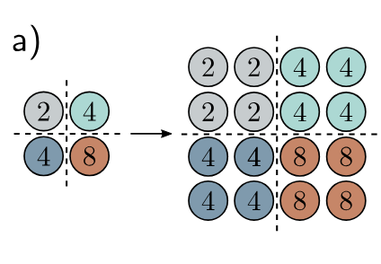{fig-align="center" width="50%"}


## Upsampling 
- Max-unpooling: lo usamos cuando ya hemos usado anteriormente max-pooling distribuimos los valores de donde se originaron 


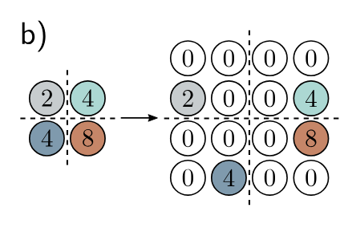{fig-align="center" width="50%"}


## Upsampling 
- Interpolacion bilineal entre los inputs que si tenemos 

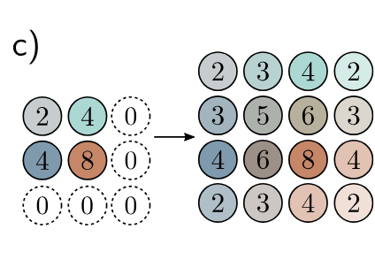{fig-align="center" width="50%"}


## Transposed Convolutions
- Vamos a tener el doble de outputs que de inputs 
- Y cada input va a contribuir a 3 outputs 

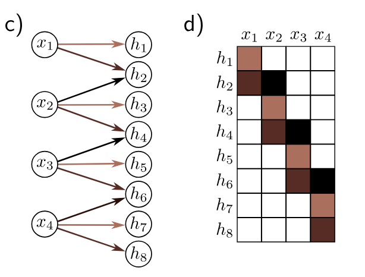{fig-align="center" width="50%"}


## Parámetros y costo computacional 

- ¿Cómo calculamos el número de parámetros en una convolución? $c_o x c_i x k_h x k_w +c_o$
- Más el bias opcional 


# Aplicaciones 

# Clasificación de imágenes 

## Clasificación de imágenes: ImageNet database
- imágenes de $244 x 244$
- 1,281,167 imágenes de entrenamiento, 50,000 de validación y 100,000 de prueba 
- mil clases 


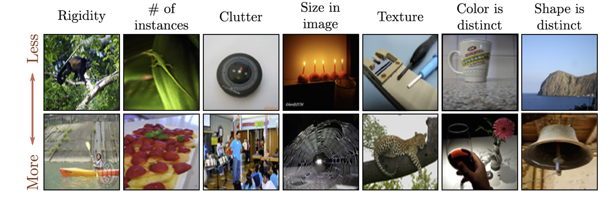{fig-align="center" width="80%"}

## AlexNet (2012)
- Primera red de computer vision que aprende las features de la red
- Antes de AlexNet todo computer vision dependia de generar buenas features de la imagen y luego aplicar ML simple como SVM
- CNN de 8 capas: 5 convoluciones, dos capas completamente conectadas y una capa de salida completamente conectada, utiliza ReLU como función de activación 
- Primera CNN en demostrar que las features aprendidas por la red son mejores a las que podemos construir 


## AlexNet (2012)
- Ojo la mayoría de los parámetros de esta CNN vienen de las capas completamente conectadas 

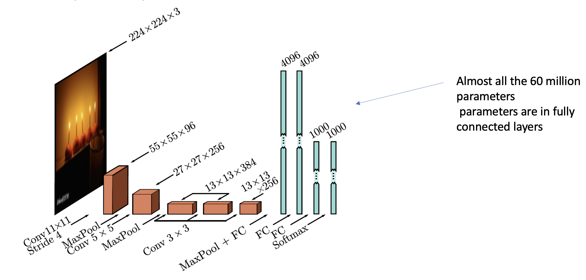{fig-align="center" width="80%"}


## Data Augmentation
- AlexNet aumento los datos de entrenamiento usando: 
1. Transformaciones espaciales
2. Modificaciones de intensidad de los inputs 

- Al momento del entrenamiento se usaron 5 versiones distintas de la misma imagen
- La predicción final fue la media de estas 5 imágenes 


## Data Augmentation 

{fig-align="center" width="80%"}


## Optimización y regularización 
- Se usa SGD con momentum de $0.9$, batch size de $128$
- Se aplico dropout a las capas completamente conectadas 
- Se aplico regularización L2 
- Esta red tiene $16.4\%$ de error en el top 5 
- Y $38.1\%$ en el top 1 


## ResNet (2015): conexiones residuales

- Problema: apilar más capas *empeoraba* el entrenamiento — no por sobreajuste, sino porque el gradiente se degrada al atravesar tantas capas
- Solución de He et al. (2015): el **bloque residual** — la capa aprende una *corrección* sobre la identidad

$$h_{k+1} = h_k + f(h_k)$$

- El término $h_k$ crea una "autopista" directa para el gradiente hacia las capas tempranas
- Con esto se entrenan redes de 100+ capas; ResNet ganó ImageNet 2015
- El mismo truco reaparece en el bloque del Transformer (las conexiones residuales que ya vimos) — es de los trucos más reutilizados de todo el DL

## Métricas para computer vision
- Clasificación: top-1/top-5 accuracy
- Detección: Intersección sobre la Unión, Average Precision (AP) y mean AP (mAP)
$$IoU = \frac{|A \cap B|}{|A \cup B|}$$

- Segmentación: pixel accuracy e IoU por clase

## Historia de clasificación de ImageNet

{fig-align="center" width="80%"}


# Detección de Objetos 

## Detección de objetos
- El objetivo es identificar y localizar varios objetos en la misma imagen 
- YOLO (you only look once) uno de los primero métodos en usar una CNN para este propósito 
- Input imágenes RGB de $448 x 448$
- Cuadrícula de $7x7$ de ubicaciones
- Predecir la clase en cada ubicación 
- Predecir dos cajas de fronteras para cada ubicación 
    - 5 parámetros $(x, y)$, ancho, altura y confianza
- Se uso momentum, weight decay (L2), dropout y data augmentation 
- Heuristica al final para decidir el threshold de las cajas finales 


## Detección de objetos

{fig-align="center" width="80%"}


## Detección de objetos
1. dividimos la imagen en una cuadricula de $7x7$
2. El sistema predice la clase más probable en cada cuadro 
3. También predice dos cajas de frontera y la confianza (que tan ancha es la linea)
4. Al final nos quedamos con las cajas con más probabilidad (acá usamos la heurística que quita cajas con poca probabilidad)


## ¿Cómo se entreno esto?
- Usando transfer learning
- La red original era para clasificar imágenes
- Se hizo fine tuning para que pudiera detectar objetos


# CNNs y políticas públicas


## Medir pobreza desde el cielo
- Problema: medir pobreza requiere encuestas de hogares — caras, lentas, y en muchos países hay *décadas* sin datos
- Idea: las imágenes satelitales son baratas, globales y frecuentes; ¿puede una CNN "leer" el bienestar económico en ellas?
- Jean et al. (2016, *Science*): predicen consumo y riqueza en 5 países africanos con imágenes satelitales diurnas
- El truco no es la arquitectura — es **cómo entrenaron con casi ninguna etiqueta**


## Jean et al. (2016): transfer learning en dos saltos
1. CNN preentrenada en ImageNet (gatos, coches... nada de pobreza)
2. Fine-tuning para predecir **luminosidad nocturna** desde imágenes diurnas — las luces de noche son un proxy de actividad económica y hay millones de "etiquetas" gratis
3. Las features aprendidas (techos, caminos, vialidades) se usan para predecir las encuestas de hogares disponibles
- Exactamente los conceptos de este deck: features jerárquicas, transfer learning, pocas etiquetas
- Explica hasta ~75% de la variación en consumo a nivel de aldea


## Después de Jean et al.
- Yeh et al. (2020, *Nature Communications*): escala el enfoque a ~20,000 aldeas en África; precisión comparable a encuestas para asignar programas sociales
- Huang, Hsiang & Gonzalez-Navarro (2021, NBER): usan CNNs + satélite para **evaluar el impacto** de un programa anti-pobreza (los outcomes se miden desde el cielo)
- Rolf et al. (2021, *Nature Communications*, MOSAIKS): features satelitales genéricas y baratas que cualquier equipo de política pública puede usar sin entrenar una CNN
- La frontera 2026: **modelos de fundación satelitales** — p. ej. Tempov (2026), preentrenado auto-supervisado sobre millones de pares de imágenes Landsat; mapea riqueza con solo 10% de las etiquetas de encuesta y hace *nowcasting* sin etiquetas nuevas
- Pregunta de examen natural: ¿qué puede salir mal? (sesgo de las luces nocturnas como proxy, validez externa entre países, drift temporal) 


