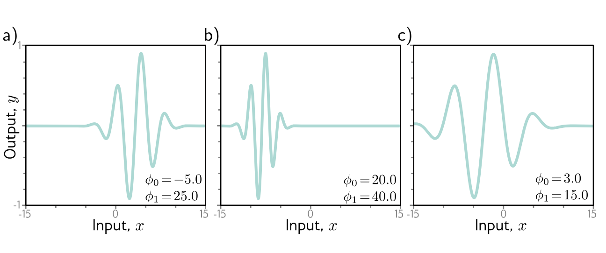
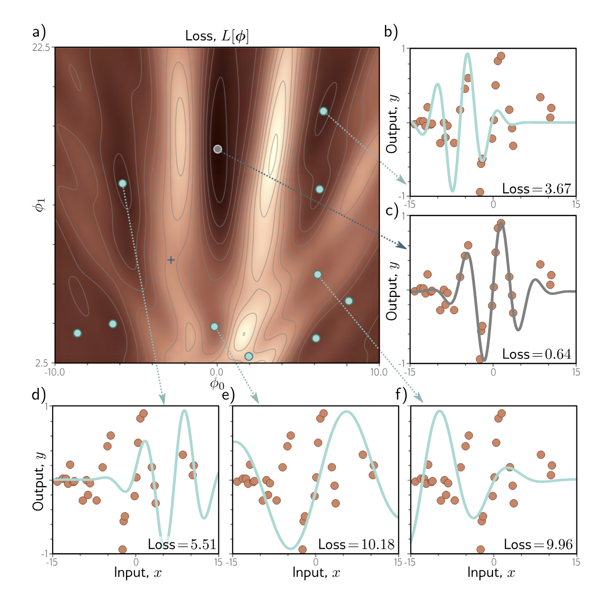

```{r setup, include=FALSE}
knitr::opts_chunk$set(echo = FALSE)
knitr::opts_chunk$set(message = FALSE, warning = FALSE)
knitr::opts_chunk$set(fig.width = 6.5, fig.height = 3.6, out.width = "70%", fig.align = "center", dev = "cairo_pdf")
```


# Funciones de pérdida 


## ¿Qué necesitamos para entrenar un algoritmos de ML? 
- Conjunto de entrenamiento $\{x_i, y_i\}$
- Función de pérdida o de costos $L(\phi)$
- La función de pérdida nos regresa un escalar de que tan bien o mal lo está haciendo el modelo 
- Estos nos permite calcular $diff(f(x_i, \phi),y_i)$


## ¿Cómo se construyen las funciones de pérdida?
- El modelo predice el output y dado los inputs x. No exactamente
- El modelo predice una distribución de probabilidad condicional $P(y|x)$ sobre todos los posibles outputs $y$ dado los inputs $x$
- La función de pérdida tiene como objetivo hacer que las $y$'s obsevadas tengan una alta probabilidad
- Esta función tiene como objetivo que cada $y_i$ de entrenamiento tenga alta probabilidad en la función de distribución $P(y|x)$ con el correspondiente input $x_i$


## ¿Cómo puede un modelo predicir una distribución de probabilidad? 
1. Escogiendo una distribución conocida (por ejemplo la normal) para modelar $y$ y  los parámetros
2. Usar el modelo para predecir los parámetros de la distribución de probabilidad 

## ¿Cómo vamos a modelar esto?
1. Primero escojemos una distribución parámetrica $P(y|\theta)$ definida por el output y 
2. Utilizamos una red neuronal para calcular los paramétros $\theta$


## Criterio de Máxima Verosimilitud
- Recordemos: el criterio de máxima verosimilitud es un método habitual para ajustar un modelo y estimar sus parámetros
- El modelo va a calcular diferentes distribuciones de los parámetros $\theta_i = f(x_i, \phi)$ para cada input de entrenamiento $x_i$
- Cada $y_i$ debe de tener alta probabilidad en la distribución $P(y_i|\theta_i)$

## Criterio de Máxima Verosimilitud
- Queremos resolver lo siguiente

$$\hat{\phi} = arg\max_{\phi} \Big[\prod_{i=1}^I P(y_i|x_i)\Big]$$
$$ = arg\max_{\phi} \Big[\prod_{i=1}^I P(y_i|\theta_i)\Big] = 
arg\max_{\phi} \Big[\prod_{i=1}^I P(y_i|f(x_i,\phi))\Big]$$


## Criterio de Máxima Verosimilitud
- Aca estamos haciendo dos supuestos: 
1. que los datos son identicamente distribuidos
2. que la distribución condicional $P(y_i|x_i)$ de cada output dado el input son independientes, de tal manera que podemos escribir la funcion de maxima verosimilitud de la siguiente manera: 

$$P(y_1,...,y_I|x_1,...,x_I) = \prod_{i=1}^I p(y_i|x_i)$$

- En otras palabras asumimos i.i.d (independidente e identicamente distibuidas)


## Criterio de Máxima Verosimilitud

- Recordemos que resolver esto es equivalente y matematicamente más sencillo maximizar el log de la verosimilitud 

$$\hat{\phi} = arg\max_{\phi} \sum_{i=1}^I log P(y_i|f(x_i,\phi))$$

## Criterio de Máxima Verosimilitud
- Maximizar el producto vs maximizar el log del producto son equivalentes porqe el logaritmo es una función monotónica: si $z > z'$ entonces $log(z) > log(z')$
- Por convención vamos a minimizar, así que la maximización es equivalente a: 

$$\hat{\phi} = arg\min_{\theta} - \sum_{i=1}^I log P(y_i|f(x_i,\phi))$$

- Donde $- \sum_{i=1}^I log P(y_i|f(x_i,\phi) = L(\theta)$


## Receta para las funciones de pérdida 

1. Escoje una distribución de probabilida adecuada $P(y|\theta)$ definida sobre el dominio de las predicciones y y que tiene parámetros de la distribución $\theta$
2. Define un modelo de ML $f(x,\phi)$ para predecir uno o más parámetros $\theta = f(x,\phi)$
3. Para entrenar el modelo, encuentra los parámetros $\hat{\phi}$ que minimicen el negativo de la log verosimilitud sobre el conjunto de entrenamiento $\{x_i,y_i\}$ 
4. Para hacer inferencia sobre un nuevo ejemplo $x$ regresa la distribución $P(y|f(x,\phi)$ o el máximo de esta distribución 

## Ejemplo: regresión univariada
- Queremos predecir un escalar $y \in \mathbb{R}$ de un input $x$
- Primero: escogemos una distribución de probabilidad $P(y|\theta)$
- Por ejemplo una normal: $P(y|\mu, \sigma^2) = \frac{1}{\sqrt{2\pi \sigma^2}}e^{-\frac{(y-\mu)^2}{2\sigma^2}}$

```{r, fig.width = 4, fig.height = 3}
library(ggplot2)
library(dplyr)
params <- tibble::tribble(
  ~mu,   ~sigma, ~col,       ~lab_x, ~lab_y, ~lab_col,
  -1.9,   0.3,   "#C26D4A",  -1.9,    1.20,  "#C26D4A",  # brick
  -0.5,   1.2,   "#76C9C2",  -0.1,    0.45,  "#76C9C2",  # teal
   1.3,   0.6,   "#2F2F2F",   1.55,   0.85,  "#2F2F2F"   # dark gray
)
zgrid <- seq(-3, 3, length.out = 800)
dens <- params %>%
  tidyr::expand_grid(z = zgrid) %>%
  mutate(pdf = dnorm(z, mean = mu, sd = sigma))
p <- ggplot(dens, aes(z, pdf, group = interaction(mu, sigma))) +
  geom_line(aes(color = interaction(mu, sigma)), linewidth = 2) +
  scale_color_manual(values = params$col,
                     labels = c(
                       expression(mu == -1.9 ~ "," ~ sigma == 0.3),
                       expression(mu == -0.5 ~ "," ~ sigma == 1.2),
                       expression(mu ==  1.3 ~ "," ~ sigma == 0.6)
                     ),
                     guide = "none") +
  coord_cartesian(xlim = c(-3, 3), ylim = c(0, 1.5), expand = FALSE) +
  labs(x = expression(z), y = expression(Pr(z))) +
  theme_minimal(base_size = 14) +
  theme(
    panel.grid = element_blank(),
    axis.title = element_text(face = "italic"),
    axis.text = element_text(color = "grey30"),
    axis.line = element_line(linewidth = 0.7, color = "black"),
    plot.margin = margin(10, 12, 10, 12)
  )

print(p)


```


## Ejemplo: regresión univariada
- Definimos un modelo de ML $f(x,\phi)$ para predecir uno o más parámetros de la distribución
- Por ejemplo si solo queremos predecir $\mu$

$$P(y|\mu, \sigma^2) = P(y|f(x,\phi),\sigma^2) = \frac{1}{\sqrt{2\pi 
\sigma^2}}e^{-\frac{(y-f(x,\phi))^2}{2\sigma^2}}$$

## Ejemplo: regresión univariada
- Sustituyendo esto en la función de - log máxima verosimilitud 

$$\hat{\phi} = arg\min -\sum_{i=1}^I log \frac{1}{\sqrt{2\pi 
\sigma^2}}e^{-\frac{(y-f(x,\phi))^2}{2\sigma^2}}$$

$$ = arg\min -\sum_{i=1}^I log \frac{1}{\sqrt{2\pi 
\sigma^2}} + log \Big[e^{-\frac{(y-f(x,\phi))^2}{2\sigma^2}} \Big]$$

$$ = arg\min -\sum_{i=1}^I log \frac{1}{\sqrt{2\pi 
\sigma^2}} - \frac{(y-f(x,\phi))^2}{2\sigma^2}$$


## Ejemplo: regresión univariada

$$ = arg\min -\sum_{i=1}^I - \frac{(y-f(x,\phi))^2}{2\sigma^2} = arg\min \sum_{i=1}^I (y_i - f(x_i,\phi))^2$$

- Y regresamos a mínimos cuadrados!! 

## Ejemplo: regresión univariada

- ¿Qué derivamos acá? la función de pérdida de mínimos cuadrados
- Esta función viene de manera natural de asumir dos cosas sobre los errores de predicción:
    - que son independientes 
    - que vienen de una distribución normal con media dada por $f(x,\phi)$

## Ejemplo: regresión univariada
- ¿Cómo se ve esto gráficamente? 

{fig-align="center" width="80%"}

## Ejemplo: regresión univariada
- ¿Qué le paso a la varianza? asumimos que era constante y desapareció
- ¿Qué pasa si la queremos aprender la varianza? 
- Podemos hacer que la varianza dependa de $x$  
- Construir un modelo con dos outputs: 
    - $\mu = f_1(x,\phi)$
    - $\sigma^2 = f_2(x,\phi)^2$
- Y seguimos los mismo pasos que antes

## Ejemplo: regresión univariada

{fig-align="center" width="80%"}


## Ejemplo 2: clasificación binaria 
- ¿Qué pasa si queremos predecir dos clases en vez de una regresión?
- Ya sabemos como hacer esto no? lo vimos en ML básico 
- Primero: seleccionamos una función de probabilidad adecuada 
- Distribución Bernoulli 

$$P(y|\lambda) = \begin{cases} 
      1- \lambda & y = 0 \\
      \lambda & y = 1
   \end{cases}$$

- El dominio de esta función es $y\in\{0,1\}$, un solo parámetro $\lambda \in [0,1]$
- $P(y|\lambda) = (1-\lambda)^{1-y}\lambda^y$


## Ejemplo 2: clasificación binaria
- Seleccionamos un modelo de ML $f(x,\phi)$ para predecir uno o varios parámetros de la distribución 
- Problema: si $f(x,\phi)$ es una red neuronal puede tomar cualquier valor pero queremos que $\lambda \in [0,1]$
- Solución: usar una función que mapee cualquier real a $[0,1]$
- Ya sabemos cual es esta función: $sig(z) = \frac{1}{1+e^{-z}}$

## Ejemplo 2: clasificación binaria
- Entonces podemos escribir la probabilidad como 
$$P(y|x) = (1-\lambda)^{1-y}\lambda^y = (1-sig(f(x,\phi)))^{1-y}sig(f(x,\phi))^y$$

## Ejemplo 2: clasificación binaria
- Para entrenar el modelo necesitamos encontrar $\hat{\phi}$ que minimice - log verosimilitud 
$$\hat{\phi} = arg\min_{\phi} L(\phi)$$
$$ L(\phi) = \sum_{i=1}^I-(1-y_i)log(1-sig(f(x_i,\phi)))- y_ilog(sig(f(x_i,\phi)))$$


## Ejemplo 2: clasificación binaria
- Para hacer inferencia regresamos o toda la distribución o el máximo de la distribución 
- Normalmente escogemos $y=1$ si $\lambda \geq 5$

{fig-align="center" width="80%"}


## Ejemplo 3: clasificación multiclase 
- Primero seleccionamos una distribución adecuada
- En este caso $P(y = k) = \lambda_k$ 
- Dominio $y \in \{1,...,k\}$ y con parámetros $\lambda_k \in [0,1]$


## Ejemplo 3: clasificación multiclase 
- Segundo seleccionamos un modelo de ML para predecir estos parámetros 
- Problema: igual que con el ejemplo anterior, queremos que $\lambda_k \in [0,1]$ pero la red neuronal nos puede dar cualquier valor 
- Solución: función softmax $softmax_k(z) = \frac{e^z_k}{\sum_{k'=1}^K e^{z_{k'}}}$
- Entonces nuestra $P(y = k|x) = softmax_k(f(x,\phi))$


## Ejemplo 3: clasificación multiclase 

{fig-align="center" width="80%"}


## Ejemplo 3: clasificación multiclase 
- 3. Entrenamos el modelo minimizando - log verosimilitud que acá va a ser la cross-entropy multiclas 

$$L(\phi) = -\sum_{i=1}^If_{y_i}(x_i,\phi) - log \sum_{k=1}^K e^{f_k(x_i,
\phi)}$$

- 4. Para la inferencia de una nueva x, calculamos o toda la distribución o el máximo 


## ¿Qué pasa si tenemos otros tipos de datos?

{fig-align="center" width="80%"}


## ¿Qué pasa si tenemos outputs múltiples?
- A pesar de que podríamos calcular distribuciones de probabilidad multivariada
- Lo más común es tratar cada predicción como independiente 
- $P(y|f(x_i,\phi)) = \prod_{d}P(y_d|f_d(x_i,\phi))$
- Usamos - log verosimilitud para entrenar 
- $L(\phi) = -\sum_{i=1}^I\sum_{d}log P(y_{id}|f_d(x_i,\phi))$

## Cross-entropy: repaso

- La función de pérdida de cross-entropy tiene como objetivo encontrar los parámetro $\theta$ que minimicen la distancia entre la distribución empírica $q(y)$ y la distribución del modelo $P(y|\theta)$
- Podemos medir esta distancia usando la divergencia de Kullback-Leiber (KL)

$$D_{KL}(q||p) = \int q(z)log(q(z))dz - \int q(z)log(p(z))dz$$

- Donde la distribución empírica esta dada por: $q(y) = \frac{1}{I}\sum_{i=1}^I \delta(y-y_i)$
- Con $\delta$ la función delta de Dirac 


## Cross-entropy: repaso
- Queremos minimizar la KL entre estas dos distribuciones lo que es lo mismo que: 

$$\hat{\theta} = arg\min_{\theta} -\int q(y)log(P(y|\theta))dy$$

- ¿Qué le paso al primer término? no depende de $\theta$
- Sustituyendo la distribución empírica regresamos a 

$$\hat{\theta} = arg\min_{\theta} - \sum_{i=1}^I log P(y|\theta)$$

- Regresamos a - la log verosimilitud! 

# Optimización 


## ¿Cómo encontramos los parámetros que minimizan la función de pérdida?

- Esto lo conocemos como aprendizaje o ajuste del modelo 
1. Sacamos los gradientes de la función de pérdida con respecto a los parámetros
2. Ajustamos los parámetros usando los gradientes para disminuir la pérdida
3. Iteramos hasta que (con suerte) encontremos el mínimo de la función de pérdida

- Recordemos que podemos hacer esto usando GD o alguna variante 


## Gradient descent
1. Sacamos el gradiente de la función de pérdida con respecto a los parámetros 

$$ \frac{\partial L}{\partial \phi} = \begin{pmatrix} \frac{\partial L}{\partial \phi_0} \\ ... \\ \frac{\partial L}{\partial \phi_N} \end{pmatrix}$$

2. Actualizamos los parámetros usando la regla, donde $\alpha$ es la tasa de aprendizaje  

$$\phi \leftarrow \phi -\alpha \frac{\partial L}{\partial \phi}$$


## Gradient descent
- Recordemos que si tenemos una función de pérdida convexa, el proceso de ir hacia el mínimo con GD no falla, siempre alcanzamos el mínimo
- Si tenemos una función convexa no importa donde inicializamos los parámetros siempre vamos a encontrar el mínimo global
- Pero en las redes neuronales las funciones de pérdida no van a ser convexas
- Como ejemplo en vez de usar una red neuronal vamos a usar el modelo de Gabor 

$$f(x, ϕ) = sin[ϕ_0 + 0.06 · ϕ_1x] · e^{-\frac{(\phi_0 + 0.06\phi_1 x)^2}{32}}$$


## Gradient descent

{fig-align="center" width="80%"}


## Gradient descent
- ¿Cuál es el problema si queremos minimizar $L(\phi) = \sum_{i=1}^I(f(x_i,
\phi) - y_i)^2$

- Está función va a tener varios mínimos locales 
- Si comenzamos en un punto aleatorio y comenzamos a descender no hay garantía que terminemos en el mínimo global 
- Si terminamos en un mínimo local no hay manera de saber que hay una mejor solución 
- Esta función también tiene puntos silla, la superficie cerca de estos puntos es plana y nos podemos atorar acá


## Gradient descent

{fig-align="center" width="80%"}


## Stochastic Gradient Descent (SGD)

- Recordemos usar GD para encontrar el mínimo global de una función de costos de altas dimensiones no va a ser muy eficiente
- Uno de los principales problemas es que donde termina el GD depende de donde empezamos a buscar
- La idea del SGD es agregar ruido 
- Sacamos el GD en un sub conjunto de los ejemplos de entrenamiento conocido como mini-batch 
- Sigue sampleando en los ejemplos de entrenamiento sin reemplazo hasta usarlos todos 
- Pasar por todos los ejemplos de entrenamiento una vez es una época 

$$\phi_{t+1} \leftarrow \phi_t -\alpha \sum_{i \in B_t} \frac{\partial l_i(\phi_t)}{\partial \phi}$$


## Propiedades del SGD
1. Mejora el ajuste en un subconjunto de los datos en cada iteración, estas actualizaciones por lo general son buenas aunque no óptimas
2. Itera sobre todos los datos y cada ejemplo contribuye de la misma manera al entrenamiento 
3. Es menos costoso computacionalmente 
4. Puede escapar el problema de los mínimos locales
5. Reduce la probabilidad de atorarte en puntos silla 
6. Parece que encuentra mejores soluciones para redes neuronales profundas 

- No converge en el sentido tradicional, entrenamos muchos GD en funciones de pérdida distintas porque cambiamos el batch 
- Funciona mejor si la tasa de aprendizaje no es constante y decrece con el tiempo 

## GD vs SGD

{fig-align="center" width="80%"}


## Momentum: 

- Actualizamos usando una combinación del gradeinte del batch actual y la dirección en la que nos movimos en el paso anterior m

$$m_{t+1} ← βm_t + (1 − β)\sum_{i∈Bt}\frac{∂ℓi[ϕt]}{∂ϕ}$$
$$ϕ_{t+1} ← ϕ_t − αm_{t+1}$$

- $m_t$ controla que tanto suavizamos el gradiente en el tiempo 
- La tasa de aprendizaje efectiva aumenta si todos los gradientes están alienados pero disminuye si la dirección cambia 
- Esto reduce la oscilación en los valles 


## Momentum: 

{fig-align="center" width="80%"}


## Momentum acelarado Nesterov: 
- Moverse en la dirección predicha y luego calcular el gradiente  
$$m_{t+1} \leftarrow \beta m_t  + (1-\beta)\sum_{i \in B_t}\frac{∂ℓi[ϕt - \alpha m_t]}{∂ϕ}$$
$$ϕ_{t+1} ← ϕ_t − αm_{t+1}$$


## Momentum acelarado Nesterov: 
- En el momentum normal nos movemos de 1-2-3
- En el de nesterov nos movemos de 1-4-5

{fig-align="center" width="80%"}


## Normalización de gradientes
- GD con un tamaño de paso fijo tiene el problema que ajusta en relación al tamaño del gradiente (si es pequeño el ajuste es pequeño si es grande el ajuste es grande)
- Cuando el gradiente de la pérdida es muchísimo más empinado en una dirección que en otra es difícil elegir una tasa de aprendizaje que:
    - progrese bien en ambas direcciones 
    - sea estable 
- La solución es normalizar los gradientes 


## Normalización de gradientes 

$$m_{t+1} \leftarrow \frac{\partial L(\phi_t)}{\partial \phi}$$
$$v_{t+1} \leftarrow \Big(\frac{\partial L(\phi_t)}{\partial \phi}\Big)^2$$
$$\phi_{t+1} \leftarrow - \alpha \frac{m_{t+1}}{\sqrt{v_{t+1}} + \epsilon}$$

- El algorítmo se mueve una distancia fija $\alpha$ sobre cada coordenada, donde la dirección es hacia donde sea que sea abajo 

## Adaptive Moment Estimation (Adam)

- Adam normaliza los gradientes y además agrega momentum
- Momentum: $m_{t+1} \leftarrow \beta m_t + (1-\beta)\frac{\partial L(\phi_t)}{\partial \phi}$
- $v_{t+1} \leftarrow \gamma v_t + (1-\gamma)\Big(\frac{\partial L(\phi_t)}{\partial \phi}\Big)^2$
- Normalizamos estos dos:
    - $\tilde{m}_{t+1} \leftarrow \frac{m_{t+1}}{1-\beta^{t+1}}$
    - $\tilde{v}_{t+1} \leftarrow \frac{v_{t+1}}{1-\gamma^{t+1}}$\
- Como $\beta,\gamma \in (0,1]$ los términos elevados se vuelven más pequeños en cada iteración  

## Adaptive Moment Estimation (Adam)
$$\phi_{t+1} \leftarrow \phi_t - \alpha \frac{\tilde{m}_{t+1}}{\sqrt{\tilde{v}_{t+1}}+\epsilon}$$

- Ojo: todos estos algoritmos los vamos a usar con mini-batches!! 
- Adam es menos sensible que otros algoritmos a donde inicializamos los parámetros 
- Para problemas de computer vision es una buena idea comparar Adam con SGD+momentum 


## Adam 

{fig-align="center" width="80%"}
