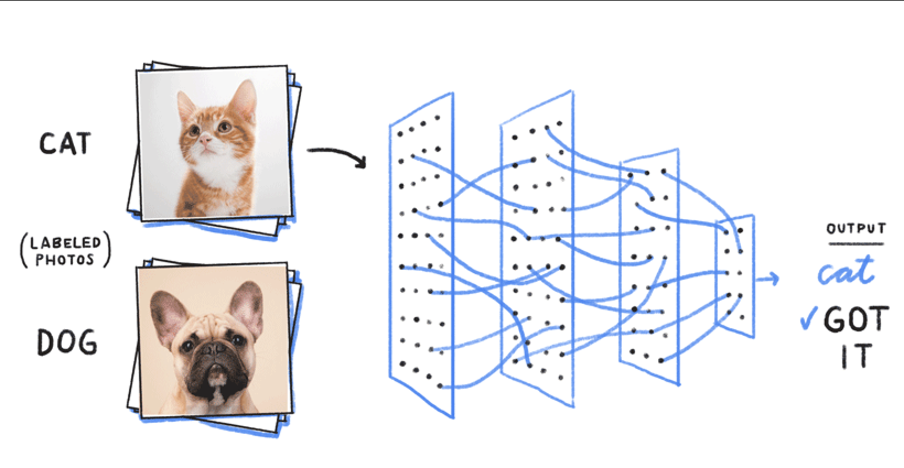
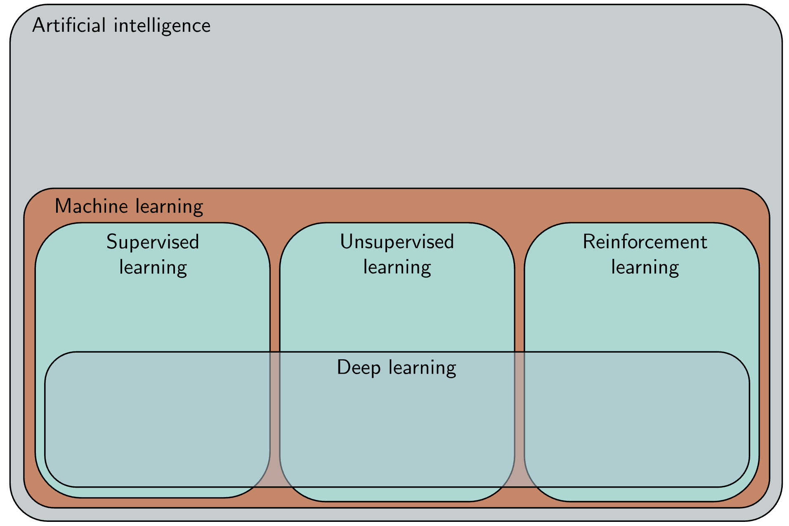
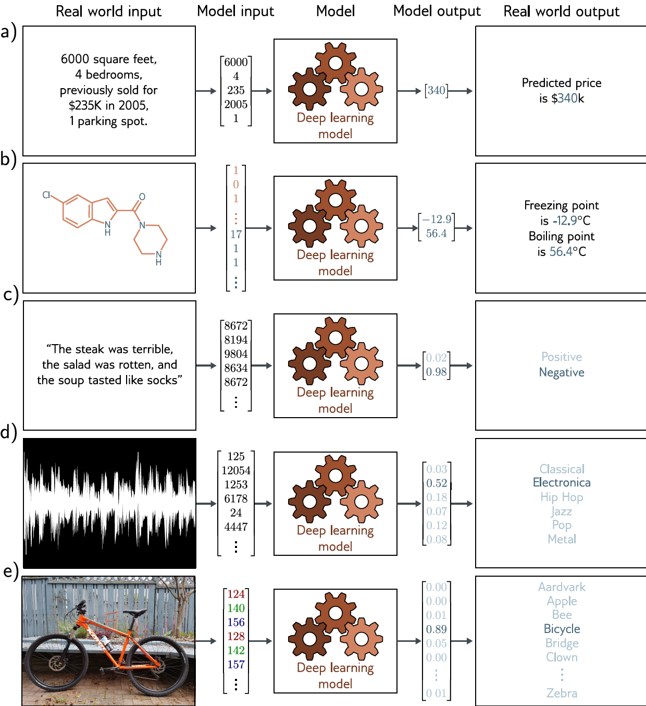
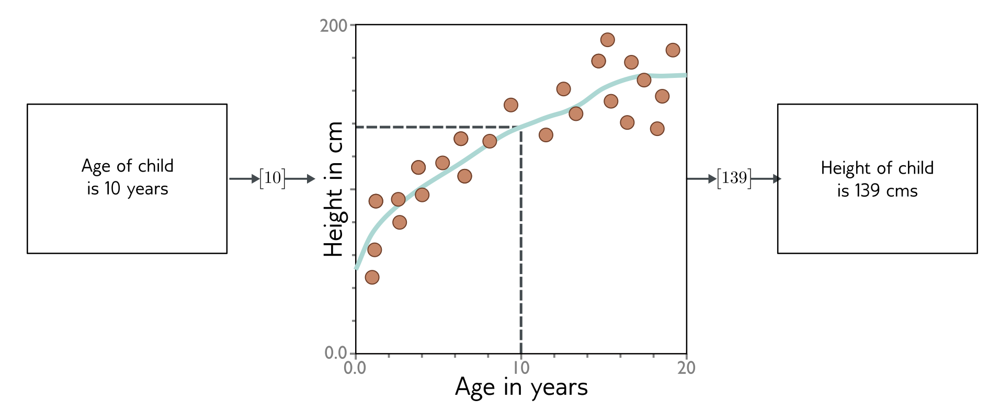
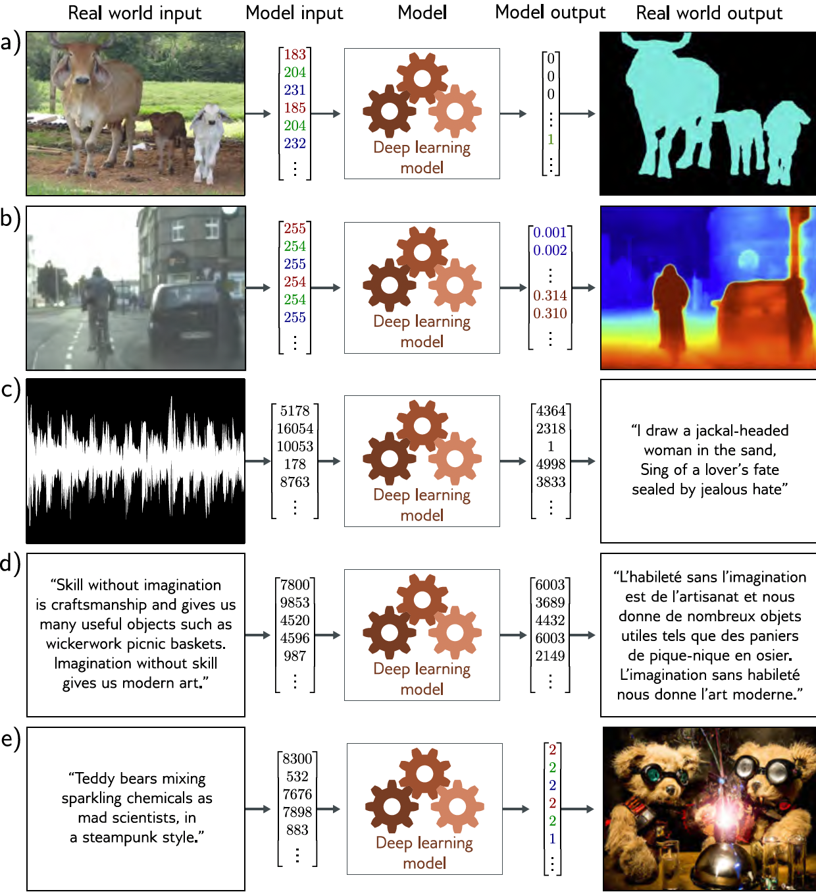
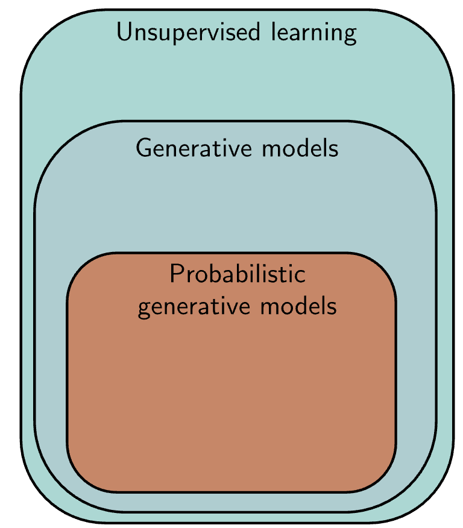

```{r setup, include=FALSE}
knitr::opts_chunk$set(echo = FALSE)
knitr::opts_chunk$set(message = FALSE, warning = FALSE)
knitr::opts_chunk$set(fig.width = 6.5, fig.height = 3.6, out.width = "70%", fig.align = "center", dev = "cairo_pdf")
```

# Este curso: 

## Objetivos de este curso: 
1.  Entender las arquitecturas centrales del aprendizaje profundo (CNNs, Transformers, etc)
2. Implementar aprendizaje profundo de extremo a extremo usando Pytorch
3. Evaluar de manera critica modelos de aprendizaje profundo incluyendo desempeño, equidad y su impacto 
4. Aplicar aprendizaje profundo a problemas reales (análisis de texto, análisis de imágenes, etc)
5. Diseñar sistemas robustos, transparentes y explicables más allá de cajas negras (no todo son LLMs, ni tienen la solución a todos nuestros problemas)

## Prerequisitos: skills que ya deberian de tener
- Programación en python: clases, funciones, estructuras de datos, programación orientada a objetos, etc
- ML básico: funciones de pérdida, algoritmos de optimización, etc
- Flujos de trabajo de un producto de ciencia de datos 


## RoadMap del curso 
- Semana 1-4: Fundamentos 
    - Repaso de ML básico 
    - Redes neuronales superficiales y profundas 
    - Entrenamiento de redes neuronales 
    - Regularización 
- Semana 5-7: CNNs y RNNs — *Examen 1 (~semana 6)*
- Semana 8-10: Transformers
- Semana 11: ¿Por qué funciona el aprendizaje profundo?/ Fairness/Etica y preguntas abiertas — *Examen 2*
- Semana 12: Presentaciones y entrega del proyecto de colaboración con IA


## Evaluación
- 2 exámenes en clase de teoría, sin código (25% + 25%)
    - Examen 1 (~semana 6): fundamentos; Examen 2 (~semana 11): arquitecturas
    - Temarios detallados en la carpeta `Examenes/` del repo
- 1 presentación de un paper de DL en parejas (35%)
- Los papers se van a asignar de manera aleatoria; formato y rúbrica en la guía del repo
- Proyecto de colaboración con IA (15%): diriges a un agente de IA para ejecutar un experimento de DL; se califica tu especificación, tu verificación y tu interpretación — no el código (guía en el repo)


## Política de IA y tareas de práctica
- Las 8 tareas del curso ahora son práctica **no calificada**: son la preparación directa para los exámenes
- El uso de LLMs está permitido en todo — pero los exámenes son en clase y a mano: úsenlos para entender, no para evitar entender
- En las presentaciones y en el proyecto es **obligatorio** entregar la transcripción completa de sus conversaciones con el LLM/agente


## Papers a presentar: 
1. AlexNet — Krizhevsky, Sutskever & Hinton (2012)
2. ResNet (Deep Residual Learning) — He et al. (2015)
3. Batch Normalization — Ioffe & Szegedy (2015)
4. Transformers — “Attention is All You Need” — Vaswani et al. (2017)
5. BERT (Devlin et al., 2018)
6. Variational Autoencoders (VAE) — Kingma & Welling (2013)
7. GANs (Goodfellow et al., 2014)
8. Double Descent — Belkin et al. (2019) / Nakkiran et al. (2019)


## Papers a presentar (adicionales, era LLM):
9. Scaling Laws / Chinchilla — Hoffmann et al. (2022)
10. InstructGPT (RLHF) — Ouyang et al. (2022)
11. LoRA — Hu et al. (2021)
12. RAG — Lewis et al. (2020)


## Libros

- Prince, Unifying Deep Learning
- Goodfellow et al., Deep Learning 
- Zhang et al., Dive into Deep Learning 
- Chollet, Deep Learning with Python

## Papers de DL en politicas públicas: 
- Medición de pobreza usando imágenes satelitales: 
    - Jean et al. (2016) – Combining satellite imagery and machine learning to predict poverty (Science)
    - Yeh et al. (2020) – Using publicly available satellite imagery and deep learning to understand economic well-being in Africa (Nature Communications)
    - Huang, Hsiang & Gonzalez‑Navarro (2021) – Using Satellite Imagery and Deep Learning to Evaluate the Impact of Anti‑Poverty Programs (NBER Working Paper)
    - Rolf et al. (2021) – A generalizable and accessible approach to machine learning with global satellite imagery, MOSAIKS (Nature Communications)
    - Babenko et al. (2017) – Poverty Mapping Using Convolutional Neural Networks… (arXiv).


## Papers de DL en politicas públicas: 
- Análisis de textos legislativos 
    - Korn & Newman (2020) – A Deep Learning Model to Predict Congressional Roll Call Votes From Legislative Texts
    - Chalkidis et al. (2019) – Large‑Scale Multi‑Label Text Classification on EU Legislation (arXiv).
    - Wei et al. (2019) – Empirical Study of Deep Learning for Text Classification in Legal Document Review (arXiv).


## Papers de DL en politicas públicas (era LLM):
- LLMs como herramienta de investigación y medición:
    - Gilardi, Alizadeh & Kubli (2023) – ChatGPT outperforms crowd workers for text-annotation tasks (PNAS)
    - Ziems et al. (2024) – Can Large Language Models Transform Computational Social Science? (Computational Linguistics)
    - Dell (2025) – Deep Learning for Economists (Journal of Economic Literature)


# Introducción


## Previosly en ML 1: ¿Qué pasa si tenemos datos que se ven así?
- En ML1 solo llegamos hasta redes neuronales superficiales

```{r}
library(ggplot2)
set.seed(123)
n <- 50
x1 <- c(runif(n, 0, 1), runif(n, 0, 1), runif(n, 1, 2), runif(n, 1, 2))
x2 <- c(runif(n, 0, 1), runif(n, 1, 2), runif(n, 0, 1), runif(n, 1, 2))
class <- factor(c(rep(0, n), rep(1, n), rep(1, n), rep(0, n)))
data <- data.frame(x1 = x1, x2 = x2, class = class)
ggplot(data, aes(x = x1, y = x2, color = class)) +
  geom_point(size = 3, alpha = 0.8) +
  labs(
    title = "Clasificación no lineal",
    x = expression(x[1]),
    y = expression(x[2])
  ) +
  theme_minimal(base_size = 15) +
  theme(
    plot.title = element_text(hjust = 0.5)
  )
```


## ¿Qué pasa si nuestros datos son imagenes/texto/grafos/videos?

{fig-align="center" width="80%"}


## ¿Qué es el aprendizaje profundo?
- *Red neuronal profunda*: red neuronal con más de una capa intermedia (hidden layer) entre las capas de entrada y de salida
    - **Profundidad:** $\geq$ 2 capas ocultas/intermedias
    - **Parámetros aprendidos:** pesos y biases 
    - **Activaciones:** ReLU, sigmoid, softmax...
- *Aprendizaje profundo*: cuando ajustamos una red neuronal profunda 

## ¿Qué es el aprendizaje profundo?
- Actualmente son los modelos de ML más poderosa y los vemos en todos lados: traducción automática, creación de imágenes, vídeos, etc. 
- Vamos a intentar entender el aprendizaje profundo sin derivar todos los algoritmos (si va a ha haber matemáticas pero no vamos a demostrar cosas) pero tampoco va a ser solo correr código en python (eso lo puede hacer el aprendizaje profundo solo)


## Aprendizaje Profundo

{fig-align="center" width="80%"}


## Los 3 pilares del Deep Learning moderno
1. **Datos masivos**  
   - Internet y sensores generan billones de ejemplos diarios.  
2. **Cómputo acelerado**  
   - GPUs/TPUs permiten ejecutar en horas lo que antes tomaba meses.  
3. **Autodiferenciación**  
   - Frameworks (PyTorch, TensorFlow) construyen grafos dinámicos y calculan gradientes por ti.  
   

## Hitos emblemáticos en Deep Learning

- **AlphaGo (2016)**: vence al campeón mundial de Go usando redes profundas + MCTS.  
- **Neural Style Transfer (2015)**: mezcla contenido y estilo de imágenes con CNNs.  
- **Transformers & GPT (2017– )**: revolucionan NLP con atención auto-regresiva.  
- **Vision Transformers (2020)**: llevan la atención a visión por computador.   


## División de ML 
- Recordemos que podemos dividir ML en tres: supervisado, no supervisado y aprendizaje por refuerzo. 
- Actualmente todos los métodos de vanguardia para los tres tipos incluyen aprendizaje profundo
- Esta clase: supervisado y no supervisado


## Pipeline típico de un proyecto de DL

1. **Definir modelo** (arquitectura, capas, activaciones)  
2. **Preparar datos** (minibatches, normalización)  
3. **Especificar pérdida & optimizador**  
4. **Entrenar** (forward + backward)  
5. **Evaluar & ajustar** (validación, regularización, hiperparámetros)  
6. **Desplegar** (exportar modelo, APIs, monitorización)


# Aprendizaje Supervisado 

## Aprendizaje Supervisado
- Definimos el mapeo entre input y output 
- El algoritmo aprende usando los ejemplos de entrenamiento 


## Aprendizaje supervisado
1. Regresión
2. Regresión con grafos
3. Clasificación de texto 
4. Clasificación de música
5. Clasificación de imágenes


## Aprendizaje supervisado

{fig-align="center" width="50%"}


## Recordemos que hace un modelo supervisado: 
- Toma inputs x y predice el output y
- Y queremos una f() tal que $y = f(x)$
- El modelo encuentra parametros tales que $y = f(x,\phi)$
- Aprendemos estos parametros utilizando el conjunto de entrenamiento $\{x_i,y_i\}$
- Recordemos la diferencia entre la predicción y el valor real lo cuantificamos utilizando una función de perdida, escalar que nos dice que tan bien esta ajustando el modelo a los datos de entrenamiento
- ¿Cómo entrenamos el modelo?

$$\hat{\phi} = arg\min_{\phi}  \quad \quad L(\phi)$$


## Aprendizaje supervisado: ejemplo

{fig-align="center" width="80%"}

## Aprendizaje supervisado: ejemplo
- Queremos una ecuación que relacione la edad con la altura
- Podemos buscar sobre familias de posibles ecuaciones para encontrar alguna que ajuste bien los datos de entrenamiento 
- Las redes neuronales profundas son una familia de ecuaciones muy flexibles (comparadas con otros algoritmos de ML que hemos visto antes)
- Ajustar una red neuronal profunda $\implies$ *aprendizaje profundo*

## Aprendizaje profundo
- Problemas mas complejos que pueden resolver las RNP pero no algoritmos mas sencillos 

{fig-align="center" width="50%"}


## Problemas mas complejos que pueden resolver las RNP pero no algorítmos mas sencillos 
1. Segmentación de imágenes
2. Estimación de profundidad
3. Voz a texto 
4. Traducción
5. Ponerle captions a una imagen
6. Generación de imágenes del texto 

## ¿Qué tienen en común los últimos 3 ejemplos?
- Relaciones muy complejas entre el input y el output 
- Puede que existan varias respuestas correctas 
- Pero tanto los outputs como los inputs siguen ciertas reglas 
- Ejemplo: 
    - El lenguaje obedece reglas gramaticales
    - Las imágenes tienen que tener cierto sentido, hay combinaciones de pixeles que no significan nada 
    
## Aprendizaje No-Supervisado
- Para resolver estos problemas necesitamos alejarnos del aprendizaje supervisado 
- La idea es aprender por ejemplo la estructura gramatical de los datos de entrenamiento sin dársela explicitamente al modelo 
- Podemos usar muchos (millones) de datos sin labels para hacer esto 
- Recordemos el aprendizaje no supervisado puede aprender de los datos sin labels cosas como: 
    - clustering
    - encontrar outliers
    - generar nuevos ejemplos 
    - llenar missing values 
    
## Aprendizaje No-Supervisado
- Aprender de nuevos datos sin labels
    - por ejemplo clustering 
- Modelos generativos pueden crear nuevos ejemplo
    - por ejemplo generative adversarial networks 
- PGMs (Probabilistic Generative models) apenden la distribución de los datos: 
    - variational autoencoders 
    - normalizing flows 
    - diffusion models 


## Aprendizaje No-Supervisado   

{fig-align="center" width="60%"}
    

# Preview: 

## ¿Por qué DL supera a métodos "shallow"?

-  **Aprendizaje jerárquico de características:** las redes profundas extraen representaciones de muy bajo nivel (bordes, texturas) hasta alto nivel (formas, conceptos) de manera automática.  
- **Menos ingeniería manual:** evitan el costo y el sesgo de diseñar features a mano (SIFT, TF–IDF, etc.).  
- **Escalabilidad:** funcionan mejor cuanto más datos y capacidad de cómputo se disponen (¡grandes datasets + GPUs!).  

##  Ventajas y retos del “feature learning”
- Ventajas:  
  - Adaptabilidad: el modelo descubre por sí mismo qué características son relevantes para la tarea.  
  - Transferibilidad: vectores aprendidos pueden reutilizarse para tareas nuevas (transfer learning).  
- Retos: 
  - **Datos:** gran dependencia de volumen y calidad de datos etiquetados.  
  - **Opacidad:** “features” internos no siempre tienen interpretación clara para expertos en política.  
  - **Sobreajuste y sesgo:** sin regularización ni auditoría, el sistema puede aprender patrones no deseados.


## Riesgos del  DL 
- Aunque compartimos muchos de los retos de los modelos “shallow”, en Deep Learning:
    - Es más difícil detectar cuándo algo falla
    - La enorme escalabilidad y complejidad pueden amplificar sesgos y errores
1. Datos Sesgados $\implies$ resultados injustos (si solo tengo imágenes de una parte de la ciudad o si tienen mejor calidad)
2. Interpretabilidad $\implies$ baja confianza institucional (decisiones ocultas en capas profundas no comprensibles para responsables de política)
3. Dependencia de cajas negras (LLMs) (asumir que el modelo “piensa” y delegar toda la responsabilidad en su output)
4. Costo ambiental: entrenamientos y despliegues masivos consumen grandes recursos energéticos. 
    
    
    


