```{r setup, include=FALSE}
knitr::opts_chunk$set(echo = FALSE)
knitr::opts_chunk$set(message = FALSE, warning = FALSE)
knitr::opts_chunk$set(fig.width = 6.5, fig.height = 3.6, out.width = "70%", fig.align = "center", dev = "cairo_pdf")
```

# Repaso Redes Neuronales Superficiales


## Podemos pensar en una red neuronal como
- Una función lineal por partes
- Por ejemplo: 

$$y = \phi_0 + \phi_1 a(\theta_{10} +\theta_{11}x) + \phi_2 a(\theta_{20} + \theta_{21}x) + \phi_3 a(\theta_{30} + \theta_{31}x)$$

- Esta función mapea $x\to y$ y la podemos separar en tres pedazos lineales:
    - $\theta_{10} +\theta_{11}x$
    - $\theta_{20} + \theta_{21}x$
    - $\theta_{30} + \theta_{31}x$

## Podemos pensar en una red neuronal como
- Después pasamos estos resultados por la función de activación $a()$ y calculamos una combinación lineal de estas usando $\phi_1$, $\phi_2$, $\phi_3$ y $\phi_0$
- Recordemos que podemos usar distintas funciones de activación como por ejemplo ReLU:

\[a(z) = ReLU(z) = \left\{
\begin{array}{ll}
      0 & z < 0\\
      z & z \geq 0
\end{array} 
\right. \]

## ReLU

```{r}
library(ggplot2)
relu <- function(x) pmax(0, x)
df <- data.frame(x = seq(-5, 5, length.out = 500))
df$y <- relu(df$x)
ggplot(df, aes(x = x, y = y)) +
  geom_line(color = "tomato", size = 1.5) +
  geom_hline(yintercept = 0, color = "grey80") +
  geom_vline(xintercept = 0, color = "grey80") +
  coord_cartesian(xlim = c(-5, 5), ylim = c(-5, 5)) +
  theme_minimal(base_size = 14) +
  theme(
    panel.background = element_rect(fill = "black", colour = NA),
    plot.background  = element_rect(fill = "black", colour = NA),
    panel.grid.major = element_blank(),
    panel.grid.minor = element_blank(),
    axis.text        = element_text(colour = "grey80"),
    axis.title       = element_text(colour = "grey90"),
    axis.ticks       = element_line(colour = "grey50")
  ) +
  labs(
    title = "ReLU Function",
    x = "x",
    y = "f(x) = max(0, x)"
  )
```

## Red neuronal superficial

$$y = \phi_0 + \phi_1 a(\theta_{10} +\theta_{11}x) + \phi_2 a(\theta_{20} + \theta_{21}x) + \phi_3 a(\theta_{30} + \theta_{31}x)$$

- Modelo con 10 parámetros $\phi = \{\phi_0, \phi_1, \phi_2, \phi_3, \theta_{10},\theta_{11}, \theta_{20}, \theta_{21}, \theta_{30}, \theta_{31} \}$
- Representa una familia de funciones
- Los parámetros van a determinar la función en particular 
- Dados los parámetros podemos correr el modelo
- Dado un conjunto de entrenamiento $\{x_i,y_i\}_{i=1}^I$
- Definimos la función de pérdida $L(\phi)$
- Cambiamos los parámetros para minimizar la función de pérdida

## Tres funciones distintas de esta familia 

- Familia de funciones definida por la ecuación anterior con tres distintos sets de los 10 parámetros
- La relación entre x y y es lineal por partes pero la posición de las articulaciones es distinta y las pendientes 

```{r}
library(ggplot2)
library(cowplot)
x_breaks <- c(0.0, 0.5, 1.0, 1.5, 2.0)
dat1 <- data.frame(
  x = x_breaks,
  y = c( 0.8,  0.6,  0.0, -0.1,  0.0) 
)
dat2 <- data.frame(
  x = x_breaks,
  y = c( 0.0,  0.0,  0.0,  0.6, -0.6) 
)
dat3 <- data.frame(
  x = x_breaks,
  y = c( 0.3,  0.8,  1.0,  0.6,  0.0) 
)
make_panel2 <- function(dat, line_col) {
  ggplot(dat, aes(x = x, y = y)) +
    geom_line(color = line_col, size = 1.2) +
    geom_point(color = line_col, size = 3) +
    geom_hline(yintercept = 0, linetype = "dotted", color = "grey50") +
    coord_fixed(ratio = 1, xlim = c(0,2), ylim = c(-1,1)) +
    theme_minimal(base_size = 14) +
    theme(
      panel.background = element_rect(fill = "black", colour = NA),
      plot.background  = element_rect(fill = "black", colour = NA),
      panel.grid       = element_blank(),
      axis.text        = element_text(colour = "grey80"),
      axis.title       = element_text(colour = "grey90"),
      plot.margin      = margin(5,5,5,5)
    ) +
    labs(x = "x", y = "y")
}
p1 <- make_panel2(dat1, line_col = "deepskyblue3")
p2 <- make_panel2(dat2, line_col = "tomato")
p3 <- make_panel2(dat3, line_col = "gray70")
combined <- plot_grid(
  p1, p2, p3,
  ncol  = 3,
  align = "hv"
)
combined <- combined + theme(plot.background = element_rect(fill = "black", colour = NA))
print(combined)
```


## ¿Por qué se ven asi estas gráficas?
- Nuestra ecuación representa una familia de funciones continuas lineales por partes con hasta 4 regiones
- Cada región es un segmento de linea: ¿porqué?

$$y = \phi_0 + \phi_1 a(\theta_{10} +\theta_{11}x) + \phi_2 a(\theta_{20} + \theta_{21}x) + \phi_3 a(\theta_{30} + \theta_{31}x)$$


## Neuronas/nodos: 
- Podemos re-escribir nuestra ecuación de la siguiente manera: 

$$y = \phi_0 + \phi_1h_1 + \phi_2h_2 + \phi_3h_3$$

- Donde las neuronas/nodos (hidden units) están dadas por: 
    - $h_1 = a(\theta_{10} + \theta_{11}x)$
    - $h_2 = a(\theta_{20} + \theta_{21}x)$
    - $h_3 = a(\theta_{30} + \theta_{31}x)$

## ¿Cómo funciona la red neuronal? 
- **Paso 1:** calcula tres funciones lineales 
```{r}
make_df <- function(intercept, slope) {
  x <- seq(0, 2, length.out = 200)
  data.frame(x = x, y = intercept + slope * x)
}
lines <- list(
  list(df    = make_df(-0.2,  0.3),
       theta0 = -0.2, theta1 = 0.3,
       col    = "tomato"),
  list(df    = make_df(-0.8,  0.9),
       theta0 = -0.8, theta1 = 0.7,
       col    = "deepskyblue3"),
  list(df    = make_df( 1.0, -1.0),
       theta0 =  1.0, theta1 = -0.8,
       col    = "gray70")
)
make_panel_theta <- function(d, pars) {
  ggplot(d$df, aes(x = x, y = y)) +
    geom_line(color = pars$col, size = 1.2) +
    geom_hline(yintercept = 0, linetype = "dotted", color = "grey50") +
    coord_fixed(ratio = 1, xlim = c(0,2), ylim = c(-1,1)) +
    theme_minimal(base_size = 14) +
    theme(
      panel.background = element_rect(fill = "black", colour = NA),
      plot.background  = element_rect(fill = "black", colour = NA),
      panel.grid       = element_blank(),
      axis.text        = element_text(colour = "grey80"),
      axis.title       = element_text(colour = "grey90"),
      plot.margin      = margin(5,5,5,5)
    ) +
    labs(x = "x", y = "y")
}
p1 <- make_panel_theta(lines[[1]], lines[[1]])
p2 <- make_panel_theta(lines[[2]], lines[[2]])
p3 <- make_panel_theta(lines[[3]], lines[[3]])
combined <- plot_grid(p1, p2, p3, ncol = 3, align = "hv")
combined <- combined + theme(plot.background = element_rect(fill = "black", colour = NA))
print(combined)
```

## ¿Cómo funciona la red neuronal? 
- **Paso 2:** aplicar ReLU para crear cada neurona
```{r}
thetas <- list(
  list(theta0 = -0.2, theta1 =  0.3, col = "tomato"),
  list(theta0 = -0.8, theta1 =  0.7, col = "deepskyblue3"),
  list(theta0 =  1.0, theta1 = -0.8, col = "gray70")  
)
make_data <- function(th) {
  x      <- seq(0, 2, length.out = 200)
  y_lin  <- th$theta0 + th$theta1 * x
  y_relu <- pmax(0, y_lin)
  data.frame(x, y_lin, y_relu)
}
data_list <- lapply(thetas, make_data)
make_panel <- function(df, th, type = c("lin","relu"), idx) {
  type <- match.arg(type)
  ycol <- if (type=="lin") "y_lin" else "y_relu"
  lbl  <- if (type=="lin") {
    paste0("θ", idx, "0 + θ", idx, "1 x")
  } else {
    paste0("h", idx, "(x) = max(0, θ", idx, "0 + θ", idx, "1 x)")
  }
  angle <- if (type=="lin") atan(th$theta1)*180/pi else 0
  y_pos <- if (type=="lin") th$theta0 + th$theta1*0.3 else 0.1
  ggplot(df, aes_string(x="x", y=ycol)) +
    geom_line(color = th$col, size = 1.2) +
    geom_hline(yintercept = 0, linetype = "dotted", color = "grey50") +
    coord_fixed(ratio = 1, xlim = c(0,2), ylim = c(-1,1)) +
    theme_minimal(base_size = 14) +
    theme(
      panel.background = element_rect(fill = "black", colour = NA),
      plot.background  = element_rect(fill = "black", colour = NA),
      panel.grid       = element_blank(),
      axis.text        = element_text(colour = "grey80"),
      axis.title       = element_text(colour = "grey90"),
      plot.margin      = margin(5,5,5,5)
    ) +
    labs(x = "x", y = "y")
}
panels <- vector("list", 6)
for (i in seq_along(thetas)) {
  panels[[i]]   <- make_panel(data_list[[i]], thetas[[i]], "lin",  i)
  panels[[i+3]] <- make_panel(data_list[[i]], thetas[[i]], "relu", i)
}
combined <- plot_grid(
  panels[[1]], panels[[2]], panels[[3]],
  panels[[4]], panels[[5]], panels[[6]],
  ncol  = 3, align = "hv"
)

combined <- combined + theme(plot.background = element_rect(fill = "black", colour = NA))
print(combined)
```


## ¿Cómo funciona la red neuronal?  
- **Paso 3:** multiplicamos las neuronas por sus $\phi$s
```{r}
thetas <- list(
  list(theta0 = -0.2, theta1 =  0.3, col = "tomato"),
  list(theta0 = -0.8, theta1 =  0.7, col = "deepskyblue3"),
  list(theta0 =  1.0, theta1 = -0.8, col = "gray70")
)
phis <- c(φ1 = -0.5, φ2 = 0.8, φ3 = .6)
make_data <- function(th, phi) {
  x       <- seq(0, 2, length.out = 200)
  y_lin   <- th$theta0 + th$theta1 * x
  y_relu  <- pmax(0, y_lin)
  y_wrelu <- phi * y_relu
  data.frame(x, y_relu, y_wrelu)
}
data_list <- mapply(make_data, thetas, phis, SIMPLIFY = FALSE)
make_panel <- function(df, th, type = c("relu","wrelu")) {
  type <- match.arg(type)
  ycol <- if (type=="relu") "y_relu" else "y_wrelu"
  ymax <- max(df[[ycol]])
  ymin <- if (type=="wrelu") -0.3 else 0
  
  ggplot(df, aes_string(x="x", y=ycol)) +
    geom_line(color = th$col, size = 1.2) +
    geom_hline(yintercept = 0, linetype = "dotted", color = "grey50") +
    coord_fixed(
      ratio = 1,
      xlim   = c(0,2),
      ylim   = c(ymin, ymax)
    ) +
    theme_minimal(base_size = 14) +
    theme(
      panel.background = element_rect(fill = "black", colour = NA),
      plot.background  = element_rect(fill = "black", colour = NA),
      panel.grid       = element_blank(),
      axis.text        = element_text(colour = "grey80"),
      axis.title       = element_text(colour = "grey90"),
      plot.margin      = margin(5,5,5,5)
    ) +
    labs(x = "x", y = "y")
}
panels <- vector("list", 6)
for (i in seq_along(thetas)) {
  panels[[i]]   <- make_panel(data_list[[i]], thetas[[i]], "relu")
  panels[[i+3]] <- make_panel(data_list[[i]], thetas[[i]], "wrelu")
}
combined <- plot_grid(
  panels[[1]], panels[[2]], panels[[3]],
  panels[[4]], panels[[5]], panels[[6]],
  ncol  = 3,
  align = "hv"
)
combined <- combined + theme(plot.background = element_rect(fill = "black", colour = NA))
print(combined)
```


## ¿Cómo funciona la red neuronal?  
- **Paso 4:** suma ponderada de las unidades ocultas para crear y
- $y = \phi_0 + \phi_1h_1 + \phi_2h_2 + \phi_3h_3$
```{r, fig.height=4.6, out.width="52%"}
library(patchwork)
thetas <- list(
  list(theta0 = -0.2, theta1 =  0.3, col = "tomato"),
  list(theta0 = -0.8, theta1 =  0.7, col = "deepskyblue3"),
  list(theta0 =  1.0, theta1 = -0.8, col = "gray70")
)
phis  <- c(phi0 =  0.0,
           phi1 = -0.5,
           phi2 =  0.8,
           phi3 =  .6)

x_vals <- seq(0, 2, length.out = 1001)
h_list <- lapply(thetas, function(th) pmax(0, th$theta0 + th$theta1 * x_vals))
w_list <- mapply(function(h, phi) phi * h, h_list, phis[-1], SIMPLIFY=FALSE)
y_comb <- phis["phi0"] + Reduce(`+`, w_list)
df <- data.frame(
  x           = x_vals,
  h1          = h_list[[1]],
  h2          = h_list[[2]],
  h3          = h_list[[3]],
  w1          = w_list[[1]],
  w2          = w_list[[2]],
  w3          = w_list[[3]],
  y_combined  = y_comb
)
make_hi_panel <- function(df, th, idx) {
  ycol <- paste0("w", idx)
  ymax <- max(df[[ycol]])
  lbl  <- sprintf("phi[%d]*h[%d]", idx, idx)
  ggplot(df, aes(x=x, y=.data[[ycol]])) +
    geom_line(color=th$col, size=1.2) +
    geom_hline(yintercept=0, linetype="dotted", color="grey50") +
    annotate(
      "text", x=1, y=ymax*0.8,
      label=lbl, parse=TRUE,
      color=th$col, size=5, fontface="italic"
    ) +
    coord_fixed(ratio=1, xlim=c(0,2), ylim=c(min(0, df[[ycol]]), ymax)) +
    theme_minimal(base_size=14) +
    theme(
      panel.background = element_rect(fill="black", colour=NA),
      plot.background  = element_rect(fill="black", colour=NA),
      panel.grid       = element_blank(),
      axis.text        = element_text(colour="grey80"),
      axis.title       = element_text(colour="grey90"),
      plot.margin      = margin(5,5,5,5)
    ) +
    labs(x="x", y="y")
}
make_combined_panel <- function(df) {
  ymax <- max(df$y_combined); ymin <- min(0, df$y_combined)
  lbl  <- "phi[0] + phi[1]*h[1] + phi[2]*h[2] + phi[3]*h[3]"
  ggplot(df, aes(x=x, y=y_combined)) +
    geom_line(color="deepskyblue3", size=1.2) +
    geom_hline(yintercept=0, linetype="dotted", color="grey50") +
    coord_fixed(ratio=1, xlim=c(0,2), ylim=c(ymin, ymax)) +
    theme_minimal(base_size=14) +
    theme(
      panel.background = element_rect(fill="black", colour=NA),
      plot.background  = element_rect(fill="black", colour=NA),
      panel.grid       = element_blank(),
      axis.text        = element_text(colour="grey80"),
      axis.title       = element_text(colour="grey90"),
      plot.margin      = margin(5,5,15,5)
    ) +
    labs(x="x", y="y")
}
p1 <- make_hi_panel(df, thetas[[1]], 1)
p2 <- make_hi_panel(df, thetas[[2]], 2)
p3 <- make_hi_panel(df, thetas[[3]], 3)
p_comb <- make_combined_panel(df)
row1 <- plot_grid(p1, p2, p3, ncol=3, align="hv")
row2 <- plot_grid(NULL, p_comb, NULL, ncol=3, rel_widths=c(1,1,1))
combined <- plot_grid(row1, row2, nrow=2, rel_heights=c(1,1))
combined <- combined + theme(plot.background = element_rect(fill = "black", colour = NA))
print(combined)

```


## Red Neuronal: 
- Cada neurona/nodo (hidden unit) contribuye con una articulación/codo a la función
- Cada neurona activa una región diferente dependiendo de si su salida es cero o no creando cuando mucho 3 articulaciones
- Estas tres articulaciones crean hasta 4 regiones (pedazos de linea)
- Tres de estas regiones son independientes, la cuarta es la suma de todas las pendientes 
- Mientras que las primeras tres regiones vienen de combinaciones de neuronas activas e inactivas, la cuarta región es cuando todas las neuronas están activas 


## ¿Qué red neuronal representa esto que acabamos de escribir?
- Tenemos 1 solo input de 1 dimensión x
- Tenemos una sola capa con 3 nodos/neuronas 
- Cada nodo es una función lineal + su activación
- Tenemos un solo output que es la combinación de las activaciones de los nodos intermedios 


## ¿Qué red neuronal representa esto que acabamos de escribir?

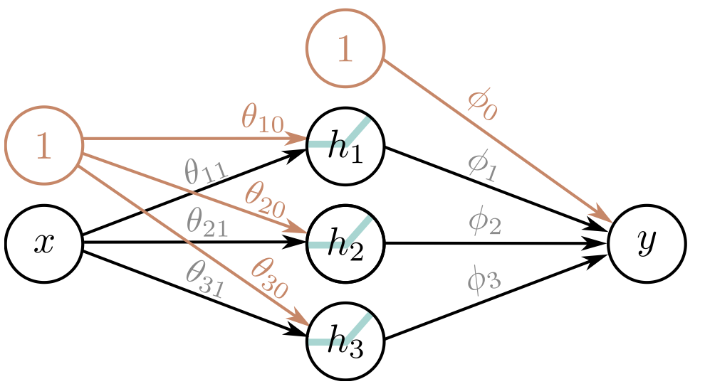{fig-align="center" width="80%"}


## Teorema de Aproximación universal
- Podemos agregar tantas neuronas/nodos como queramos a una red superficial $$y = \phi_0 + \sum_{d = 1}^D \phi_d h_d$$
- Donde $h_d = a(\theta_{d0} + \theta_{d1}x)$
- El número de neuronas de una red superficial mide la capacidad de la red 

## Teorema de Aproximación universal

- Si usamos la activación ReLU el output de una red superficial con D neuronas tiene cuando mucho D articulaciones
- Será una función lineal por partes de cuando mucho $D+1$ regiones lineales
- Si seguimos agregando unidades ocultas podemos aproximar funciones muy complejas
- **Teorema de Aproximación Universal:** con suficientes neuronas, una red superficial puede describir cualquier función continua en un subconjunto compacto de $\mathbb{R}^D$ con precisión arbitraria


## Teorema de Aproximación universal
```{r}
f_true <- function(x) cos(pi * x)
make_panel <- function(n_regions, col) {
  x_vals <- seq(0, 2, length.out = 500)
  y_true <- f_true(x_vals)
  knots_x <- seq(0, 2, length.out = n_regions + 1)
  knots_y <- f_true(knots_x)
  y_approx <- approx(knots_x, knots_y, xout = x_vals)$y
  df <- data.frame(x = x_vals, y_true = y_true, y_approx = y_approx)
  ggplot(df, aes(x = x)) +
    geom_line(aes(y = y_true), color = col, linetype = "dashed", size = 0.8) +
    geom_line(aes(y = y_approx), color = col, size = 1.5) +
    geom_hline(yintercept = 0, linetype = "dotted", color = "grey50") +
    labs(title = paste(n_regions, "regiones"), x = "x", y = "y") +
    coord_fixed(ratio = 1, xlim = c(0,2), ylim = c(-1,1)) +
    theme_minimal(base_size = 14) +
    theme(
      plot.title       = element_text(color = col, size = 16, face = "bold", hjust = 0.02),
      panel.background = element_rect(fill = "black", colour = NA),
      plot.background  = element_rect(fill = "black", colour = NA),
      panel.grid.major = element_line(colour = "grey30"),
      panel.grid.minor = element_line(colour = "grey20"),
      axis.text        = element_text(colour = "grey80"),
      axis.title       = element_text(colour = "grey90")
    )
}
p5  <- make_panel( 5, col = "deepskyblue3")
p10 <- make_panel(10, col = "tomato")
p20 <- make_panel(20, col = "steelblue")
combined <- plot_grid(p5, p10, p20, ncol = 3, align = "hv")
combined <- combined + theme(plot.background = element_rect(fill = "black", colour = NA))
print(combined)
```


## Inputs/Outputs de más dimensiones
- Todo lo que vimos se generaliza independientemente de la dimensión tanto de los inputs como de los outputs

## Outputs >> 1D
- Esta red tiene 1 input, 4 neuronas y dos outputs

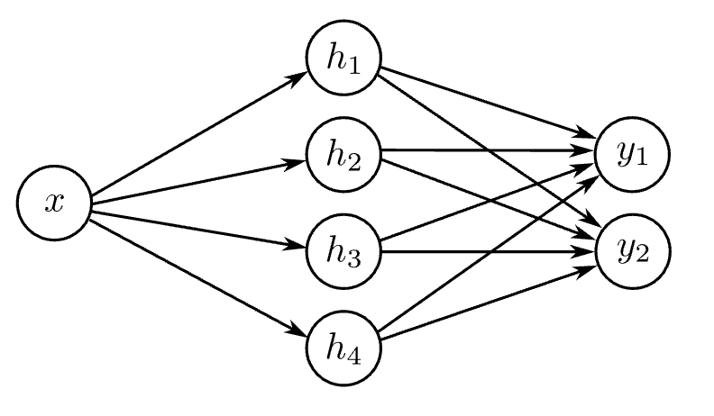{fig-align="center" width="80%"}

## Outputs >> 1D
- ¿Cómo escribiríamos la red de la slide anterior?
- Unidades ocultas: 
    - $h_1 = a(\theta_{10} + \theta_{11}x)$
    - $h_2 = a(\theta_{20} + \theta_{21}x)$
    - $h_3 = a(\theta_{30} + \theta_{31}x)$
    - $h_4 = a(\theta_{40} + \theta_{41}x)$
- Output:
    - $y_1 = \phi_{10} + \phi_{11}h_1 + \phi_{12}h_2 + \phi_{13}h_3 + \phi_{14}h_4$
    - $y_2 = \phi_{20} + \phi_{21}h_1 + \phi_{22}h_2 + \phi_{23}h_3 + \phi_{24}h_4$
  
  
    
## Outputs >> 1D
 - ¿Qué genera esta red?
 - 2 funciones por partes para cada uno de los outputs
 
```{r}
knots <- seq(0, 20, by = 4)  # six points → five regions

# sample values read off your sketch
y1_vals <- c( 0.5,  0.3, -0.2,  0.1,  0.0,  0.8)
y2_vals <- c(-0.5, -0.5,  0.0,  0.5, -0.6, -0.2)

# 2) Interpolate on a fine grid
x_fine <- seq(0, 20, length.out = 500)
y1_interp <- approx(knots, y1_vals, xout = x_fine)$y
y2_interp <- approx(knots, y2_vals, xout = x_fine)$y

df <- data.frame(
  x   = rep(x_fine, 2),
  y   = c(y1_interp, y2_interp),
  which = rep(c("y1","y2"), each = length(x_fine))
)

# 3) Vertical region dividers (except at 0 and 20)
vlines <- data.frame(x = knots[-c(1,length(knots))])

# 4) Plot
ggplot(df, aes(x = x, y = y, color = which)) +
  # region dividers
  geom_vline(data = vlines, aes(xintercept = x),
             linetype = "dashed", color = "grey30") +
  # piecewise curves
  geom_line(size = 1.5) +
  # axes and zero line
  geom_hline(yintercept = 0, linetype = "dotted", color = "grey50") +
  # color mapping
  scale_color_manual(
    values = c(y1 = "deepskyblue3", y2 = "tomato"),
    labels = c(y1 = expression(y[1]), y2 = expression(y[2])),
    guide  = guide_legend(override.aes = list(size = 1.5))
  ) +
  # labels
  labs(x = "Input, x", y = "Output, y", color = NULL) +
  # dark theme
  coord_cartesian(xlim = c(0,20), ylim = c(-1,1)) +
  theme_minimal(base_size = 14) +
  theme(
    plot.background  = element_rect(fill = "black", colour = NA),
    panel.background = element_rect(fill = "black", colour = NA),
    panel.grid       = element_blank(),
    axis.text        = element_text(colour = "grey80"),
    axis.title       = element_text(colour = "grey90"),
    legend.background = element_rect(fill = "black", colour = NA),
    legend.key         = element_rect(fill = "black", colour = NA),
    legend.text        = element_text(colour = "grey80")
  )
```
 
## Inputs >> 1D
- Esta red tiene inputs de dos dimensiones, 3 neuronas y output de 1 dimensión

{fig-align="center" width="80%"} 
 
 
## Inputs >> 1D
 - ¿Cómo escribiríamos la red de la slide anterior?
- Neuronas: 
    - $h_1 = a(\theta_{10} + \theta_{11}x_1 + \theta_{12}x_2)$
    - $h_2 = a(\theta_{20} + \theta_{21}x_1 + \theta_{22}x_2)$
    - $h_3 = a(\theta_{30} + \theta_{31}x_1 + \theta_{23}x_2)$
- Output:
    - $y = \phi_0 + \phi_1h_1 + \phi_2h_2 + \phi_3h_3$


## Inputs >> 1D: gráficamente 
- El input de cada unidad oculta es una función lineal de $x_1$ y $x_2$, osea un plano orientado. Las lineas son curvas de nivel
- A cada plano le aplicamos una función ReLU

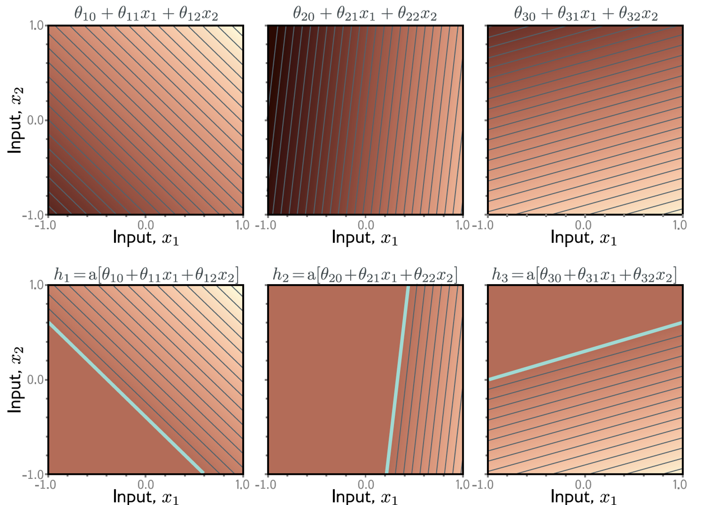{fig-align="center" width="80%"}

## Inputs >> 1D: gráficamente 
- Les aplicamos a las neuronas los pesos
- Ojo antes esto cambiaba la pendiente, pero como estamos en 2D cambia el gradiente lo que hace que las curvas de nivel se vean más o menos juntas
- $\phi$ escala la magnitud del gradiente (qué tan “empinado” es el plano) pero no su dirección (el ángulo del gradiente), porque multiplicas por un escalar


## Inputs >> 1D: gráficamente 

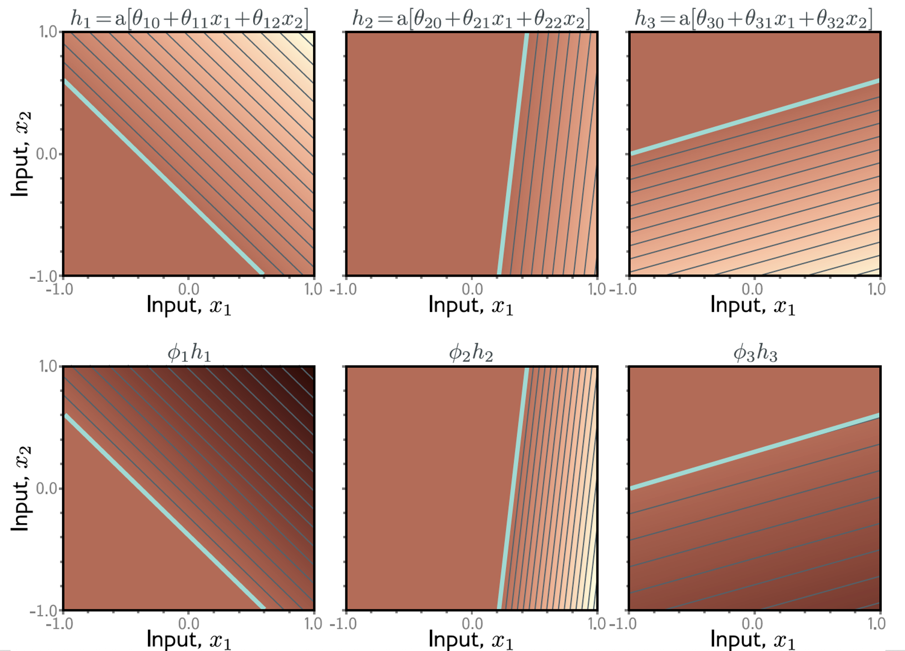{fig-align="center" width="80%"}

## Inputs >> 1D: gráficamente 
- Ponderamos los planos recortados 
- El resultado es una superficie compuesta por regiones poligonales lineales convexas por partes

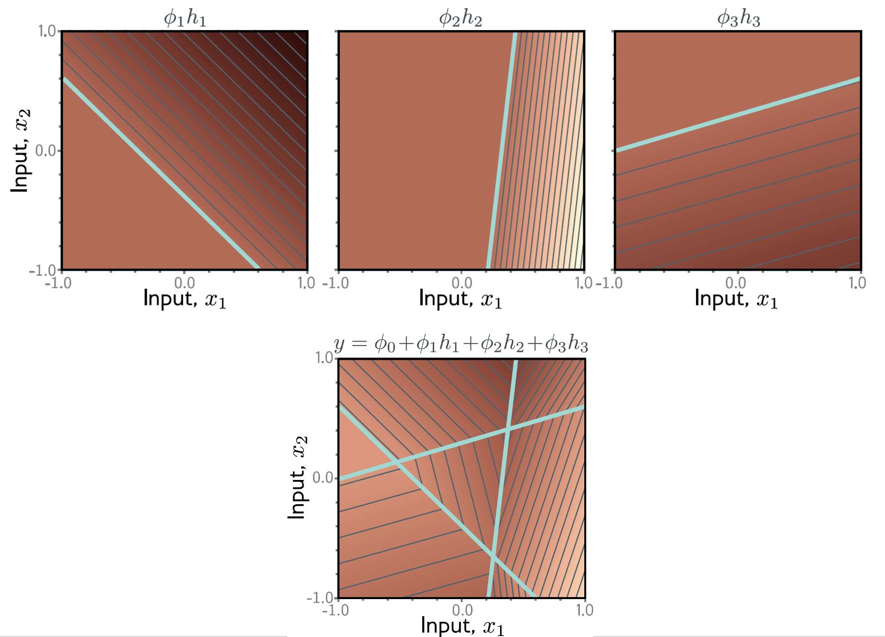{fig-align="center" width="80%"}

## Caso General
- Podemos generalizar esto para una cantidad arbitraria de inputs/outputs y neuronas 
- $D_o$ outputs, $D_i$ inputs y $D$ neuronas
- $h_d = a\Big(\theta_{d0} + \sum_{i=1}^{D_i} \theta_{di}x_i\Big)$
- $y_j = \phi_{j0} + \sum_{d=1}^D\phi_{jd}h_d$


## Caso general
- ¿Cuántos parámetros va a tener una red que se ve así?
<!-- 3 inputs (3*4 + 4*2  = 12 + 8 = 20) -->

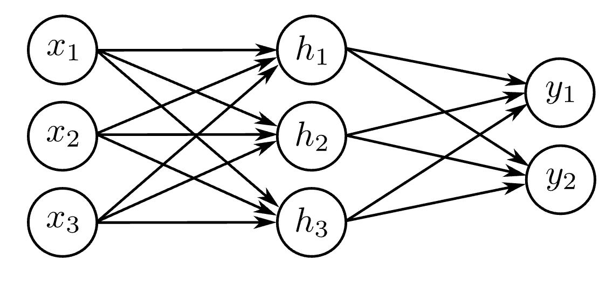{fig-align="center" width="80%"}


## Número de regiones
- En general cada output va a consistir en politopos convexos (poliedro en espacio de dimensión superior a tres) de D dimensiones
- En el ejemplo de antes vimos que con dos inputs y tres outputs hay 7 polígonos 

## Número de regiones
- Con $D=500$ y un input de dimensión 100 puede haber más de $10^{107}$ regiones
- Con $D=500$ y input de dimensión 100 tenemos 51001 parámetros (estos son pocos comparados con la mayoría de los modelos actuales)

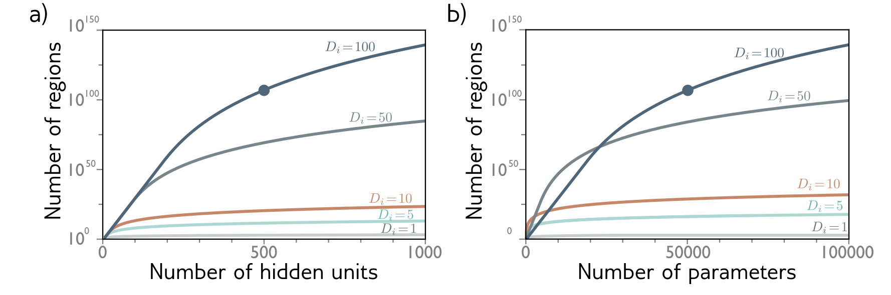{fig-align="center" width="80%"}


 
 
## Número de regiones
 - Con una red superficial con $D_i \geq 2$ inputs y $D$ neuronas 
 - La cantidad de regiones lineales está dada por la intersección de los D hiperplanos creados por las articulaciones de las funciones de activación 
- Zaslavsky  (1975) demostró el número de regiones creadas por $D$ hiperplanos en el espacio de entrada de dimensión $D_i ≤ D$
- La cantidad de regiones creadas por D hiperplanos donde $D_i \leq D$ es: 
 
 $$ 2^{D_i} \leq \sum_{j = 0} ^{D_i}\binom{D}{j} \leq 2^D$$
 
 
## Número de regiones 
 - 1D input con una neurona crea dos regiones (una articulación)
 - 2D input con dos neuronas crea 4 regiones (dos lineas)
 - 3D input con tres neuronas crea 8 regiones (3 planos)
 
 
 
# Redes Neuronales Profundas 


## ¿Qué es una red neuronal profunda?
- Una red con más de una capa intermadia (**hidden layer**).
- Recordemos que, si aumentamos la cantidad de neuronas/nodos en una red superficial, ganamos capacidad para describir patrones complejos.
- **Problema:** para ciertas funciones, la cantidad de neuronas necesarias en una sola capa es prohibitivamente grande.
- Las redes profundas pueden generar muchas más regiones lineales que una superficial, para un número equivalente de parámetros.  
- Son más eficientes que “alargar/ensanchar” una única capa, pero su comportamiento es menos intuitivo.  


## Pegando dos redes superficiales
- Red 1: input para la segunda red 
    - $h_1 = a(\theta_{10} + \theta_{11}x)$
    - $h_2 = a(\theta_{20} + \theta_{21}x)$
    - $h_3 = a(\theta_{30} + \theta_{31}x)$
    - $y = \phi_0 + \phi_1 h_1 + \phi_2 h_2 + \phi_3 h_3$
- Red 2: toma como input esta y y regresa $y'$ pasando por una segunda red
    - $h'_1 = a(\theta'_{10} + \theta'_{11}y)$
    - $h'_2 = a(\theta'_{20} + \theta'_{21}y)$
    - $h'_3 = a(\theta'_{30} + \theta'_{31}y)$
    - $y' = \phi'_0 + \phi'_1 h_1 + \phi'_2 h_2 + \phi'_3 h_3$
    

## Pegando dos redes superficiales
- Al componerlas, obtenemos **9 regiones** lineales con sólo 20 parámetros, frente a las 7 regiones de una red superficial equivalente.

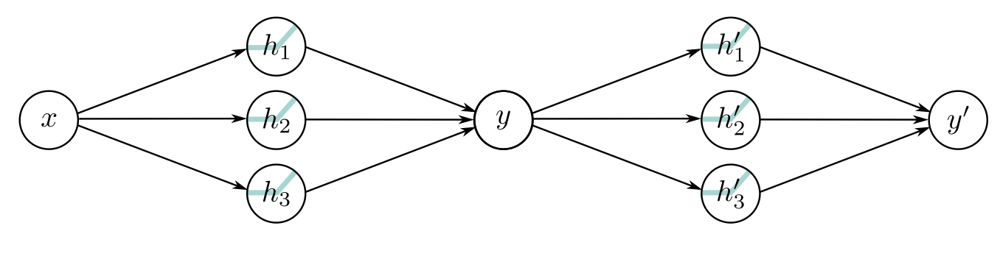{fig-align="center" width="80%"}


## ¿Cómo se ve esto?

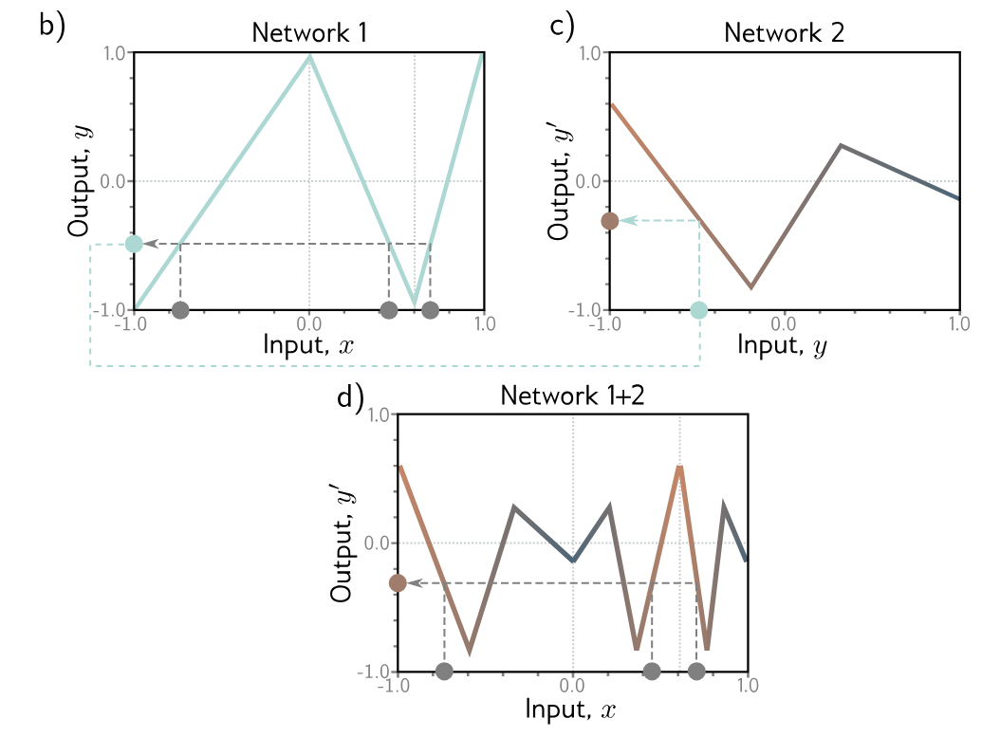{fig-align="center" width="80%"}


## ¿Qué esta pasando acá?
- La primera red mapea inputs $x\in[-1,1]$ a outputs $y\in[-1,1]$ usando una función por partes con 3 partes lineales 
- Varios inputs $x$'s (circulos grises) van a mapear a la misma y
- La segunda red es otra función lineal por partes con 3 regiones lineales, que toma y y regresa $y'$
- El resultado lo vemos en el último panel donde tenemos una función lineal por partes pero con 9 regiones! 
- En esta última gráfica vemos como nuestras x en gris se mapean al mismo $y'$

## Ejemplo de como se ve esto: 

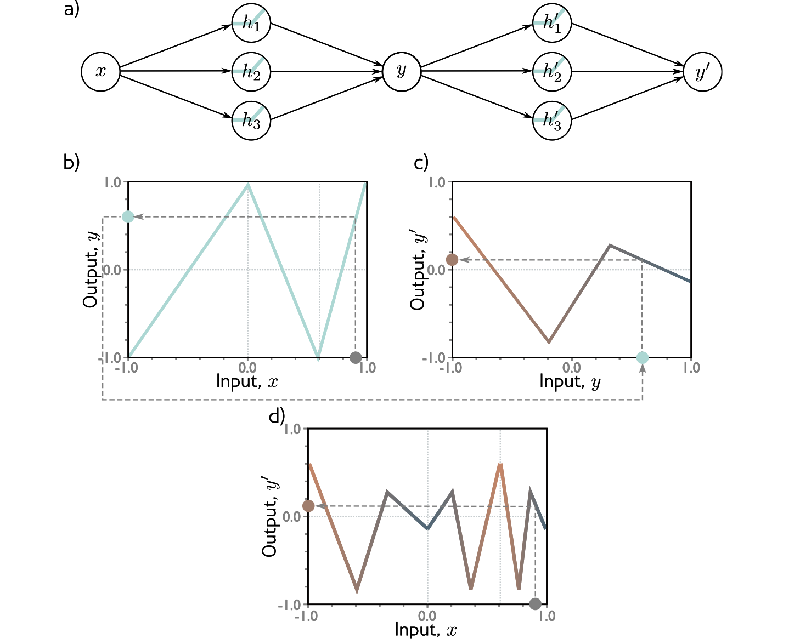{fig-align="center" width="80%"}


## Comparación: 
- ¿Cuántos parámetros y cuántas regiones produce esta red?
<!-- 20 parámetros y 9 o más regiones-->

{fig-align="center" width="80%"}


## Comparación: 
- ¿Cuántos parámetros y cuántas regiones produce esta red?
<!-- 19 parámetros y cuando mucho 7 regiones-->

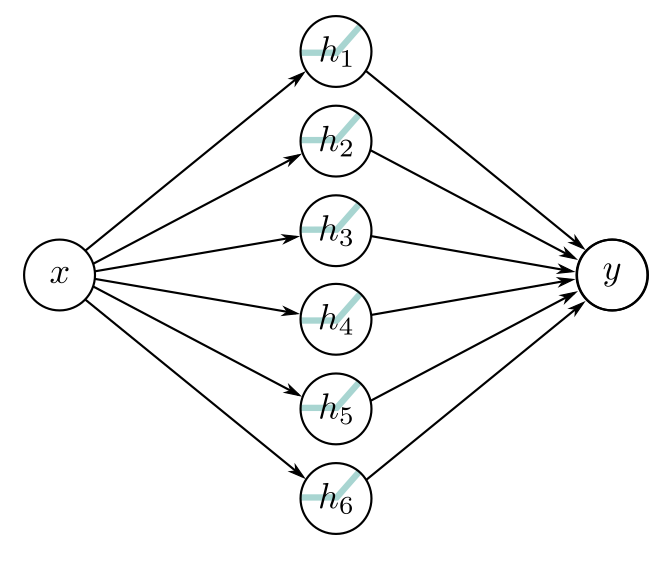{fig-align="center" width="80%"}

 

## ¿Cómo se ven estas dos redes en una sola ecuación? 
- Recordemos que podemos escribir las unidades ocultas de la segunda red de esta manera: 
    - $h'_1 = a(\theta'_{10} + \theta'_{11}y)$
    - $h'_1 = a(\theta'_{10} + \theta'_{11}\phi_0 + \theta'_{11}\phi_1 h_1 + \theta'_{11}\phi_2 h_2 + \theta'_{11}\phi_3 h_3)$
    - Podemos renombrar estos parámtros y escribirlo asi: 
    - $h'_1 = a(\psi_{10} + \psi_{11}h_1 + \psi_{12}h_2 + \psi_{13}h_3)$
- Siguiendo la lógica anterior podemos escribir a $y'$ en terminos de las x's y todos los parámtros re-definidos


## ¿Cómo construye una familia de funciones esta red? 

1. Las 3 neuronas h1, h2 y h3 son lineales y les aplicamos la función ReLU. 
2. La pre-activación en la segunda capa se calculan tomando 3 nuevas funciones lineales. En este punto tenemos una red superficial con 3 ouputs, hemos calculado 3 funciones por piezas con articulaciones entre las regiones en los mismos lugares. 
3. Le aplicamos ReLU a esta segunda capa lo que junta y agrega las nuevas articulaciones a la función
4. El resultado es una combinación lineal de estas unidades ocultas


## Hiperparámetros

- ¿Qué es un hiperparámetro?
- En una red neuronal profunda tenemos: 
    - K capas: que tan profunda es la red
    - $D_k$ para $k=1,...K$ neuronas por capa: que tan ancha/larga es la red 
- Los seleccionamos antes de entrenar el modelo 
- Para un set de hiperparámetros el modelo describe una familia de funciones y de parámetros que determinan el modelo en particular 

## ¿Qué es un hiperparámetro?
- Podemos re-entrenar con otros parámetros... recordemos: optimización de hiperparámetros o busqueda de hiperparámetros. 
- Tomando en cuenta los hiperparámetros la red representa una familia de familias que relacionan los inputs con los outputs 


## ¿Cómo escribimos una red neuronal profunda general?
- Para cada capa h: 
    - $h_1 = a(\theta_{10} + \theta_{11}x)$
    - $h_2 = a(\theta_{20} + \theta_{21}x)$
    - $h_3 = a(\theta_{30} + \theta_{31}x)$
- Se puede re-escribir como: 

$$\begin{bmatrix}
h_1 \\
h_2 \\
h_3
\end{bmatrix} = a\Bigr(\begin{bmatrix}
\theta_{10} \\
\theta_{20} \\
\theta_{30}
\end{bmatrix} + \begin{bmatrix}
\theta_{11} \\
\theta_{21} \\
\theta_{31}
\end{bmatrix}x \Bigr)$$


## ¿Cómo escribimos una red neuronal profunda general?
- Podemos hacer lo anterior con todas las partes de la red y escribir todo en forma vectorial de la siguiente manera: 
     - $\mathbf{h} = a(\boldsymbol{\theta}_0 + \boldsymbol{\theta}\, \mathbf{x})$
     - $\mathbf{h}' = a(\boldsymbol{\psi}_0 + \boldsymbol{\Psi}\, \mathbf{h})$
     - $y = \boldsymbol{\phi}'_0 + \boldsymbol{\phi}'\, \mathbf{h}'$
- Entonces podemos escribir todas las capas en términos de un vector de bias y una matriz de pesos 
     - $\mathbf{h}_1 = a(\boldsymbol{\beta}_0 + \boldsymbol{\Omega}_0\, \mathbf{x})$
     - $\mathbf{h}_2 = a(\boldsymbol{\beta}_1 + \boldsymbol{\Omega}_1\, \mathbf{h}_1)$
     - $y = \boldsymbol{\beta}_2 + \boldsymbol{\Omega}_2\, \mathbf{h}_2$
     
     
     
     
## Hiperparámetros
- **¿Qué es un hiperparámetro?**  
  Parámetro que se define **antes** del entrenamiento (no se aprende con backprop).

- En redes profundas típicamente ajustamos:
  - **K capas:** profundidad de la red.  
  - **\(D_k\) unidades por capa \(k\):** largo de cada capa.  
- Cada combinación define una familia de funciones; luego entrenamos (optimización de hiperparámetros).     
     

## Redes superficiales vs profundas 


| Propiedad                     | Superficiales    | Profundas          |
|-------------------------------|------------------|--------------------|
| Teorema de Aproximación      | ✅                | ✅                 |
| Regiones lineales            | \(D+1\)         | \((D+1)K\)        |
| Procesamiento local → global | ❌               | ✅                 |
| Facilidad de entrenamiento   | Difícil           | “Fácil”           |
| Generalización               | Peor             | Mejor              |


## Redes superficiales vs profundas: Teorema de aproximación universal 
- Las redes neuronales superficiales con suficiente capacidad (neuronas) pueden modelar cualquier función continua
- Una red neuronal profunda con dos capas intermedias puede interpretarse como la composición de dos redes superficiales
- Si la segunda red es la función identidad $\implies$ la red profunda replica a la superficial
- Y entonces puede aproximar cualquier función continua con suficiente capacidad (neuronas y capas intermedias)


## Redes superficiales vs profundas: número de regiones lineales

- Una red superficial de 1 input, 1 output y D unidades ocultas crea $D+1$ regiones lineales y está definida por $3D + 1$ parámetros
- Una red profunda con 1 input, 1 output, K capas de $D>2$ neuronas crea hasta $(D + 1)K$ regiones usando $3D + 1 + (K − 1)D(D + 1)$ parámetros
- Las redes profundas crean funciones más complejas con una cantidad de parámetros fijos 
- Si aumentamos las dimensiones del input $D_i$ aumentan tanto el número de parámetros como de regiones 


## Redes superficiales vs profundas: número de regiones lineales

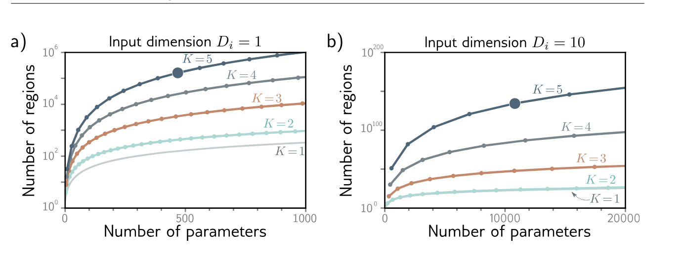{fig-align="center" width="80%"}

    
    
## Redes superficiales vs profundas: procesamiento de local a global
- Solo hemos visto redes completamente conectadas 
- Esto en general no es práctico porque genera demasiados parámetros e ignora la estructura de los datos
- La solución por ejemplo para imágenes es procesar en paralelo distintas partes de una imagen e ir integrando más información de regiones más grandes
- Este procesamiento de local a global solo se puede hacer con múltiples capas

## Redes superficiales vs profundas: entrenamiento
- En general es más fácil entrenar una red profunda pequeña que una red superficial muy larga
- Empíricamente sabemos lo siguiente: 
    - es "fácil" entrenar modelos profundos sobreparametrizados 
    - la posible explicación es que exista una gran familia de soluciones aproximadamente equivalentes que son fáciles de encontrar
    - pero si seguimos agregando capas se vuelve extremadamente difíciles de entrenar 

## Redes superficiales vs profundas: generalización
- Las redes profundas generalizan mejor a nuevos datos que las superficiales
- En la practica los mejores resultados se han obtenido con redes profundas con decenas o cientos de capas intrermedias 
- No entendemos bien porque pasa esta parte del entrenamiento y la generalización

 
 