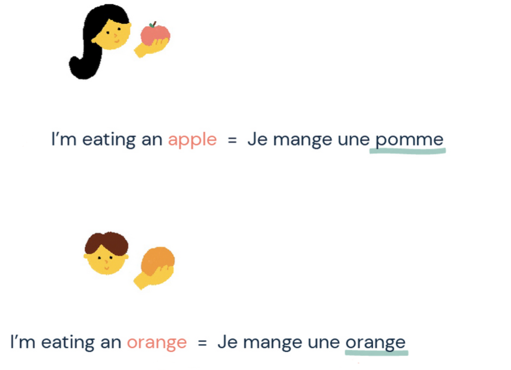
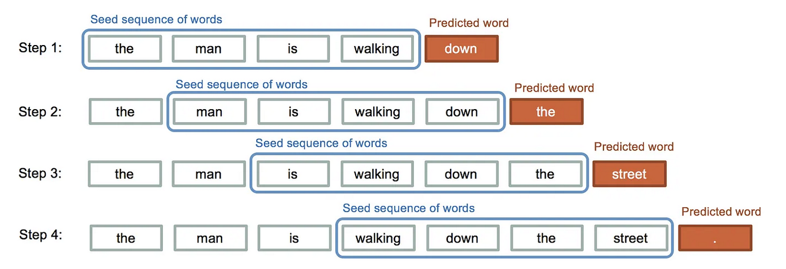
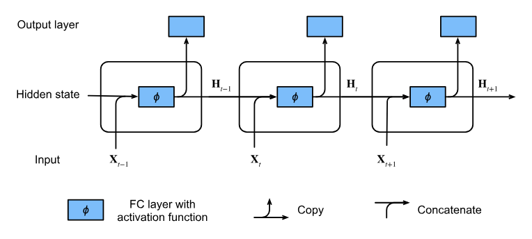
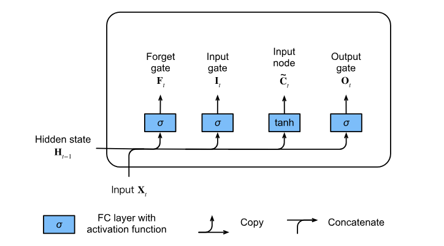
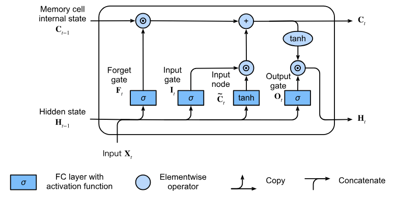
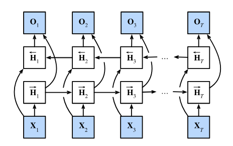

```{r setup, include=FALSE}
knitr::opts_chunk$set(echo = FALSE)
knitr::opts_chunk$set(message = FALSE, warning = FALSE)
knitr::opts_chunk$set(fig.width = 6.5, fig.height = 3.6, out.width = "70%", fig.align = "center", dev = "cairo_pdf")
```


# Introducción


## Podemos hacer lo siguiente con las redes que aprendimos hasta ahora 

{fig-align="center" width="75%"}


## Podemos hacer lo siguiente con las redes que aprendimos hasta ahora 

{fig-align="center" width="75%"}


## Podemos hacer lo siguiente con las redes que aprendimos hasta ahora 

{fig-align="center" width="75%"}


## ¿Qué es una RNN?
- Recurrent neural networks
- Nos van a ayudar a completar tareas que tengan que ver con datos secuenciales
- Pueden aceptar tanto inputs como outputs que son secuencias 
- Van a capturar las dinámicas de las secuencias usando conexiones recurrentes
- Casi todos las tareas que resuelven las RNNs tienen que ver con procesamiento del lenguaje natural 


## ¿Qué tipo de tareas nos van a ayudar a resolver?
- Secuencias como outputs: image captioning, generar música, etc
- Secuencias como inputs: analisis de videos, clasificación de textos, clasificación de audio, etc 
- Secuencias como inputs y outputs: traducción, chatbots, predicción de texto, etc 

# ¿Cómo trabajamos con secuencias? 

## Secuencias de inputs 
- Ahora nuestros inputs van a ser secuencias 
- Lista ordenada de vectores de características $x_1,...,x_T$
- Donde $x_t$ es el vector en el `time step` $t$ y $t\in \mathbb{Z}^{+}$
- Por ejemplo nuestros inputs pueden ser: 
    - una colección de documentos, cada documento es una secuencia con su propia longitud $T_i$
    - representación secuencial de las estancias de un paciente en el hospital, cada estancia es un conjunto de eventos y la longitud de la secuencia depende de cuanto duro la estancia en el hospital 
    
## Secuencias de inputs 
- Cuando teníamos inputs individuales asumimos que los sampleamos los datos de manera independiente de una distribución $P(X)$
- Ahora vamos a asumir que toda la secuencia la sampleamos de manera independiente de una distribución de secuencias
- Pero no podemos asumir esto de los datos dentro de las secuencias ¿por qué?


## Secuencias de outputs 
- Depende de la tarea vamos a querer que la secuencia de inputs genere: 
    - un solo input por ejemplo clasificar un texto $y$
    - una secuencia $(y_1,...,y_T)$ traducción 
    
  
  
## Modelos Autoregresivos
- Si tenemos datos como estos
- ¿Cómo calcularíamos el precio el siguiente día?

```{r,echo=FALSE}
packages <- c("dplyr", "ggplot2", "scales")
invisible(lapply(packages, library, character.only = TRUE))
from <- as.Date("1984-01-01")
to   <- as.Date("2015-01-01")
# Los datos del FTSE se leen de un cache local; solo se descargan de Yahoo
# (requiere red y el paquete quantmod) si el CSV no existe todavia.
ftse_csv <- "data/ftse.csv"
if (file.exists(ftse_csv)) {
  ftse <- read.csv(ftse_csv)
  ftse$Date <- as.Date(ftse$Date)
} else {
  library(quantmod)
  ftse_xts <- quantmod::getSymbols("^FTSE", src = "yahoo", from = from, to = to, auto.assign = FALSE)
  ftse <- data.frame(
    Date  = as.Date(index(ftse_xts)),
    Close = as.numeric(Cl(ftse_xts))
  )
  dir.create("data", showWarnings = FALSE)
  write.csv(ftse, ftse_csv, row.names = FALSE)
}
ftse <- ftse %>%
  dplyr::filter(Date >= from, Date <= to)
ggplot(ftse, aes(Date, Close)) +
  geom_line(linewidth = 0.6, color = "#3C6EB4") +
  scale_x_date(
    limits = c(from, to),
    breaks = seq(as.Date("1984-01-01"), as.Date("2014-12-31"), by = "2 years"),
    date_labels = "%Y"
  ) +
  scale_y_continuous(
    limits = c(0, 8000),
    breaks = seq(0, 8000, by = 1000),
    labels = scales::label_number()
  ) +
  labs(title = "FTSE 100 Index", x = NULL, y = NULL) +
  theme_minimal(base_size = 12) +
  theme(
    plot.title = element_text(hjust = 0.5, face = "bold", size = 16),
    panel.grid.minor = element_blank(),
    panel.grid.major = element_line(color = "grey80", linewidth = 0.4),
    axis.text.x = element_text(
      angle = 45,             
      hjust = 1,          
      vjust = 1,        
      margin = margin(t = 4)
    ),
    axis.text.y = element_text(margin = margin(r = 4)),
    plot.margin = margin(10, 20, 10, 20)
  )

```
    


## Modelos Autoregresivos
- Si no tenemos ninguna otra característica más que el pasado del precio podemos usarlo para predecir 
- Nos interesa algo como: $P(x_t|x_{t-1},...,x_1)$
- Estimar esta probabilidad no es tan fácil así que podríamos aspirar a algo como:

$$E[x_t|x_{t-1},...,x_1]$$

- ¿Cómo? podemos usar una regresión lineal sobre los valores pasados un modelo autoregresivo
- El problema acá: el número de inputs aumenta junto con $t$ 
- Cada ejemplo en el tiempo va a tener un número distinto de características 


## Modelos Autoregresivos
- Existen varias maneras de restringir el número de features cuando t aumenta
- Opción 1: Usar una ventana de tamaño $\tau$:
    - Todo lo mas alejado en el tiempo puede que no influya tanto 
    - La cantidad de características ahora esta fija y es menor que t
    - $\implies$ el input es fijo y podemos usar casi cualquier modelo de ML
    
## Modelos Autoregresivos    
- Opción 2: Usar variables latentes 
    - Guardamos un resumen del pasado en una variable $h_t$
    - Actualizamos esta $h_t$ en cada momento del tiempo junto con $x_t$
    - Ahora queremos $\hat{x}_t = P(x_t|h_t)$ y $h_t = g(h_{t-1},x_{t-1})$
    - Estos modelos se conocen como modelos latentes autoregresivos
    - Nunca observamos $h_t$ por eso son latentes 


## Estacionariedad 
- Cuando tengamos datos secuenciales normalmente vamos a construir los ejemplos de entrenamiento sampleando ventanas de la secuencia de manera aleatoria
- Estamos asumiendo que la dinámica con la que se generan las nuevas observaciones dada la secuencia no cambia
- Este supuesto se conoce como estacionariedad  


## Estacionariedad 
- En estadística hay dos definiciones de estacionariedad

1. Estricta: un proceso estocástico ${X_t}$ es estrictamente estacionario si su distribución conjunta para $(X_{t_1},X_{t_2},...,X_{t_k})$ es la misma que para $(X_{t_1 + h},X_{t_2 + h},...,X_{t_k + h})$ para cualquier $h$ 
    - la probabilidad no cambia si nos desplazamos sobre la secuencia 

2. Débil: normalmente la que se asume en DL 
    - si la media es constante $E[X_t] = \mu \quad \forall t$
    - si la varianza es constante y finita $Var(X_t) = \sigma^2 \quad \forall t$
    - la autocovarianza solo depende de $h$: $\gamma(h) = Cov(X_t, X_{t+h})$
    

## ¿Por que nos importa la estacionariedad? 
- Si los datos no son estacionarios entonces una RNN entrenada en una parte de la secuencia no va a funcionar en otras partes
- Existen varios trucos de pre-procesamiento para intentar hacer los datos 'mas' estacionarios
- Dependiendo de la tarea esto puede incluir diferencias, quitar tendencias, ajustar estacionalmente, etc


## Modelos Secuenciales 
- Un modelo secuencial va a ser aquel que estima la probabilidad conjunta de toda la secuencia
- Para texto normalmente estos modelos se llaman modelos del lenguaje 
- Como casi todos estos modelos iniciaron en texto muchos libros/papers etc van a usar de manera intercambiable modelo de secuencia y modelo de lenguaje 
- ¿Qué van a hacer los modelos del lenguaje?
    - Calcular la verosimilitud de una oración 
    - Samplear secuencias verosímiles 
    - Optimizar por la secuencia más probable 
    


## Modelos del Lenguaje 
- Podemos escribir un modelo del lenguaje como un problema autoregresivo
- Descomponemos la distribución conjunta 

$$P(x_1,...,x_T) = P(x_1)\prod_{t=2}^TP(x_t|x_{t-1},...,x_1)$$


## Modelos de Markov
- Una secuencia satisface la *condición de Markov*, el futuro es condicionalmente independiente del pasado dado la historia reciente
- Si $\tau = 1$ modelo de Markov de primer orden
$$P(x_1,...,x_T) = P(x_1)\prod_{t=2}^TP(x_t|x_{t-1})$$


- Si $\tau = k$ modelo de Markov de orden k


## Orden
- ¿Por qué caracterizamos las secuencias de izquierda a derecha?
    - es el orden natural del texto en español (y en muchos otros idiomas)
    - factorizando el orden si tenemos la probabilidad de la secuencia hasta $x_t$ fácilmente podemos calcular la que llega a $x_{t+1}$
    - los modelos van a ser mejores si predecimos la palabra que sigue a si intentamos predecir la que sigue después de otros 100/200 pasos 
    
    
    
    
# Modelos del Lenguaje

## ¿Cómo transformamos el texto en algo que la máquina pueda leer?
- Normalmente vamos a usar pre-procesamiento y esto se basa en 4 pasos
1. Cargar el texto a la memoria
2. Dividir los strings en tokens
3. Construir un vocabulario y asociar cada elemento del vocabulario son un indice numérico
4. Convertir el texto en secuencias


## Tokens
- Unidades atómicas indivisibles de texto 
- Cada *time step t* va a ser un token 
- Un token puede ser una palabra o un caracter va a depender de lo que queramos contestar 

## Vocabulario
- Asocia cada token a un valor único en un índice 
- Primero identificamos el conjunto de tokens únicos en nuestro corpus de entrenamiento 
- Luego le asignamos un índice único a cada token
- Necesitamos un token `<unk>` que representa un token nunca antes visto!

## Estadísticas del Lenguaje
- *stop words* palabras frecuentes en un idioma que no son particularmente descriptivas en español son palabras como *a, el, de, en, del,..* 
- Algoritmos sencillos de NLP normalmente las eliminan, pero las redes no lo harán estas palabras dan contexto y pueden ayudarnos
- La frecuencia de las palabras en un texto sigue la Zipf’s law que nos dice que la frecuencia de la $i$ palabra más común esta dada por

$$n_i \propto \frac{1}{i^\alpha} \quad \equiv\quad log n_i = -\alpha log i + c$$

    

## Estadísticas del Lenguaje
- Dada la  Zipf’s law no parece tan buena idea solo contar estadísticas de las palabras
- Vamos a sobre estimar las palabras poco frecuentes
- Si graficamos los bigramas (conjuntos de dos palabras) y los trigramas (conjuntos de tres palabras) ambas siguen la Zipf’s law pero con $\alpha$'s más pequeñas
- El número de n-grams únicos disminuye conforme aumentamos n 
- Algunos n-grams casi nunca los vamos a ver 

## ¿Cómo aprenden los modelos del lenguaje?
- Primero necesitamos convertir en tokens nuestro texto y aplicar probabilidades
\small

$$P(deep,learning,is,fun) = P(deep)P(learning|deep)P(is|deep,learning)P(fun|deep,learning,is)$$

\normalsize
- ¿Cómo vamos a estimar estas probabilidades?
     - asumimos que tenemos un corpus enorme (todo el internet/Wikiped/..)
     - contamos
     - $\hat{P}(learning|deep) = \frac{n(deep,learning)}{n(deep)}$
     

## ¿Cómo aprenden los modelos del lenguaje?     
- Hay algún problema con calcular así las probabilidades observadas de bigramas?
- Que pasa con parejas raras.. o con palabras que nunca ocurren juntas


## Laplace smoothing 
- La solución para no tener probabilidades de 0 cuando contamos n-grams
- Agregamos una pequeña constante 
- Si n es el número de palabras en los datos de entrenamiento y m la cantidad de palabras únicas
    - $\hat{P}(x) = \frac{n(x) + \epsilon_1/m}{n + \epsilon_1}$
    - $\hat{P}(x'|x) = \frac{n(x,x') + \epsilon_2\hat{P}(x)}{n + \epsilon_2}$
    - $\hat{P}(x''|x,x') = \frac{n(x,x',x''') + \epsilon_3\hat{P}(x'|x)}{n(x,x') + \epsilon_3}$
- Donde las $\epsilon$'s son hiperparámetros


## Laplace smoothing 
- Parece una buena solución pero...:
    - muchos n-grams casi no ocurren
    - tenemos que guardar todas estas sumas en algún lado 
    - ignora el significado de las palabras 
    - las secuencias muy largas por lo general son únicas un modelo como este es incapaz de generalizar 
    

## ¿Cómo vamos a medir que tan bien lo hace un modelo del lenguaje?
- Idealmente queremos medir la verosimilitud de una secuencia
- Este número por lo general es difícil de entender y de calcular
- ¿Por qué? 
    - las secuencias cortas son mas probables que las largas
    - queremos algo como un promedio para poder comparar entre secuencias largas y cortas


## ¿Cómo vamos a medir que tan bien lo hace un modelo del lenguaje?
- Un modelo del lenguaje mejor deberías de ser capaz de predecir de manera mas precisa que token sigue
- Medir que tan cercana es la distribución de probabilidad del modelo comparada con los datos reales

## ¿Cómo vamos a medir que tan bien lo hace un modelo del lenguaje?
- Si normalizamos y sacamos el logaritmo de la verosimilitud regresamos a la cross-entropy 
$$ \frac{1}{n}\sum_{t=1}^n -log P(x_t|x_{t-1},...,x_1)$$

- Donde P es nuestro modelo del lenguaje y $x_t$ es el token que observamos en el paso t 
- Ahora podemos ver que tan bien lo hace el modelo independientemente de la longitud de la secuencia 

## Perplejidad
- Por razones históricas no vamos a usar la entropía cruzada sino una transformación de la misma llamada perplejidad
$$ exp \Big(\frac{1}{n}\sum_{t=1}^n -log P(x_t|x_{t-1},...,x_1)\Big)$$

- Si el modelo es perfecto, siempre le atina la probabilidad es 1 $\implies$ perplejidad de 1
- Si el modelo lo hace mal en todos los tokens la probabilidad es 0 $\implies$ la perplejidad $\to \infty$

## Perplejidad
- Si el modelo predice una distribución uniforme sobre todos los tokens del vocabulario entonces la perplejidad va a ser igual al número de tokens únicos en el vocabulario
- Esto va a ser una buena cota superior para saber si nuestro modelo lo esta haciendo al menos mejor que una uniforme en todo el vocabulario


## ¿Cómo creamos minibatches para el entrenamiento?
- Supongamos que tenemos una secuencia de T tokens 
- Para poder entrenar el modelo necesitamos partir la secuencia en sub-secuencias
- Al principio de cada época vamos a introducir cierta aleatoriedad y vamos a tirar los primeros $d \sim U[0,n)$
- Partimos lo que queda de la secuencia en $m = \lfloor{(T-d)/n} \rfloor$
- Queremos sub-secuencias de tamaño n
- Cada una de estas subsecuencias las vamos a usar de input en el modelo 
- Como queremos predecir el siguiente token las etiquetas van a ser las secuencias originales desplazadas un token 


# RNNs

## Estado Oculto 
- Vamos a usar como inspiración los modelos autoregresivos con variables latentes
- En vez de modelar la probabilidad del token $x_t$ como dependiente de toda la secuencia previa
- La vamos a modelar como dependiente de una variable latente $h_{t-1}$

$$P(x_t|x_{t-1},...,x_1) \approx P(x_t|h_{t-1})$$

- Donde $h_{t-1}$ va a ser el estado oculto o *hidden state* y guarda información hasta el paso $t-1$


## Estado Oculto 
- Podemos calcular el *hidden state* de la siguiente manera

$$h_t = f(x_t,h_{t-1})$$

- Ojo *hidden layer $\neq$ hidden state* en español deberíamos de tener menos problemas porque capa intermedia es muy distinto que estado oculto o latente 
- RNNs son rede con hidden states!


## Notación redes neuronales 
- Capa intermedia $H = \phi(XW_{xh} + b_h)$
- Capa de salida: $O = HW_{hq} + b_q$ si es clasificación nos falta la softmax acá 


## *Hidden State*
- Si estamos en el time step t 

$$H_t = \phi(X_tW_{xh} + H_{t-1}W_{hh} + b_h)$$

- La capa intermedia en t va a ser una ponderación entre los inputs en t y la capa intermedia del time step anterior $t-1$
- El objetivo es que $H_{t-1}$ nos ayude a conservar la historia parecido a nuestra variable latente autoregresiva
- El resultado de este tipo de capa intermedia va a ser nuestro *hidden state*


## *Hidden State*
- Las capas que tengan esto se llaman capas recurrentes
- El output se va a ver igual que antes $O = HW_{hq} + b_q$ 
- Ojo: los parámetros no van a cambiar entre time steps, así que no van a aumentar los parámetros arbitrariamente con el número de pasos


##  *Hidden State*

{fig-align="center" width="75%"}


## Profundidad
- Las redes de las que hemos hablado hasta ahora son profundas
- Pero en lugar de muchas capas intermedias la longitud de la secuencia introduce una nueva profundidad 
- Además de recorrer la red como antes de input-output pasando por capas intermedias ahora los inputs en el primer time step recorren la cadena de capas recurrentes T para influir el output  
- Si hacemos propagación  hacia atrás vamos a tener problemas parecidos que con redes de muchas capas
    - inestabilidad numérica $\implies$ que los gradientes explotan o desaparezcan 
- ya conocemos un par de técnicas para evitar esto en capas intermedias ahora veremos como hacerlo en capas recurrentes 

## Recortar gradientes (gradient clipping)
- Nos va a ayudar a evitar gradientes que explotan 
- Usando GD con una tasa de aprendizaje de $\eta$ $x \leftarrow x - \eta g$ con g el gradiente
- Una función es  continua de Lipschitz si cumple con lo siguiente 

$$|f(x) - f(y)| \leq L\|x - y\|$$

- Si avanzamos un paso en el GD esto se ve así: 
$$|f(x) - f(x - \eta g)| \leq L\eta \|g\|$$

## Recortar gradientes (gradient clipping)
- Esto nos da un cota superior a cuanto va a cambiar la función objetivo cuando nos movemos 
- Si esta cota superior no es muy grande puede se bueno y malo
    - malo nos vamos a mover muy lento 
    - bueno un paso no va a brincar demasiado 
- Si $\|g\|$ es muy grande decimos que los gradientes explotan y un solo paso del GD puede movernos en dirección contraria del mínimo deshaciendo todo lo que habíamos avanzado 
- La solución sin mover mucho la tasa de aprendizaje: recortar el gradiente 


## Recortar gradientes (gradient clipping)

$$g \leftarrow min\Big(1, \frac{\theta}{g}\Big)g$$

- Esto asegura que la norma del gradiente nunca es mas grande que $\theta$
- Y que el nuevo gradiente va en la dirección del original, no va a saltar el GD 
- También reduce el efecto que cada minibatch puede tener en el entrenamiento
- Esto es un truco pero no sabemos analíticamente como afecta encontrar o no el mínimo
- Solo sabemos que se usa mucho con RNNs porque vuelve el entrenamiento menos inestable 


## Propagación hacia atrás a traves del tiempo (secuencia)
- Vamos a necesitar desenrollar el grafo de la red paso a paso 
- Esta RNN desenrollada es una red neuronal 'normal' con la propiedad de que se repiten algunos parámetros a lo largo de la red 
- Así que a esta red desenrollada le podemos aplicar propagación hacia atrás como lo hacemos en cualquier otra red 
- El problema viene de que la mayoría de las secuencias son muy largas 


## Gradientes
- *hidden state* $h_t = f(x_t, h_{t-1}, w_h)$

- output del time step t: $o_t = g(h_t, w_o)$
- Medimos el error como $L(x_1,...,x_T,y_1,...,y_T,w_h,w_o) = \frac{1}{T}\sum_{t=1}^Tl(y_t,o_t)$
- Para propagación hacia atrás vamos a necesitar calcular 

$$\frac{\partial L}{\partial w_h} = \frac{1}{T}\sum_{t=1}^T\frac{\partial l(y_t,o_t)}{\partial w_h} $$
$$= \frac{1}{T}\sum_{t=1}^T\frac{\partial l(y_t,o_t)}{\partial o_t}\frac{\partial g(h_t,w_o)}{\partial h_t}\frac{\partial h_t}{\partial w_h}$$

- Los primeros dos términos de esto son fáciles de sacar el tercero no tanto 


## Gradientes
- $\frac{\partial h_t}{\partial w_h}$ se calcula de manera recurrente

$$\frac{\partial h_t}{\partial w_h} = \frac{ \partial f(x_t,h_{t-1},w_h)}{\partial  w_h} + \frac{ \partial  f(x_t,h_{t-1},w_h)}{\partial h_{t-1}}\frac{\partial h_{t-1}}{\partial w_h}$$

- ¿Cómo sacamos esto? vamos a usar un truco 


## Gradientes
- Tenemos tres secuencias $\{a_t\},\{b_t\},\{c_t\}$
- Donde $a_0 = 0$
- $a_t = b_t + c_ta_{t-1}$ entonces podemos escribir esto de la siguiente manera 

$$a_t = b_t + \sum_{i=1}^{t-1}\Big(\prod_{j=i+1}^t c_j\Big)b_i$$

## Gradientes
- Si nos damos cuenta estas secuencias nos sirven para reescribir nuestros gradientes 
- $a_t = \frac{\partial h_t}{\partial w_h}$
- $b_t = \frac{\partial f(x_t,h_{t-1},w_h)}{\partial w_h}$
- $c_t = \frac{\partial f(x_t,h_{t-1},w_h)}{\partial h_{t-1}}$
- Y podemos escribirlo como: 

\small

$$\frac{\partial h_t}{\partial w_h} = \frac{\partial f(x_t,h_{t-1},w_h)}{\partial w_h} + \sum_{i=1}^{t-1}\Big(\prod_{j=i+1}^t \frac{\partial f(x_t,h_{j-1},w_h)}{\partial h_{j-1}}\Big)\frac{\partial f(x_t,h_{i-1},w_h)}{\partial w_h}$$

\normalsize

- podemos calcular esta regla de la cadena pero si es muy larga va a ser un problema 


## ¿Cómo calculamos el gradiente?
- **Completo**: se puede pero va a ser muy lento y puede explotar rápidamente
- **Truncado en el tiempo**:
    - Podemos truncar la suma después de $\tau$ pasos 
    - Aproximación del verdadero gradiente 
    - El modelo se centra en la influencia de corto plazo (igual y esto no es tan mala idea)
    
    
## ¿Cómo calculamos el gradiente?    
- **Truncado aletoriamente**:
    - Usamos una secuencia $\xi_t$ donde $P(\xi_t = 0) = 1 - \pi_t$ y $P(\xi_t = \pi_t^{-1}) =\pi_t$ y con $E[\xi_t] = 1$
    - Entonces $z_t = \frac{\partial f(x_t,h_{t-1},w_h)}{\partial w_h} + \xi_t\frac{\partial f(x_t,h_{t-1},w_h)}{\partial h_{t-1}}\frac{\partial h_{t-1}}{\partial w_h}$
    - Esta variable nueva sustituye a $\frac{\partial h_t}{\partial w_h}$ pero su esperanza es igual $E[z_t] = \frac{\partial h_t}{\partial w_h}$
    - Si $\xi_t = 0$ el calculo recurrente termina en t
    - Terminamos con una suma ponderada de secuencias de distintos tamaños 
    

## ¿Cuál es mejor?
- **Truncado aletoriamente**: divide el texto en segmentos de distintas longitudes
- **Truncado en el tiempo**: divide el texto en sub secuencias del mismo tamaño 
- Aunque truncar aleatoriamente parece buena idea no lo hace mejor que solo truncar  
- Regularizar con un tamaño de paso fijo va a tener efecto regularizador en la red y traerá varios de sus beneficios 


# Long Short-Term Memory (LSTM)

## ¿De dónde vienen?
- Las RNNs sencillas sufren de vanishing / exploding gradients cuando la secuencia es larga → la red no puede propagar señales a pasos temporales lejanos.
- LSTM introduce una célula de memoria con gates multiplicativos que controlan el flujo de información y permiten retener o borrar información durante largos intervalos.
- Especialmente útil cuando la tarea requiere recordar información a largo plazo (p. ej. dependencias a largo plazo en lenguaje)


## Memory cell y Gates
- Cada paso temporal mantiene dos vectores:
    - *cell state* $C_t$ información que va a pasar por muchos pasos temporales
    - *hidden state* $h_t$ se usa para alimentar el siguiente paso temporal 
- Los gates van a controlar que información se olvida, añade o transfiere
    - *Forget gate* $f_t$: decide que parte de $C_{t-1}$ mantener
    - *Input gate* $i_t$: decide qué nueva información escribir en la célula
    - *Input node* $\tilde{C}_t$: candidato a nueva información
    - *Output gate* $o_t$: decide qué parte del estado de la célula produce la salida $h_t$
    
    
## Memory cell y Gates  
- *Forget gate*: $f_t = \sigma(x_tw_{xf} + h_{t-1}w_{hf} + b_f)$
- *Input gate*: $i_t = \sigma(x_tw_{xi} + h_{t-1}w_{hi} + b_i)$
- *Input node*: $\tilde{C}_t = tanh(x_tw_{xc} + h_{t-1}w_{hc} + b_c)$
- *Output gate*: $o_t = \sigma(x_tw_{xo} + h_{t-1}w_{ho} + b_o)$


## Memory cell y Gates  

{fig-align="center" width="75%"}    


## Memory cell y Gates 

- donde $\odot$ es la multiplicación elemento por elemento 

$$c_t = f_t  \odot c_{t-1} + i_t  \odot \tilde{c}_t$$

- si $f_t = 1$ y $i_t = 0$ la célula de memoria va a permanecer constante 
- estas dos gates son las que le dan flexibilidad al modelo 
- y nos ayudan a resolver el problema de los gradientes que desaparecen 
- la célula puede mantener información estable y solo modificar lo que sea necesario 

## Hidden state 
$$h_t = o_t \odot tanh(c_t)$$

- si $c_t \approx 1$ entonces la *memory cell* va a impactar en las capas que siguen 
- si $c_t \approx 0$ evitamos que la *memory cell* afecte a otras capas en $t$
- las unidades de memoria pueden almacenar información a lo largo de varios intervalos de tiempo sin afectar a la red (si la salida es cerca a 0) y de repente encenderse ($\sim 1$) y afectarla 


## Hidden state 

{fig-align="center" width="75%"}   


# Gated Recurrent Units (GRU)

## GRU
- Versión optimizada de las células de memorias
- Se desempeña casi igual que LSTM pero es más rápida 
- Vamos a reemplazar las 3 *gates* de LSTM por solo dos 


## Gates
- *reset gate*: cuanto del estado anterior queremos recordar, nos ayudan a  capturar dependencias cortas
    - $r_t = \sigma(x_tw_{xr} + h_{t-1}w_{hr} + b_r)$
- *update gate*:cuanto del nuevo estado es solo una copia o parte del estado anterior, nos ayudan a capturar dependencias largas 
    -  $z_t = \sigma(x_tw_{xz} + h_{t-1}w_{hz} + b_z)$
- *candidate hidden state*: si $r_t \sim 0$ regresamos a una RNN normal
    - $\tilde{h}_t = tanh(x_tw_{xh} + (r_t \odot h_{t-1})w_{hh} + b_h)$
- *hidden state*: si $z_t \sim 1$ nos quedamos con el estado viejo e ignoramos lo que pueda aportar $x_t$ 
    -  $h_t = z_t \odot h_{t-1} + (1-z_t)\odot \tilde{h}_t$


## GRU

{fig-align="center" width="75%"} 


# RNNs bidireccionales

## RNNs bidireccionales
- Hasta ahora solo hemos tomado el contexto de antes de la palabra
- Esto tiene sentido para algunas tareas pero para otras no tanto 
- ¿Cómo podemos tomar el contexto de ambos lados? rnns bidireccionales 
- Por ejemplo para detección de voz o si queremos adivinar palabras faltantes de un texto (no necesariamente la que sigue)


## RNNs bidireccionales
- Implementar dos capas de RNN unidireccionales juntas en direcciones contrarias en los mismos datos va a resolver esto 
- Para la primera el primer input es $x_1$ y el último $x_T$
- Para la segunda el primero es $x_T$ y el último $x_1$ 
- El resultado es la concatenación de los outputs de las dos RNNs 

## ¿Cómo escribimos esto?
- $\overrightarrow{h}_t = \phi(x_tw_{xh}^{(f)} + \overrightarrow{h}_{t-1} w_{hh}^{(f)} + b_h^{(f)}$ 
- $\overleftarrow{h}_t = \phi(x_tw_{xh}^{(b)} + \overleftarrow{h}_{t-1} w_{hh}^{(b)} + b_h^{(b)}$ 
- Concatenamos estos dos *hidden states* $o_t = h_t w_{hq} + b_q$
 
 
## ¿Cómo se ven estas redes? 

{fig-align="center" width="75%"} 

# Secuencias y políticas públicas


## Texto legislativo como datos
- Todo lo de hoy (tokenización, vocabulario, perplejidad, modelos de secuencia) es la maquinaria detrás del análisis de texto político y legal a escala:
    - Chalkidis et al. (2019): clasificación multi-etiqueta de ~57,000 leyes de la UE en ~4,300 categorías — imposible de mantener a mano
    - Korn & Newman (2020): predecir votos nominales en el Congreso desde el texto de las iniciativas
    - Wei et al. (2019): revisión de documentos legales con deep learning
- Otras secuencias de política pública: demanda de servicios (series de tiempo), trayectorias de pacientes, expedientes administrativos


## De RNNs a Transformers
- Estos papers usan la generación anterior de herramientas (RNNs/LSTMs y primeros BERT)
- Hoy las mismas tareas se resuelven con Transformers — el tema de las próximas semanas
- Pero los conceptos de hoy no caducan: tokenización, OOV, perplejidad, y el diagnóstico de sobreajuste en pocos datos aplican igual
- Y las RNNs siguen vivas donde importa la eficiencia: secuencias largas con recursos limitados
