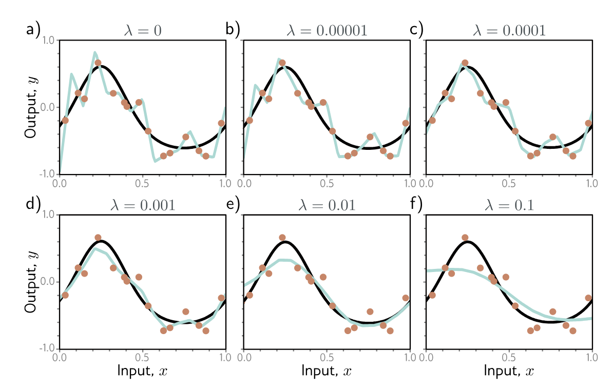
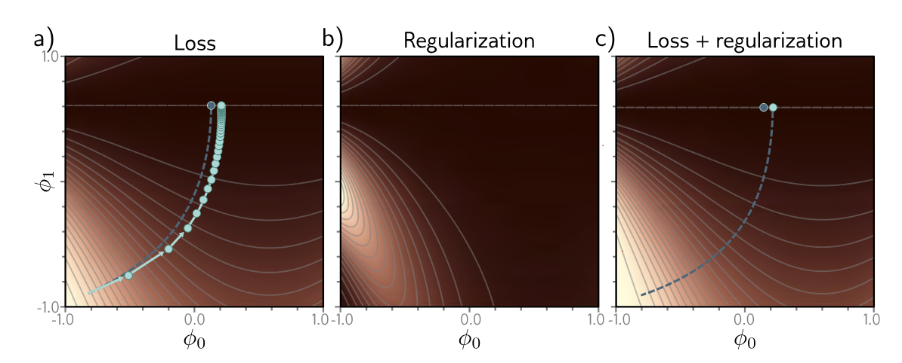
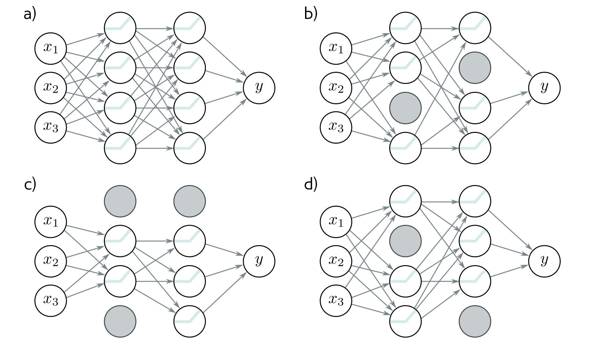

```{r setup, include=FALSE}
knitr::opts_chunk$set(echo = FALSE)
knitr::opts_chunk$set(message = FALSE, warning = FALSE)
knitr::opts_chunk$set(fig.width = 6.5, fig.height = 3.6, out.width = "70%", fig.align = "center", dev = "cairo_pdf")
```


## Regularización 
- ¿Por qué hay una brecha de generalización entre los errores de entrenamiento y los de prueba?
    - Overfitting 
    - Modelo sin restricciones donde no tenemos ejemplos de entrenamiento
- Regularización: métodos que ayudan a reducir la brecha de generalización


# Regularización Explícita 

## Regularización Explícita 
- Función de pérdida estandar: $\hat{\phi} = arg\min_{\phi} L(\phi)$
- Donde $L(\phi) = \sum_{i=1}^I \Big[l(x_i,y_i)\Big]$
- Regularización, agregamos un término extra: 

$$\hat{\phi} = arg\min_{\phi}\Big[\sum_{i=1}^I l(x_i,y_i) + \lambda g(\phi)\Big]$$

- Recordemos $\lambda$ controla que tanto nos importa regularizar relativo a la función de pérdida original 


## Regularización Explícita: visualización

{fig-align="center" width="80%"}


## Interpretación probabilistica 
- Recordemos que podemos construir las funciones de pérdida usando el criterio de máxima verosimilitud 
$$\hat{\phi} = arg\min_{\phi}\Big[\prod_{i=1}^I P(y_i|x_i,\phi)\Big]$$

- Podemos considerar el término de regularización como una prior de $P(\phi)$ que representa lo que sabemos de los parámetros antes de observar los datos 

## ¿Qué es una prior?
- En estadística una prior representa el conocimiento inicial que tenemos acerca de una variable aleatoria antes de observarla 
- La distribución de probabilidad que le asignas a algúna variable o parámetro antes de tener datos 
- Por lo general refleja conocimiento previo sobre esa variable: conocimiento experto o la falta del mismo (podemos tener priors no informativas)
- Cuando observamos los datos usamoes el teorema de Bayes para actualizar esta prior usando la verosimilitud de los datos observados


## Interpretación probabilistica 
- Usando  $P(\phi)$ como prior podemos escribir la máxima verosimilitud como 

$$\hat{\phi} = arg\min_{\phi}\Big[\prod_{i=1}^I P(y_i|x_i,\phi)P(\phi)\Big]$$


- Si sacamos la - log verosimilitud entonces $\lambda g(\phi) = - log P(\phi)$


## Regularización L2 
- Previene que los pesos se vuelvan muy grandes 
$$\hat{\phi} = arg\min_{\phi}\Big[\sum_{i=1}^I l_i(x_i,y_i) + \lambda \sum_j \phi_j ^2\Big]$$

- En redes normalmente la vamos a aplicar a los pesos pero no a los biases 
- Se le conoce como el término de `weight decay`
- El objetivo es que los pesos se vuelvan más pequeños y la función de pérdida más suave 


## Regularización L2 

{fig-align="center" width="80%"}


## Regularización L2 
- Ya la habíamos visto con ridge regression
- Lo que hace es que el algoritmo de aprendizaje aprenda pesos distribuidos más uniformemente entre todas las features
- Y normalmente esto hace un modelo sencillo como una regresión menos sensible y más generalizable 


## Regularización L2 
- ¿Por qué el weight decay mejora el error de generalización?
1. Si la red está sobreajustando agregar la regularización quiere decir que la red tiene que equilibrar entre aprenderse los ejemplos de entrenamiento y volverse más suave. Se reduce el error relacionado a la varianza aumentando el del sesgo 
2. Si la red está sobreparametrizada, el modelo describe áreas donde no tenemos ejemplos de entrenamiento. La regularización favorece funciones más suaves que interpolan mejor en áreas sin ejemplos. 


# Regularización Implícita 

## Regularización Implícita
- Recientemente descubrimos que los algoritmos basados en GD no se mueven neutralmente al mínimo de la función de pérdida sino que tienen preferencias por algunas soluciones 
- GD hace lo siguiente $\phi_{t+1} = \phi_t - \alpha \frac{\delta L}{\delta \phi}$
- Esta discretización causa que el GD se desvié del path continuo al mínimo global 
- Si resolviéramos el problema de minimización de manera continua el mínimo que encontramos es el mínimo global 'verdadero' distinto a la discretización
- Agregar regularización al GD va a hacer que el GD continuo y el discreto convergan 


## Regularización Implícita

{fig-align="center" width="80%"}


## Regularización Implícita
- Vamos a agregar lo siguiente a la función de pérdida 

$$\tilde{L}_{GD}(\phi) = L(\phi) + \frac{\alpha}{4}\Big\|\frac{\partial L}{\partial \phi}\Big\|^2$$

- Esto obliga al GD a alejarse de lugares donde la pendiente es muy empinada
- Esto no cambia la posición donde los gradientes son cero 
- Pero cambia la función de pérdida en el resto de los lugares y modifica la trayectoria de optimización que podría converger a otro mínimo 


## Regularización Implícita en SGD 
- Buscamos una función de pérdida modificada de tal manera que la versión contuina llegue al mismo punto que el promedio de las actualizaciones del SGD. 
$$\tilde{L}_{SGD}(\phi) = \tilde{L}_{GD}(\phi) + \frac{\alpha}{4B}\sum_{b=1}^B\Big\|\frac{\partial L_b}{\partial \phi} - \frac{\partial L}{\partial \phi}\Big\|^2$$
$$= L(\phi) + \frac{\alpha}{4}\Big\|\frac{\partial L}{\partial \phi}\Big\|^2 + \frac{\alpha}{4B}\sum_{b=1}^B\Big\|\frac{\partial L_b}{\partial \phi} - \frac{\partial L}{\partial \phi}\Big\|^2$$

- Donde $L_b$ es la pérdida del batch b de los B batches 
- Y $L = \frac{1}{I}\sum_{i=1}^I l_i(x_i,y_i)$ y $L_b = \frac{1}{|B|}\sum_{i \in B_b} l_i(x_i,y_i)$


## Regularización Implícita en SGD 
- Acá agregamos un término extra que corresponde a la varianza de lo gradientes en un batch 
- SGD favorece lugares donde el gradiente es estable (todos los batches coinciden en la pendiente)
- Igual que antes esto va a modificar la trayectoria alejando la discreta de la trayectoria continua 
- Hacia que mínimo se muevan GD/SGD va a depender del paso (learning rate), el batch size y el tipo de optimizador que utilicemos 


# Heurísticas de regularización 


## Batch Normalization (BN)
- Esto lo hicimos en la última tarea
- Idea: normalizar las activaciones de una capa por minibatch, restamos la media y dividimos por la desviación estándar

$$  \hat{x} = \frac{x - \mu_B}{\sqrt{\sigma_B^2 + \epsilon}},\quad y = \gamma \hat{x} + \beta$$

- Reduce la sensibilidad de la red a la inicialización y permite usar tasas de aprendizaje más grandes
- Actua como regularizador implícito 
- Acelara la convergencia y estabiliza el entrenamiento en redes muy profundas


## Early Stopping
- Si paramos el entrenamiento antes los pesos no tienen tiempo de aprenderse los ejemplos de entrenamiento 
- Los pesos comienzan pequeños y no tienen tiempo de volverse más grandes 
- Reduce la complejidad del modelo 
- No tienes que re-entrenar, entrenas una vez pero monitoreas la validación cada T iteraciones 
- Efecto similar a la regularización L2
- Tiene solo un hiperparametro el número de pasos cuando términamos de entrenar


## Early Stopping

{fig-align="center" width="80%"}


## Early Stopping
- La manera más común de determinar cuando parar es monitoreando el error de validación y térmninar de entrenar cuando el error de validación ya no baje más que alguna $\epsilon$ para alguna cantidad de épocas o de iteraciones
- No solo suele generalizar mejor sino que nos ahorra tiempo de entrenamiento lo cual va a ser importante para modelos muy pesados
- Normalmente funciona mejor cuando tenemos datos con etiquetas con ruido 
- Si tenemos datos con clases perfectamente separables (distinguir perros de gatos) `early stopping` no va a ayudar mucho 


## Ensambles 
- En ML básico vimos modelos de ensamble (RF, ET, etc)
- Entrenamos varios modelos y usamos la media de sus predicciones 
- Por lo general reduce el error de generalización pero el costo es tener que entrenar varios modelos 
- Podriamos usar la misma ifraestructura de red con distintas inicializaciones 
- Usar diferentes sub conjuntos de los datos de entrenamiento con reemplazo (bagging)


## Ensambles 

{fig-align="center" width="80%"}


## Dropout 
- La idea del dropout es iyectar ruido cuando hacemos el forward pass en cada capa intermedia 
- Se llama dropout porque vamos a tirar algunas neuronas durante el entrenamiento 
- Consiste en volver cero ciertas neuronas en cada capa antes de calcular la capa siguiente 
- ¿Cómo inyectamos este ruido? con probabilidad de dropout $p$ cada activación $h$ es reemplazada por: 

$$h'= \begin{cases} 
      0 & with\quad probability \quad p\\
      \frac{h}{1-p} & otherwise \\
   \end{cases}$$
   

- Por definición la esperanza es la misma $E[h'] = h$


## Dropout 
- Normalmente durante las pruebas apagamos el dropout 
- Como la red va a tener más neuronas que para las que fue entrenada
- Usamos la probabilidad de dropout para compensar 
- Esto se conoce como: `weight scaling inference rule`
- Una segunda opción es usar dropout Monte carlo: 
    - corremos la red varias veces con diferentes neuronas apagadas 
    - combinamos los resultados 
    - esto es parecido a ensambles 

## Dropout 

{fig-align="center" width="80%"}


## Agregar ruido
- Podemos interpretar dropout (como lo definimos antes) como aplicarle ruido Bernoulli multiplicativo a las activaciones de la red 
- Las otras tres cosas a las que les podemos agregar ruido son: 
    - los pesos 
    - los inputs/datos de entrada
    - las etiquetas 


## Agregar ruido

{fig-align="center" width="80%"}


## Transfer Learning
- Cuando tenemos pocos ejemplos de entrenamiento, podemos usar otros datos para mejorar el desempeño
- Pre-entrenamos la red para llevar a cabo una tarea secundaria relacionada a la tarea principal pero para la cual tenemos más datos de entrenamiento 
- Adaptamos este modelo pre-entrenado a la tarea original 
- Normalmente se lleva a cabo quitando la última capa y agregando una o más para producir el resultado deseado 


## Transfer Learning
- La lógica detrás es que la red va a construir una buena representación interna de los datos en la tarea secundaria
- Esta representación puede ser explotada para la tarea original 
- También se puede ver como inicializar todos los parámetros de la red en una parte buena del espacio que puede que produzca buenos resultados


## Transfer Learning

{fig-align="center" width="80%"}

- Tenemos pocos datos de entrenamiento para depth estimation pero muchos para segmentation 
- Entrenamos un modelo para segmentation quitamos las ultimas capas y las reemplazamos por unas que sirvan para depth estimation 
- Entrenamos las nuevas capas o fine-tune toda la red


## Multi-task learning
- Entrenamos la red para resolver distintos problemas 
- Por ejemplo una red puede tomar una imagen y de manera simultanea aprender a segmentarla, estimar la profundidad o predecir una frase que la describa 
- Todas estas tareas necesitan un entendimiento de la imagen 


## Multi-task learning

{fig-align="center" width="80%"}


## Self-supervised learning
- Generative: partes de cada uno de los ejemplos de entrenamiento se esconde (masked) y la tarea secundaria predice lo que falta
    - Por ejemplo los modelos del lenguaje suelen hacer esto, enmascaran algunas palabras, aprenden a predecirlas (representaciones vectoriales de cada palabra) y luego puedes fine-tune la red a hacer casi cualquier tarea relacionada con el lenguaje 
- Contrastive: se comparan pares de ejemplos parecidos con ejemplos que no tengan nada que ver. 
    - Por ejemplo para imágenes la tarea secundaria es identificar si un par de imágenes son transformaciones de otra imagen o no tienen nada que ver 


## Self-supervised learning

{fig-align="center" width="95%"}


## Augmentation 
- En algunos casos sobre todo para imágenes podemos transformar los ejemplos de entrenamiento sin que cambie la etiqueta 
- Podemos rotar, poner en espejo, aplicar filtros, cambiar el balance de color y la etiqueta de la imagen no va a cambiar 
- Para texto podríamos cambiar algunas palabras por sinónimos o traducir a otro idioma
- Para audio podemos amplificar o atenuar la frecuencia de las bandas 
- Por lo general aumentar el training data nos va a ayudar a reducir el error de generalización 


## Catálogo rápido de técnicas de regularización
- **Regularización explícita**
  - L2 (weight decay), L1 — penalizan la magnitud de los pesos (prior Gaussiano / Laplaciano).
- **Ruido / stochasticidad**
  - Dropout (neuronas), Input noise (jitter), Label noise (data labelling noise).
- **Arquitectura**
  - Red más pequeña (capacity control), weight sharing (convoluciones), convoluciones en vez de FC.
  
  
## Catálogo rápido de técnicas de regularización  
- **Datos**
  - Data augmentation (rotaciones, crop, traducciones), recolección/curación, synthetic data, transfer learning (pretrain + fine-tune).
- **Entrenamiento**
  - Early stopping, optimizadores (SGD vs Adam), learning-rate schedules, batch size control.
  
  
## Catálogo rápido de técnicas de regularización  
- **Post-hoc / ensamblado**
  - Ensembles, model averaging, MC-Dropout (como ensemble aproximado).
- **Self-supervised / multi-task**
  - Pretraining contrastivo / masked modeling; multi-task learning como regularizador vía shared representations.


## Tips
- **Ojo:** Estas categorías de regularización no son mutuamente excluyentes y suelen combinarse
- **Regla general:** empezar simple (weight decay + augmentation si hay imágenes) → medir gap train/val → añadir dropout o early stopping si overfitting persiste.  
- **Si hay pocos datos:** prioriza data augmentation y transfer learning antes que ensanchar la red.  
- **Cuando usar dropout:** útil en FCs profundas; en CNNs suele usarse en la última parte (fc) con p moderado (0.3–0.5).  


## Tips
- **BatchNorm handy-tips:** permite lr más altas; pero si el batch es pequeño, reemplazar por *GroupNorm* o *LayerNorm*.  
- **Medir, siempre:** reporta train loss, val loss, val accuracy y métricas por subgrupo; muestra ejemplos cualitativos donde el modelo falla.  
- **Coste/beneficio:** balancea regularización con coste computacional y transparencia (ensambles y grandes pretrains mejoran accuracy, pero suben costo y difuminan interpretabilidad).
