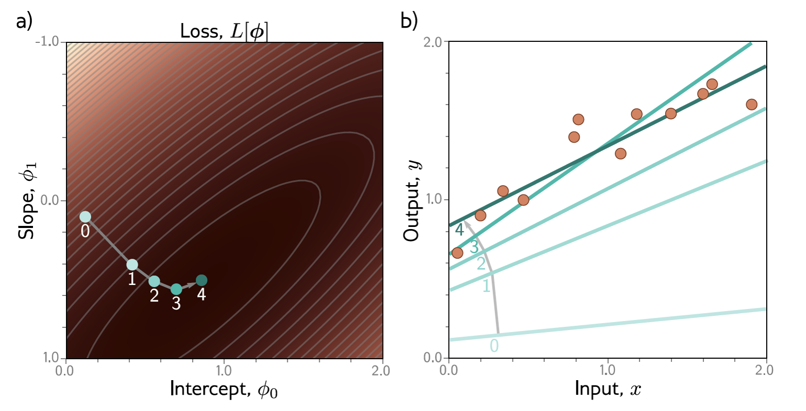
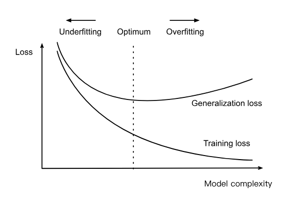

```{r setup, include=FALSE}
knitr::opts_chunk$set(echo = FALSE)
knitr::opts_chunk$set(message = FALSE, warning = FALSE)
knitr::opts_chunk$set(fig.width = 6.5, fig.height = 3.6, out.width = "70%", fig.align = "center", dev = "cairo_pdf")
```


# Aprendizaje Supervisado 


## Aprendizaje supervisado 

Recordemos:

- Mapea los inputs a los outputs 
- ¿Cómo? con un modelo 
- Un modelo va a ser una familia de ecuaciones 
- El modelo depende de parámetros
- Cuando entrenamos el modelo encontramos los parámetros que predicen bien usando los inputs del conjunto de entrenamiento los outputs 

## Notación: 
- Input: $x$ independientemente de la dimensión
- Output: $y$
- Parámetros: $\phi$
- Modelo: $y = f(x,\phi)$

## ¿Cómo entrenamos esto?

Necesitamos: 

- set de entrenamiento $\{x_i, y_i\}_{i=1}^I$
- función de costos o de pérdida: $L(\phi)$
    
$$L\big[\phi,f(x,\phi), \{x_i,y_i\}_{i=1}^I\big]$$

## ¿Cómo entrenamos esto?
$$\hat{\phi} = arg \min_{\phi} L(\phi)$$

- ¿Cómo evaluamos esto? en el set de prueba 


# Regresión lineal

## Regresión lineal

¿Por qué regresamos a la regresión lineal?

- ya todos la entendemos y podemos correrla desde 0 (en teoria)
- la vamos a usar como base para recordar ML básico
- la vamos a usar de base para programar DL


## Regresión lineal
- Modelo: $y = f(x,\phi) = \phi_0 + \phi_1 x$
- Parámetros: $\phi = [\phi_0 \phi_1]^T$

```{r}
library(ggplot2)
library(ggrepel)
phi_params <- data.frame(
  phi0  = c(0.0, 1.2, 1.0),
  phi1  = c(1.0, -0.1, -0.4),
  label = c("φ0 = 0.0, φ1 = 1.0",
            "φ0 = 1.2, φ1 = -0.1",
            "φ0 = 1.0, φ1 = -0.4"),
  col   = c("tomato", "deepskyblue3", "gray70")
)
df <- do.call(rbind, lapply(seq_len(nrow(phi_params)), function(i) {
  x <- seq(0, 2, length.out = 200)
  data.frame(
    x, 
    y     = phi_params$phi0[i] + phi_params$phi1[i] * x,
    label = phi_params$label[i],
    col   = phi_params$col[i]
  )
}))
anchors <- transform(phi_params,
  x = 1.8,
  y = phi0 + phi1 * 1.8
)

ggplot(df, aes(x = x, y = y, color = label)) +
  geom_line(size = 1.2) +
  geom_label_repel(
    data            = anchors,
    aes(x = x, y = y, label = label, fill = label),
    color           = "white",
    fontface        = "bold",
    label.padding   = unit(0.3, "lines"),
    label.size      = 0,        
    segment.size    = 0.3,
    show.legend     = FALSE
  ) +
  scale_color_manual(values = setNames(phi_params$col, phi_params$label)) +
  scale_fill_manual (values = setNames(phi_params$col, phi_params$label)) +
  coord_cartesian(xlim = c(0,2), ylim = c(0,2)) +
  labs(x = "x", y = "y") +
  theme_minimal(base_size = 14) +
  theme(
    panel.background = element_rect(fill = "black", colour = NA),
    plot.background  = element_rect(fill = "black", colour = NA),
    panel.grid.major = element_line(colour = "grey30"),
    panel.grid.minor = element_line(colour = "grey20"),
    axis.text        = element_text(colour = "grey80"),
    axis.title       = element_text(colour = "grey90"),
    legend.position  = "none"
  )

```


## Regresión lineal
- Función de costos: cuadrática 

$$L(\phi) = \sum_{i=1}^I (\phi_0 + \phi_1 x_i - y_i)^2$$

## Regresión lineal

```{r}
library(ggplot2)
library(cowplot)
dat1 <- data.frame(
  x = seq(0, 2, by = 0.2),
  y = c(0.30,0.75,1.05,1.15,1.25,1.40,1.50,1.65,1.70,1.80,1.95)
)
params1 <- list(phi0 = 0.4, phi1 =  0.2, loss =  7.11, line_col = "tomato")
dat2 <- data.frame(
  x = seq(0, 2, by = 0.2),
  y = c(1.00,0.90,1.10,1.30,1.45,1.60,1.75,1.85,1.95,2.00,2.10)
)
params2 <- list(phi0 = 1.6, phi1 = -0.8, loss = 10.22, line_col = "gray70")

dat3 <- data.frame(
  x = seq(0, 2, by = 0.2),
  y = c(0.50,0.85,1.00,1.20,1.35,1.55,1.65,1.75,1.90,2.05,2.20)
)
params3 <- list(phi0 = 0.84, phi1 =  0.50, loss =  0.19, line_col = "deepskyblue3")
make_panel <- function(dat, pars) {
  ggplot(dat, aes(x = x, y = y)) +
    geom_point(color = "sienna1", size = 3, stroke = 1) +
    geom_segment(aes(
      xend = x,
      yend = pars$phi0 + pars$phi1 * x
    ), linetype = "dashed", color = "sienna1") +
    geom_abline(
      intercept = pars$phi0,
      slope     = pars$phi1,
      color     = pars$line_col,
      size      = 1.2
    ) +
    labs(
      title = sprintf("Loss, L = %.2f", pars$loss),
      x     = "x",
      y     = "y"
    ) +
    # square aspect, no grid
    coord_fixed(ratio = 1, xlim = c(0,2), ylim = c(0,2)) +
    theme_minimal(base_size = 14) +
    theme(
      plot.title       = element_text(
                            colour = pars$line_col,
                            size   = 16,
                            face   = "bold",
                            hjust  = 0.5,
                            margin = margin(b = 10)
                          ),
      panel.background = element_rect(fill = "black", colour = NA),
      plot.background  = element_rect(fill = "black", colour = NA),
      panel.grid.major = element_blank(),
      panel.grid.minor = element_blank(),
      axis.text        = element_text(colour = "grey80"),
      axis.title       = element_text(colour = "grey90"),
      plot.margin      = margin(5,5,5,5)
    )
}
p1 <- make_panel(dat1, params1)
p2 <- make_panel(dat2, params2)
p3 <- make_panel(dat3, params3)
combined <- plot_grid(
  p1, p2, p3,
  ncol  = 3,
  align = "hv"
)
combined <- combined + theme(plot.background = element_rect(fill = "black", colour = NA))
print(combined)
```


## Regresión lineal
- Usamos gradient descent para encontrar el óptimo 

{fig-align="center" width="80%"}


## Regresión lineal

- Sabemos que hacer GD con todos los datos o hacer SGD con 1 solo dato a la vez no es muy eficiente o conveniente
- En la práctica no vamos a usar GD, usaremos algo parecido a minibatch SGD
- El tamaño de estos batches depende de factores como la memoria, aceleradores (GPUs), cuantas capas y el tamaño de los datos
- Normalmente es entre 32 y 256


## Regresión lineal
- ¿Qué hace el minibatch SGD?
1. inicializa los parámetros del modelo normalmente at 'random'
2. iterativamente samplear minibatches de los datos, actualizando los parámetros en la dirección negativa del gradiente

$$(w,b) \leftarrow (w, b) - \frac{\eta}{|B|}\sum_{i \in B_t} \nabla l(w,b)$$

- donde $B_t$ es el minibatch sampleado en t, $\nabla$ el gradiente evaluado en esos puntos y $\eta$ es la tasa de aprendizaje


## Regresión lineal
- ¿Por qué no usamos la solución cerrada de la regresión lineal?
    - costo computacional de voltear matrices
    - otros algoritmos más complicados no tienen soluciones cerradas
- ¿Por qué no hacer una búsqueda exhaustiva probando todas las combinaciones de parámetros?
    - no tan costoso si tenemos 2 parámetros 
    - muy costoso si tenemos millones de parámetros (CNNs/RNNs/GANs/LLMs)


## Regresión lineal 
- Recordemos que podemos motivar la regresión lineal con función de pérdida cuadrática asumiendo que las observaciones vienen de observaciones medidas con ruido $N(0,\sigma^2)$
- La verosimilitud de una y en particular la podemos escribir como: 
$$P(y|x) = \frac{1}{\sqrt{2\pi\sigma^2}}e^{-\frac{1}{2\sigma^2}(y - w^Tx -b)^2}$$


## Regresión lineal 
- Y de acuerdo al principio de máxima verosimilitud los mejores valores w y b son los que maximicen la verosimilitud de los datos observados:
$$P(y|x) = \prod_{i=1}^n p(y_i|x_i)$$

- Esto es cierto porque $y_i$,$x_i$ se samplearon de manera independiente


## Regresión lineal 
- Simplificamos la maximización aplicando logaritmos: 
$$- log P(y|x) = \sum_{i=1}^n \frac{1}{2} log(2\pi \sigma^2) + \frac{1}{2\sigma^2}(y-w^Tx-b)^2$$

- El segundo término de está ecuación es igual a la pérdida cuadrática
- Minimizar el error cuadrático medio es equivalente a la estimación de máxima verosimilitud de un modelo lineal bajo el supuesto de ruido gaussiano aditivo


## Generalización

¿Cómo vamos a medir si el modelo lo está haciendo bien o mal?

- Error de entrenamiento: 

$$R_{train}[X,y,f] = \frac{1}{n}\sum_{i=1}^n l(x,y,f(x))$$

## Generalización

¿Cómo vamos a medir si el modelo lo está haciendo bien o mal?

- Error: 

$$R[p,f] = E[l(x,y,f(x))] = \int \int l(x,y,f(x))p(x,y)dx dy$$

- Este nunca lo vamos a poder calcular porque no conocemos la distribución de los datos 


## Generalización
- Recordemos que el modelo con el que terminamos depende explícitamente de la selección de los conjuntos de entrenamiento 
- Por lo que en general nuestro error de entrenamiento va a estar sesgado y no representa el $R$
- La pregunta central de la generalización es cuando el error de entrenamiento es lo suficientemente cercano al error $R$ (de la población)

## Overfitting vs Underfitting: 

{fig-align="center" width="80%"}

## Overfitting vs Underfitting: 
- Menos datos normalmente nos llevan a overfitting 
- Cuando aumentamos los datos de entrenamiento normalmente el error del test se hace más pequeño 
- Para muchas tareas el aprendizaje profundo lo va a hacer mejor que modelos sencillos de ML 
- Esto es cierto en parte porque tenemos muchos datos para entrenar estos modelos

## Selección de modelos 

- No podemos usar el conjunto de prueba para seleccionar
- Pero tampoco podemos solo usar el conjunto de entrenamiento porque no va a generalizar bien 
- La solución dividir nuestros datos en 3: prueba, validación y entrenamiento
- El de validación para poder entrenar los hiperparámetros 


## Regularización: 
- Recordemos que una manera de combatir el overfitting es la regularización
- Por ejemplo $l_2$: vuelve algunas de las w's muy pequeñas 

$$\frac{1}{n}\sum_{i=1}^n \frac{1}{2}(w^Tx_i + b - y_i)^ 2 + \frac{\lambda}{2}\|w\|$$


## Regularización: 
- Podemos aplicar regularización o weight decay a nuestro SGD
- ¿Cómo? 

$$ w \leftarrow (1 - \eta \lambda)w - \frac{\eta}{|B|}\sum_{i \in B} x (w^Tx + b - y)^2$$

- ¿Por qué necesitamos esto? PRÓXIMAMENTE

- pero va a ser MUY importante para las redes neuronales 

 