```{r setup, include=FALSE}
knitr::opts_chunk$set(echo = FALSE)
knitr::opts_chunk$set(message = FALSE, warning = FALSE)
knitr::opts_chunk$set(fig.width = 6.5, fig.height = 3.6, out.width = "70%", fig.align = "center", dev = "cairo_pdf")
```


# Ejemplos de redes para imágenes


## Clasificación 

{fig-align="center" width="80%"}


## Detección de Objetos 

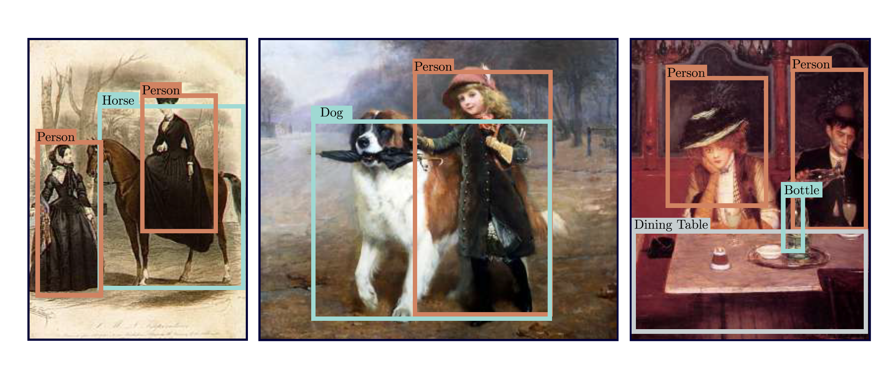{fig-align="center" width="80%"}


## Segmentación de Imágenes

{fig-align="center" width="80%"}


## Redes para imágenes

Si usamos una red completamente conectada directamente sobre pixeles, el número de parámetros crece muy rápido.

Una imagen RGB de $224\times224$ tiene $224\times224\times3=150{,}528$ dimensiones.

Una sola capa completamente conectada que mapeara esa representación a otra del mismo tamaño tendría aproximadamente $150{,}528^2 \approx 22.7\times10^9$ pesos.


## Redes para imágenes

El problema no es solo el número de parámetros.

Una red completamente conectada ignora dos propiedades importantes de las imágenes:

- pixeles cercanos suelen estar estadísticamente relacionados;
- muchos patrones visuales pueden aparecer en distintas posiciones de la imagen.

Por ejemplo, un borde vertical puede aparecer a la izquierda, al centro o a la derecha.

No queremos aprender un detector completamente distinto para cada posición.


## Redes convolucionales

Las CNNs aprovechan la estructura espacial de las imágenes usando dos ideas:

1. **Localidad:** cada neurona observa una región pequeña de la imagen.
2. **Compartición de parámetros:** el mismo filtro se aplica en muchas posiciones.

Esto permite:

- reducir drásticamente el número de parámetros;
- aprender detectores locales reutilizables;
- construir representaciones espaciales capa por capa.


## Inspiración: ¿Dónde está Wally?

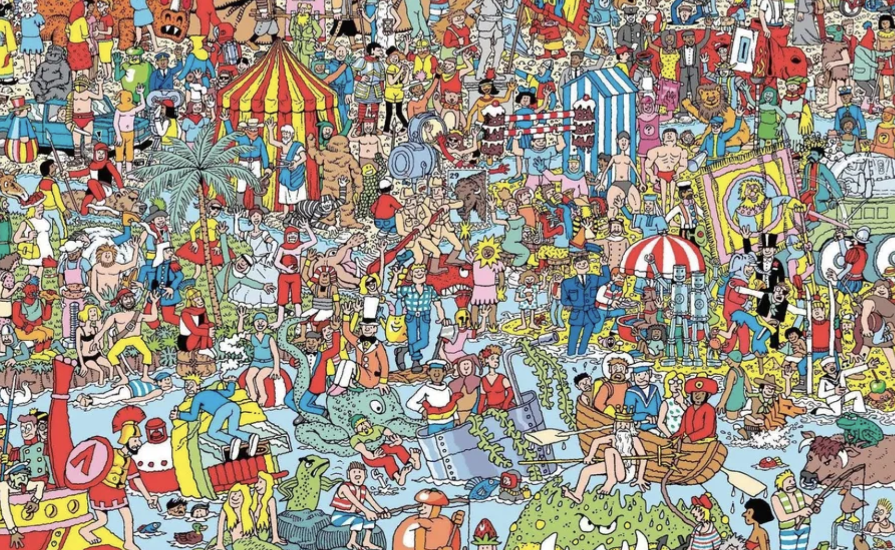{fig-align="center" width="80%"}


## Inspiración: ¿Dónde está Wally?

Si queremos detectar a Wally, no debería importar demasiado si aparece:

- arriba;
- abajo;
- a la izquierda;
- a la derecha.

Una estrategia natural sería recorrer la imagen por regiones y preguntar:

$$
\text{¿esta región contiene a Wally?}
$$

Las CNNs hacen algo parecido: aplican detectores locales en muchas partes de la imagen usando los mismos pesos.


## ¿Qué tipo de redes cumplen esto?

Para imágenes queremos modelos que:

1. procesen regiones locales en las primeras capas;
2. usen los mismos filtros en distintas posiciones;
3. combinen información local para construir representaciones más globales;
4. permitan que capas profundas tengan campos receptivos más grandes.

La intuición es:

$$
\text{pixeles}
\rightarrow
\text{bordes/texturas}
\rightarrow
\text{partes}
\rightarrow
\text{objetos}
$$

Esta jerarquía es una intuición útil, no una descripción perfecta de lo que cada canal aprende.


# Invariancia y Equivariancia


## Invariancia

Una función $f(x)$ es invariante a una transformación $t[\cdot]$ si:

$$
f(t[x])=f(x)
$$

Es decir, el output no cambia después de aplicar la transformación.

Ejemplo:

$$
\text{imagen de perro}
\rightarrow
\text{clase perro}
$$

Si movemos ligeramente el perro dentro de la imagen, normalmente queremos seguir clasificándolo como perro.


## ¿Por qué queremos invariancia?

En clasificación, muchas transformaciones pequeñas no deberían cambiar la etiqueta.

Por ejemplo:

- pequeñas traslaciones;
- cambios moderados de iluminación;
- pequeñas rotaciones;
- cambios de escala razonables.

Pero cuidado: no todas las transformaciones preservan la etiqueta.

Una imagen médica, un número escrito a mano o una señal de tránsito pueden cambiar de significado si se transforman.


## Invariancia

Si queremos clasificar esto como una montaña nevada, mover la imagen unos cuantos pixeles a la derecha o izquierda no debería cambiar la clase.

{fig-align="center" width="80%"}


## Equivariancia

Una función $f(x)$ es equivariante a una transformación $t[\cdot]$ si:

$$
f(t[x])=t[f(x)]
$$

Es decir, el output cambia de la misma manera que el input.


## Equivariancia

:::: {.columns}
::: {.column width="45%"}
En segmentación, si movemos la imagen, queremos que la máscara también se mueva.

La clase global puede quedarse igual, pero la ubicación de cada pixel segmentado debe trasladarse.
:::
::: {.column width="55%"}
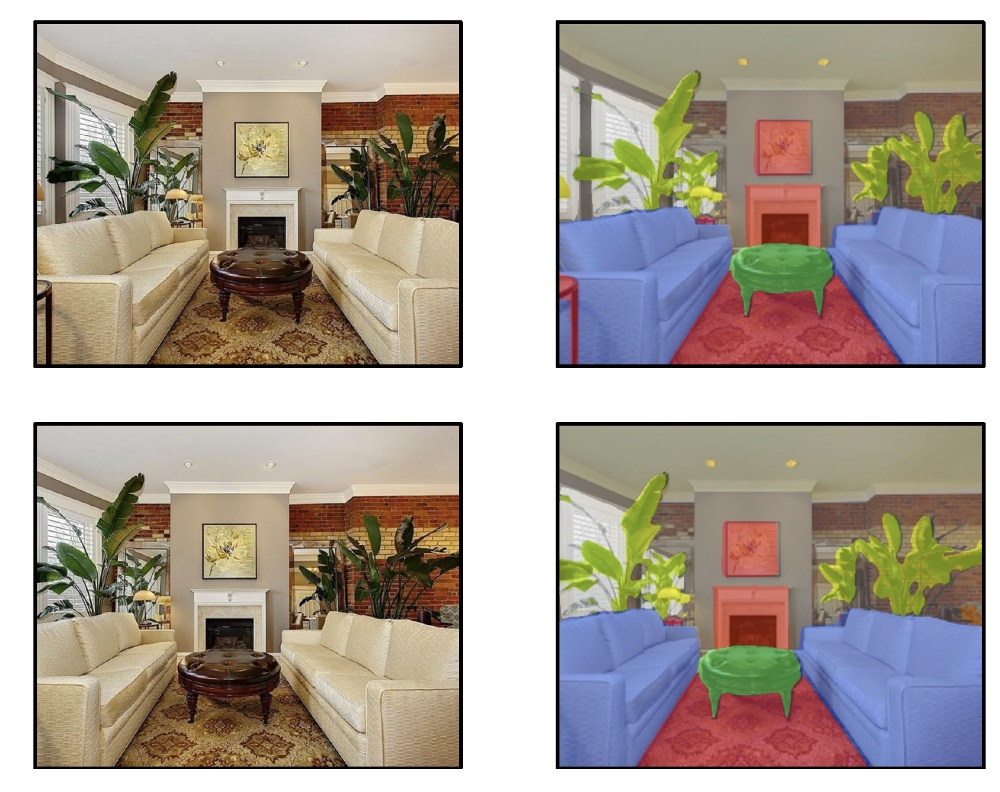{width="100%"}
:::
::::


## Invariancia vs equivariancia

La diferencia depende de la tarea.

Para clasificación, mover perro $\rightarrow$ sigue siendo perro: queremos cierta invariancia.

Para segmentación, mover perro $\rightarrow$ se mueve la máscara del perro: queremos equivariancia.

Las CNNs son naturalmente **equivariantes a traslaciones** de forma aproximada; la invariancia suele aparecer después mediante pooling, downsampling o agregación global.


# Convoluciones 


## Representación completamente conectada

Supongamos una imagen de entrada $X$ y una capa intermedia $H$.

Si cada posición de $H$ puede depender de todos los pixeles de $X$, podríamos escribir:

$$
H_{i,j}=U_{i,j}+\sum_k\sum_l W_{i,j,k,l}X_{k,l}
$$

Aquí cada ubicación $(i,j)$ tiene sus propios pesos hacia todos los pixeles $(k,l)$.

Esto es muy flexible, pero usa demasiados parámetros y no aprovecha la estructura espacial.


## Reindexando alrededor de cada pixel

Podemos reescribir la relación anterior centrando los pixeles alrededor de $(i,j)$:

$$
H_{i,j}=U_{i,j}+\sum_a\sum_b V_{i,j,a,b}X_{i+a,j+b}
$$

Aquí:

$$
k=i+a,
\qquad
l=j+b.
$$

La interpretación es:

> el valor en la posición $(i,j)$ se calcula mirando pixeles alrededor de esa posición.

Pero todavía tenemos pesos distintos para cada ubicación.


## Compartición de parámetros

Para tener equivariancia aproximada a traslaciones, usamos los mismos pesos en todas las posiciones:

$$
H_{i,j}=u+\sum_a\sum_b V_{a,b}X_{i+a,j+b}
$$

Ahora $V$ ya no depende de $(i,j)$.

El mismo filtro se aplica en toda la imagen.

Eso es la idea central de una convolución en CNNs.


## Localidad

Además de compartir pesos, normalmente restringimos la suma a una vecindad local.

Por ejemplo, con radio $\Delta$:

$$
H_{i,j}
=
u+
\sum_{a=-\Delta}^{\Delta}
\sum_{b=-\Delta}^{\Delta}
V_{a,b}X_{i+a,j+b}
$$

El filtro tiene tamaño $(2\Delta+1)\times(2\Delta+1)$.

En la práctica se usan filtros como $3\times3$, $5\times5$ o $7\times7$.


## ¿Qué ganamos?

Una capa completamente conectada sobre una imagen grande puede necesitar miles de millones de pesos.

Una convolución $3\times3$ con un solo canal necesita solo:

$$
3\times3=9
$$

pesos por filtro.

Con canales, el número de parámetros aumenta, pero sigue siendo mucho menor que conectar cada pixel con todos los demás.


## ¿Por qué se llama convolución?

En matemáticas, la convolución entre dos funciones puede escribirse como:

$$
(f*g)(x)=\int f(z)g(x-z)dz
$$

En versión discreta:

$$
(f*g)(i)=\sum_a f(a)g(i-a)
$$

La idea es medir cómo se combinan dos funciones mientras una se desplaza sobre la otra.


## Convolución en dos dimensiones

Para dos dimensiones:

$$
(f*g)(i,j)
=
\sum_a\sum_b f(a,b)g(i-a,j-b)
$$

En muchos frameworks de deep learning, la operación implementada es técnicamente **correlación cruzada**, porque no se invierte el kernel:

$$
H_{i,j}=\sum_a\sum_b V_{a,b}X_{i+a,j+b}
$$

La diferencia es formal. Como los pesos se aprenden, seguimos llamándola convolución por tradición.


# Canales

## Canales

Una imagen RGB no es una matriz bidimensional, sino un tensor: alto $\times$ ancho $\times$ canales.

Por ejemplo:

$$
1024\times1024\times3.
$$

El último eje contiene los canales rojo, verde y azul.

Entonces escribimos $X_{i,j,c}$ para referirnos al canal $c$ en la posición $(i,j)$.


## Canales de entrada y salida

Si el input tiene $c_i$ canales y queremos producir $c_o$ canales de salida, necesitamos un filtro para cada canal de salida.

El tensor de pesos tiene forma:

$$
(c_o,c_i,k_h,k_w)
$$

Cada canal de salida combina información de todos los canales de entrada.


## Convolución con canales

Una forma de escribirlo es:

$$
H_{i,j,d}
=
\nu_d+
\sum_{a}\sum_b\sum_c
V_{d,c,a,b}X_{i+a,j+b,c}
$$

Donde:

- $c$ indexa canales de entrada;
- $d$ indexa canales de salida;
- $a,b$ indexan posiciones dentro del kernel.


## Parámetros de una capa convolucional

Para una capa con:

- $c_i$ canales de entrada;
- $c_o$ canales de salida;
- kernel $k_h\times k_w$;

el número de pesos es $c_o\times c_i\times k_h\times k_w$.

Si usamos bias, agregamos $c_o$ parámetros adicionales.

Por tanto:

$$
\boxed{
\#\text{parámetros}
=
c_o c_i k_h k_w+c_o
}
$$


## Operación de correlación cruzada

Ignorando canales por un momento, si tenemos una ventana $2\times2$, la correlación cruzada calcula una suma ponderada local.

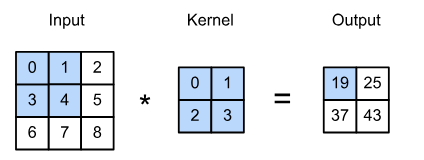{fig-align="center" width="60%"}

En deep learning usualmente hacemos esta operación, aunque la llamemos convolución.


# Tamaño del output

## Tamaño del output sin padding

Si el input tiene tamaño:

$$
n_h\times n_w
$$

el kernel tiene tamaño:

$$
k_h\times k_w
$$

y usamos stride 1 sin padding, el output tiene tamaño:

$$
(n_h-k_h+1)\times(n_w-k_w+1).
$$

Por eso, sin padding, el output suele ser más pequeño que el input.


## Padding

El problema de no usar padding es que perdemos información en los bordes.

Los pixeles de las esquinas participan en menos ventanas que los pixeles del centro.

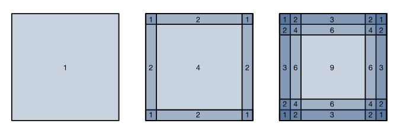{fig-align="center" width="60%"}


## Padding

Una solución es agregar valores extra alrededor de la imagen, usualmente ceros.

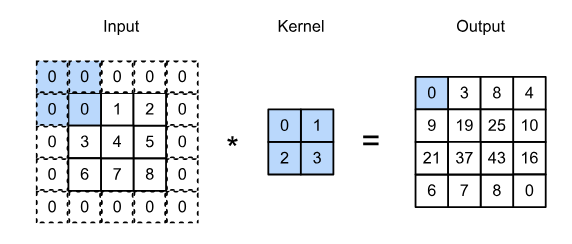{fig-align="center" width="60%"}

Esto permite controlar el tamaño del output y conservar más información de los bordes.


## Padding

Si agregamos padding $p_h$ arriba y abajo, y $p_w$ a izquierda y derecha, entonces con stride 1 el output tiene tamaño:

$$
(n_h+2p_h-k_h+1)\times(n_w+2p_w-k_w+1).
$$

Para mantener el mismo tamaño espacial con kernels impares, usamos:

$$
p_h=\frac{k_h-1}{2},
\qquad
p_w=\frac{k_w-1}{2}.
$$

Por ejemplo, para un kernel $3\times3$:

$$
p_h=p_w=1.
$$


## Stride

Cuando calculamos una convolución, movemos el kernel sobre la imagen.

Hasta ahora asumimos stride 1:

$$
\text{nos movemos una posición a la vez.}
$$

Pero podemos usar strides mayores:

$$
s_h,
\qquad
s_w.
$$

Esto reduce el tamaño espacial del output.


## Stride

El stride indica cuántas filas o columnas avanza la ventana en cada paso.

{fig-align="center" width="60%"}

Un stride mayor reduce resolución, pero aumenta eficiencia computacional.


## Tamaño del output con padding y stride

Con padding por lado $p_h,p_w$ y stride $s_h,s_w$, el tamaño del output es:

$$
\left\lfloor
\frac{n_h+2p_h-k_h}{s_h}
\right\rfloor+1
$$

por:

$$
\left\lfloor
\frac{n_w+2p_w-k_w}{s_w}
\right\rfloor+1.
$$

El floor aparece porque a veces el kernel no cae exactamente en la última posición.


# Feature maps y receptive fields

## Feature maps y receptive fields

Al output de una capa convolucional lo llamamos frecuentemente **feature map**.

Es una representación espacial aprendida de la capa anterior.

Un **receptive field** de una neurona es el conjunto de posiciones del input original que pueden afectar su valor.


## Receptive field

:::: {.columns}
::: {.column width="55%"}
Input de 11 posiciones que va a una capa intermedia con 3 canales y un kernel de tamaño 3.

El receptive field de una neurona en la primera capa son las posiciones del input que afectan su valor.
:::
::: {.column width="45%"}
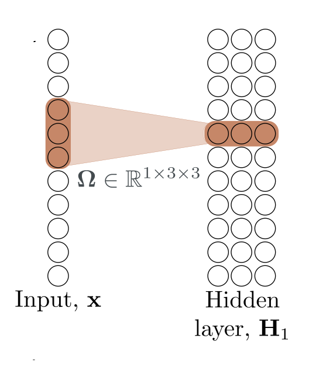{width="100%"}
:::
::::


## Receptive field

En capas más profundas, una neurona depende de neuronas anteriores.

Cada una de esas neuronas anteriores ya dependía de una región del input.

Por eso, al apilar capas convolucionales, el receptive field crece.

{fig-align="center" width="50%"}


## Receptive field

Si agregamos más capas o usamos stride, el receptive field puede crecer más rápido.

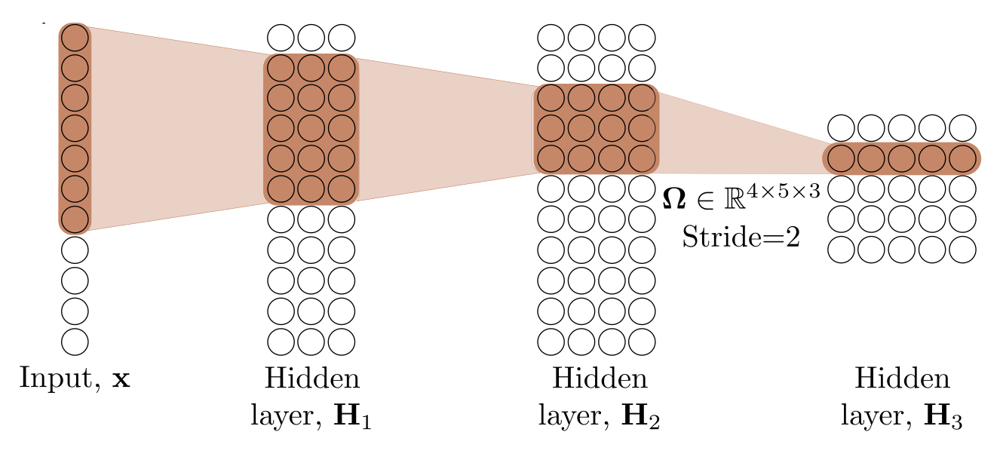{fig-align="center" width="50%"}


## Receptive field

Eventualmente, una neurona profunda puede depender de todo el input.

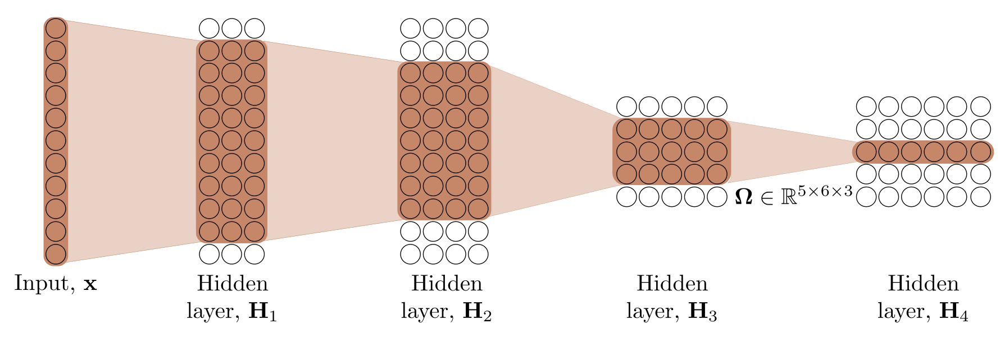{fig-align="center" width="50%"}

Esta es una forma en la que las CNNs combinan información local para tomar decisiones globales.


# Canales múltiples

## Canales múltiples: input

Si los datos de entrada contienen múltiples canales, el kernel debe tener profundidad igual al número de canales de entrada.

Si $X\in\mathbb R^{n_h\times n_w\times c_i}$ y queremos $c_o$ canales de salida, entonces los pesos tienen forma $(c_o,c_i,k_h,k_w)$.

Los parámetros totales son:

$$
c_o c_i k_h k_w+c_o.
$$


## Canales múltiples: input 

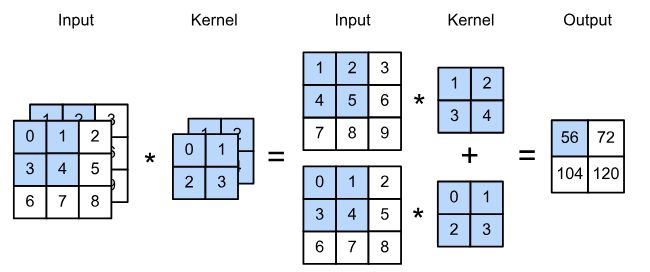{fig-align="center" width="50%"}


## Canales múltiples: output

Normalmente queremos que las capas intermedias tengan muchos canales.

Intuitivamente, distintos canales pueden responder a distintos patrones, como:

- bordes;
- texturas;
- colores;
- partes de objetos.

Pero no debemos interpretar cada canal como una feature humana limpia y separada.

Los canales se optimizan juntos para reducir la pérdida.


## Capas convolucionales de $1\times1$

Una convolución $1\times1$ no mezcla información entre pixeles vecinos.

Pero sí mezcla información entre canales en la misma ubicación espacial.

Para cada pixel, transforma:

$$
\mathbb R^{c_i}\rightarrow\mathbb R^{c_o}.
$$

Podemos pensarla como una capa lineal aplicada en cada posición de la imagen, compartiendo pesos en todas las posiciones.


## Capas convolucionales de $1\times1$

Una convolución $1\times1$ necesita:

$$
c_i\times c_o
$$

pesos, más biases opcionales.

Se usa para:

- cambiar el número de canales;
- combinar información entre canales;
- reducir costo computacional antes de convoluciones más grandes;

Con una no linealidad después, puede aumentar la expresividad de la red.


## Capas convolucionales de $1\times1$

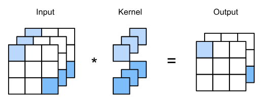{fig-align="center" width="50%"}


# Pooling

## Pooling

En clasificación de imágenes queremos que la decisión final pueda usar información de toda la imagen.

Las convoluciones apiladas aumentan el receptive field.

El pooling ayuda a:

- reducir la resolución espacial;
- disminuir costo computacional;
- introducir cierta robustez a cambios pequeños de posición.

Pooling no crea verdadera invariancia total. Solo reduce sensibilidad local.


## Pooling

Una capa de pooling mueve una ventana sobre la imagen y calcula una cantidad por ventana.

No tiene parámetros aprendidos.

Las operaciones típicas son:

- average pooling;
- max pooling.


## Average pooling y max pooling

**Average pooling:** calcula el promedio dentro de una ventana.

Puede verse como una forma de reducir resolución suavizando información local.

**Max pooling:** conserva el valor máximo dentro de una ventana.

Puede ayudar a detectar si cierta feature aparece en una región, sin importar exactamente en qué pixel de esa región apareció.


## Pooling 

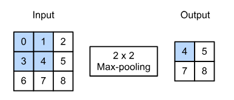{fig-align="center" width="50%"}


## Características del pooling

Igual que en convoluciones, pooling puede tener:

- tamaño de ventana;
- stride;
- padding.

El pooling normalmente se aplica a cada canal por separado.

Por eso, si el input tiene $c$ canales, el output también suele tener $c$ canales.


# Upsampling

## Upsampling

En tareas como segmentación necesitamos producir un output espacial.

Por ejemplo:

$$
\text{imagen}
\rightarrow
\text{máscara por pixel}
$$

Si la red redujo la resolución usando pooling o stride, necesitamos recuperar resolución.

A esto le llamamos **upsampling**.


## Upsampling simple

La forma más simple es repetir valores para aumentar el tamaño espacial.

{fig-align="center" width="50%"}

Es barato, pero puede producir outputs poco suaves.


## Max-unpooling

Si antes usamos max-pooling, podemos guardar las posiciones donde ocurrió el máximo.

Luego, max-unpooling coloca los valores de regreso en esas posiciones.

{fig-align="center" width="50%"}


## Interpolación bilineal

Otra opción es usar interpolación bilineal entre los valores disponibles.

{fig-align="center" width="50%"}

No aprende parámetros, pero produce una reconstrucción espacial más suave que repetir valores.


## Transposed convolutions

:::: {.columns}
::: {.column width="48%"}
Las transposed convolutions son capas aprendibles para aumentar resolución.

Cada valor del input contribuye a varias posiciones del output, según un kernel aprendido.

No siempre duplican la resolución: el tamaño final depende de kernel, stride, padding y output padding.
:::
::: {.column width="52%"}
{width="100%"}
:::
::::


## Parámetros y costo computacional

Para una convolución estándar:

$$
\#\text{parámetros}=c_o c_i k_h k_w+c_o.
$$

El costo computacional también depende del tamaño espacial del output:

$$
\text{alto}_{out}\times\text{ancho}_{out}\times c_o.
$$

Por eso, capas con muchos canales y alta resolución pueden ser costosas aunque el kernel sea pequeño.


# Aplicaciones

# Clasificación de imágenes

## Clasificación de imágenes: ImageNet

ImageNet/ILSVRC fue clave para medir progreso en clasificación de imágenes.

En la tarea clásica:

- se usaban imágenes redimensionadas y recortadas típicamente alrededor de $224\times224$;
- había alrededor de 1.2 millones de imágenes de entrenamiento;
- 50,000 imágenes de validación;
- 1000 clases.

{fig-align="center" width="55%"}


## AlexNet (2012)

AlexNet fue uno de los puntos de quiebre del deep learning moderno en visión.

No fue la primera CNN, pero sí mostró que una CNN grande entrenada con GPUs podía superar fuertemente a métodos basados en features diseñadas a mano en ImageNet.

Características importantes:

- 5 capas convolucionales;
- capas completamente conectadas al final;
- ReLU;
- entrenamiento en GPU;
- data augmentation;
- dropout en capas completamente conectadas.


## AlexNet (2012)

La mayor parte de los parámetros venía de las capas completamente conectadas, no de las convoluciones.

{fig-align="center" width="50%"}

Esta fue una de las razones por las que arquitecturas posteriores redujeron o eliminaron capas completamente conectadas grandes.


## Data augmentation en AlexNet

AlexNet usó aumentación de datos para reducir sobreajuste.

La idea general:

- generar crops de la imagen;
- usar flips horizontales;
- modificar intensidades/color.

En inferencia también se pueden promediar predicciones sobre varias versiones de la imagen.

Esto no cambia el concepto central: la red ve muchas variantes plausibles de los mismos ejemplos.


## Data Augmentation 

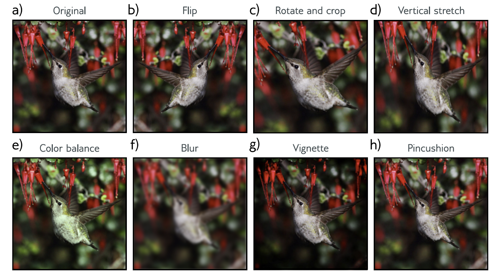{fig-align="center" width="80%"}


## Optimización y regularización en AlexNet

AlexNet combinó varias decisiones prácticas:

- SGD con momentum;
- batch size relativamente grande para la época;
- dropout;
- regularización $L_2$;
- data augmentation.

En ILSVRC 2012 alcanzó un error top-5 cercano a 15--16%, muy por debajo de los métodos previos.

No fue solo “una arquitectura”: fue arquitectura, datos, cómputo, optimización y regularización trabajando juntos.


## ResNet (2015): conexiones residuales

Problema: al apilar muchas capas, el entrenamiento podía empeorar.

No necesariamente por overfitting, sino porque la optimización se volvía más difícil.

La idea de ResNet es que un bloque aprenda una corrección sobre la identidad:

$$
h_{k+1}=h_k+F(h_k).
$$

Si no hace falta transformar mucho la representación, el bloque puede aprender:

$$
F(h_k)\approx0.
$$

## ResNet (2015): conexiones residuales

:::: {.columns}
::: {.column width="42%"}
Las conexiones residuales crean caminos más directos para la información y los gradientes.

Esto permitió entrenar redes mucho más profundas, como ResNet-152.

El mismo principio reaparece en muchas arquitecturas modernas, incluyendo Transformers.
:::
::: {.column width="58%"}
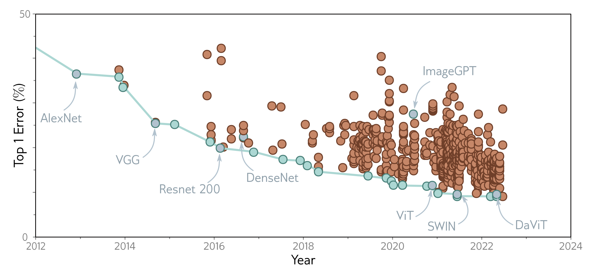{width="100%"}
:::
::::


## Después de ResNet: CNNs modernas

Las CNNs no se quedaron congeladas en 2015. 

Algunas ideas modernas importantes:

- bloques residuales;
- normalización;
- convoluciones separables en profundidad;
- bloques bottleneck;
- escalamiento cuidadoso de profundidad, anchura y resolución;
- entrenamiento con mucha aumentación y mejores schedules.

Ejemplos: ResNet, MobileNet, EfficientNet, ConvNeXt.


## Historia de clasificación de ImageNet

{fig-align="center" width="80%"}


## CNNs hoy

Hoy muchas tareas de visión usan Transformers o modelos fundacionales visuales.

Pero las CNNs siguen siendo importantes porque:

- son eficientes;
- tienen buenos sesgos inductivos para imágenes;
- funcionan bien con menos datos que modelos sin tanta estructura;
- aparecen como componentes dentro de modelos híbridos;
- siguen siendo fuertes en dispositivos con recursos limitados.

La lección no es “CNNs fueron reemplazadas”. La lección es:

$$
\boxed{
\text{localidad + compartición de pesos siguen siendo ideas centrales}
}
$$

# Métricas para computer vision

## Métricas para computer vision

Distintas tareas requieren métricas distintas.

- **Clasificación:** top-1 accuracy; top-5 accuracy.
- **Detección:** Intersection over Union; Average Precision; mean Average Precision.
- **Segmentación:** pixel accuracy; IoU por clase; mean IoU.


## Intersection over Union

Para comparar una caja o máscara predicha con la verdadera usamos:

$$
IoU=
\frac{|A\cap B|}{|A\cup B|}
$$

Si las dos regiones coinciden perfectamente:

$$
IoU=1.
$$

Si no se traslapan:

$$
IoU=0.
$$


# Detección de objetos

## Detección de objetos

El objetivo es identificar y localizar varios objetos en una imagen.

La salida no es solo una clase.

También necesitamos:

- cajas delimitadoras;
- clase de cada objeto;
- confianza de cada predicción.

{fig-align="center" width="45%"}


## YOLO: You Only Look Once

YOLO formuló detección como un problema de predicción directa desde una sola red.

La imagen se divide en una cuadrícula:

$$
S\times S
$$

Cada celda predice:

- probabilidades de clases;
- cajas delimitadoras;
- confianza de las cajas.

La versión original usaba una cuadrícula $7\times7$ y dos cajas por celda.


## Detección de objetos con YOLO

:::: {.columns}
::: {.column width="55%"}
La intuición:

1. Dividimos la imagen en una cuadrícula.
2. Cada celda se responsabiliza por objetos cuyo centro cae dentro de ella.
3. La red predice cajas y clases.
4. Se eliminan predicciones redundantes o de baja confianza.

La heurística clásica para eliminar cajas redundantes se llama **Non-Maximum Suppression**.
:::
::: {.column width="45%"}
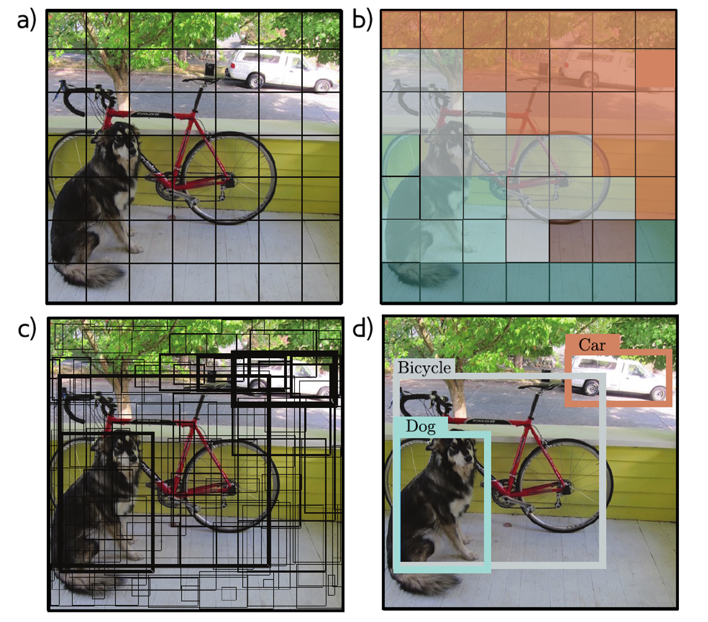{width="100%"}
:::
::::


## ¿Cómo se entrenó YOLO originalmente?

La red original se entrenó primero para clasificación.

Después se adaptó para detección.

Esto conecta con transfer learning:

$$
\text{features visuales aprendidas en clasificación}
\rightarrow
\text{detección de objetos}
$$

Hoy hay muchas variantes modernas de detectores, incluyendo modelos de una etapa, dos etapas y modelos basados en Transformers.

No necesitamos todos los detalles todavía. Respiremos, que todavía faltan RNNs, Transformers y el circo completo.


# Segmentación

## Segmentación de imágenes

En segmentación queremos una predicción por pixel.

Por ejemplo:

$$
\text{pixel }(i,j)
\rightarrow
\text{clase del pixel}
$$

La red debe conservar o recuperar información espacial.

Por eso aparecen:

- convoluciones;
- downsampling;
- upsampling;
- skip connections.


## Arquitecturas encoder-decoder

Muchas redes de segmentación tienen forma de encoder-decoder.

El encoder reduce resolución y aumenta abstracción:

$$
\text{imagen}
\rightarrow
\text{features globales}
$$

El decoder recupera resolución:

$$
\text{features}
\rightarrow
\text{máscara por pixel}
$$

U-Net es un ejemplo clásico de esta idea.


## Skip connections en segmentación

Para recuperar detalles finos, muchas arquitecturas conectan capas tempranas con capas tardías.

Las capas tempranas conservan detalles espaciales.

Las capas profundas contienen información más semántica.

La segmentación necesita ambas.

$$
\boxed{
\text{detalle espacial}+
\text{contexto semántico}
}
$$


# CNNs y políticas públicas

## Medir pobreza desde el cielo

Problema: medir pobreza requiere encuestas de hogares.

Estas encuestas pueden ser:

- caras;
- lentas;
- poco frecuentes;
- geográficamente incompletas.

Idea:

> usar imágenes satelitales como fuente auxiliar para estimar bienestar económico.

Pero ojo: esto no reemplaza automáticamente a las encuestas. Es una herramienta complementaria y necesita validación cuidadosa.


## Jean et al. (2016): transfer learning en dos pasos

La idea central:

1. Usar una CNN preentrenada en ImageNet.
2. Adaptarla para predecir luminosidad nocturna a partir de imágenes diurnas.
3. Usar las features aprendidas para predecir riqueza o consumo usando encuestas disponibles.

¿Por qué funciona la luminosidad nocturna como tarea intermedia?

Porque está correlacionada con actividad económica y existe a gran escala.

No es perfecta. Es un proxy, y los proxies también mienten con bastante confianza.


## ¿Qué aprende la red?

La red no observa “pobreza” directamente.

Aprende patrones visuales asociados con condiciones económicas, por ejemplo:

- caminos;
- techos;
- densidad urbana;
- agricultura;
- infraestructura;
- iluminación nocturna.

La predicción final depende de que estas correlaciones sean estables entre regiones y en el tiempo.

Ese supuesto debe evaluarse, no darse por hecho.


## Después de Jean et al.

Trabajos posteriores escalaron y modificaron esta idea.

Ejemplos:

- modelos entrenados con imágenes satelitales públicas para muchas aldeas;
- representaciones satelitales reutilizables para muchas tareas;
- modelos fundacionales geoespaciales entrenados con auto-supervisión.

La frontera actual se mueve hacia:

$$
\text{pretraining geoespacial}
+
\text{few labels}
+
\text{validación temporal y espacial}
$$


## ¿Qué puede salir mal?

En aplicaciones de política pública, el desempeño predictivo no es suficiente.

Preguntas importantes:

- ¿el modelo generaliza entre países o regiones?
- ¿funciona en zonas rurales y urbanas por igual?
- ¿el proxy de luminosidad nocturna introduce sesgos?
- ¿qué pasa cuando cambian las condiciones económicas o climáticas?
- ¿quién queda invisible en los datos satelitales?
- ¿cómo se auditan errores antes de asignar recursos?


# Resumen

## ¿Qué debemos recordar de CNNs?

Las CNNs se basan en tres ideas centrales:

1. **localidad:** mirar regiones pequeñas;
2. **compartición de pesos:** usar el mismo filtro en muchas posiciones;
3. **composición:** construir features más complejas capa por capa.

Estas ideas reducen parámetros y explotan la estructura espacial de las imágenes.


## ¿Qué debemos recordar de CNNs?

- convolución/correlación cruzada;
- canales;
- padding;
- stride;
- pooling;
- receptive field;
- upsampling;
- detección y segmentación.


# Referencias

## Referencias

- LeCun et al. (1998). *Gradient-Based Learning Applied to Document Recognition*.
- Krizhevsky, Sutskever & Hinton (2012). *ImageNet Classification with Deep Convolutional Neural Networks*.
- Simonyan & Zisserman (2014). *Very Deep Convolutional Networks for Large-Scale Image Recognition*.
- He et al. (2015). *Deep Residual Learning for Image Recognition*.
- Redmon et al. (2016). *You Only Look Once: Unified, Real-Time Object Detection*.
- Ronneberger et al. (2015). *U-Net: Convolutional Networks for Biomedical Image Segmentation*.


## Referencias sugeridas

- Tan & Le (2019). *EfficientNet: Rethinking Model Scaling for Convolutional Neural Networks*.
- Liu et al. (2022). *A ConvNet for the 2020s*.
- Jean et al. (2016). *Combining satellite imagery and machine learning to predict poverty*.
- Yeh et al. (2020). *Using publicly available satellite imagery and deep learning to understand economic well-being in Africa*.
- Rolf et al. (2021). *A generalizable and accessible approach to machine learning with global satellite imagery*.


