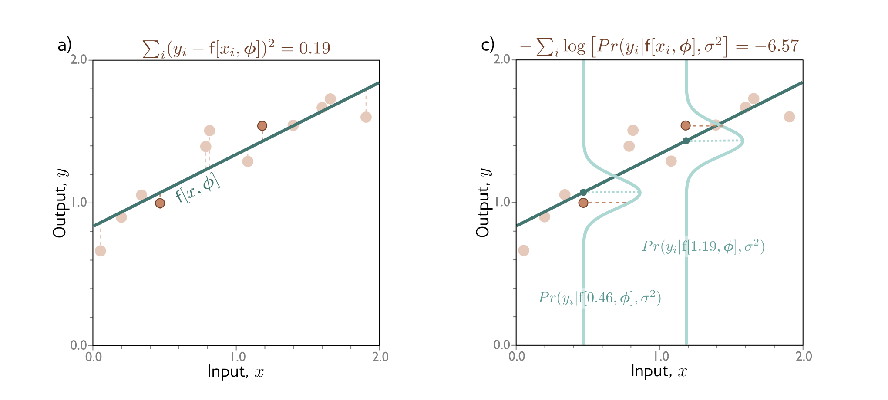
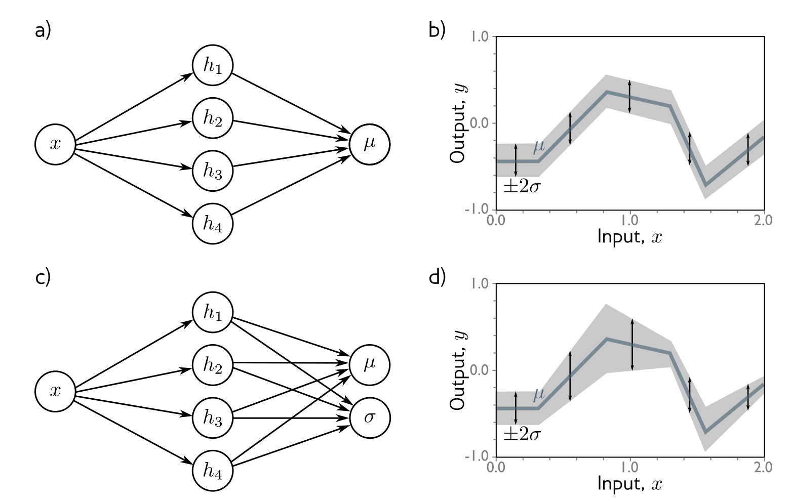
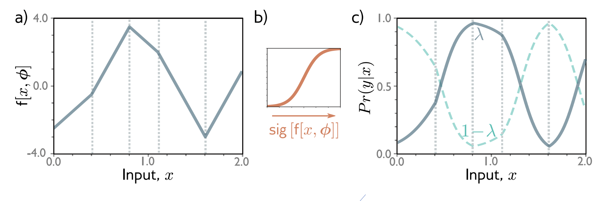
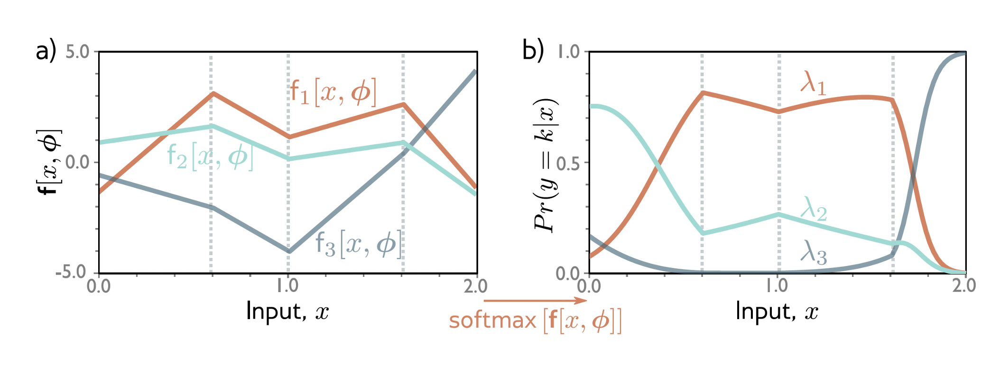
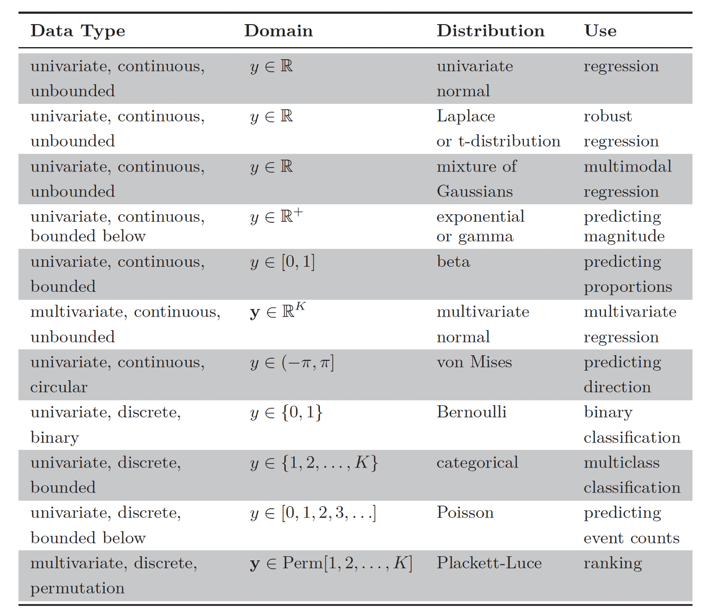
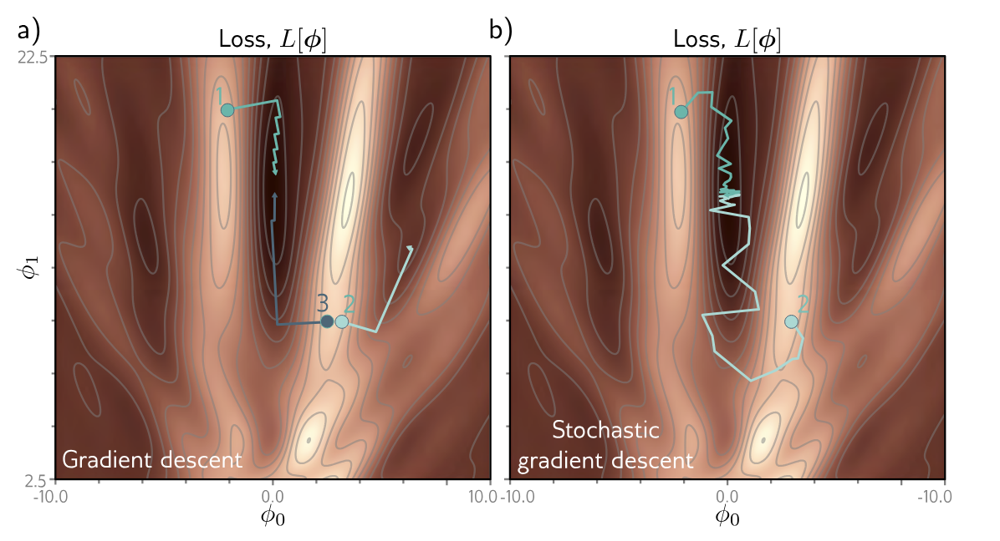
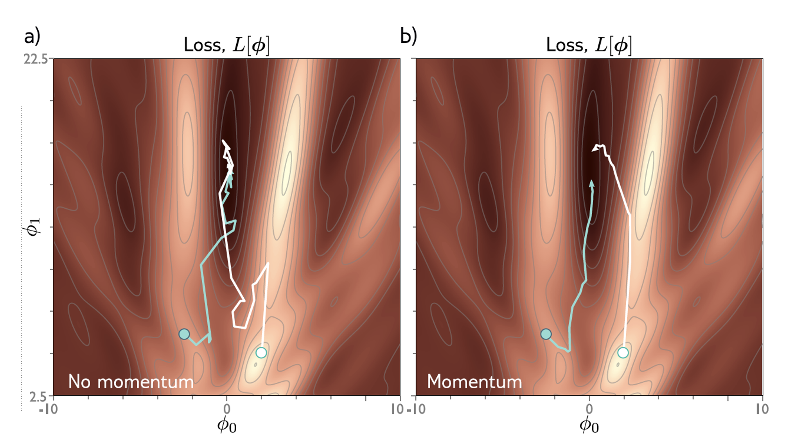
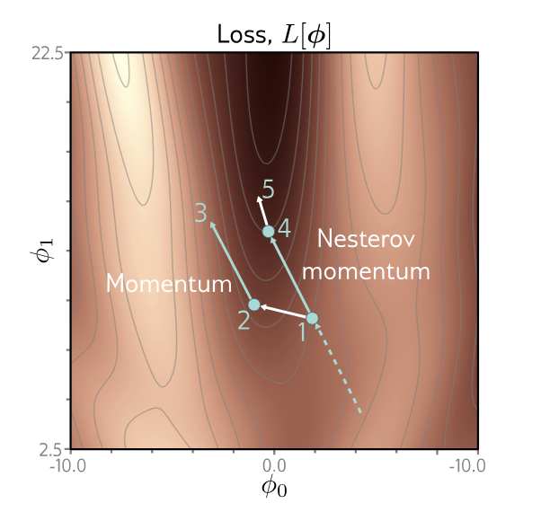
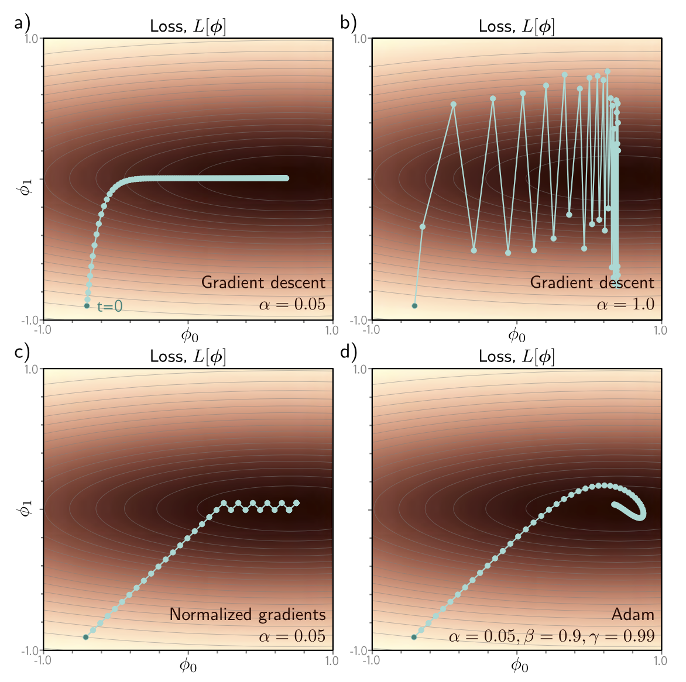

```{r setup, include=FALSE}
knitr::opts_chunk$set(echo = FALSE)
knitr::opts_chunk$set(message = FALSE, warning = FALSE)
knitr::opts_chunk$set(fig.width = 6.5, fig.height = 3.6, out.width = "70%", fig.align = "center", dev = "cairo_pdf")
```


# Funciones de pérdida 


## ¿Qué necesitamos para entrenar un algoritmos de ML? 

Para entrenar un modelo necesitamos:

- un conjunto de entrenamiento: $\mathcal D_{train}=\{(x_i,y_i)\}_{i=1}^n$
- un modelo con parámetros: $\hat y_i=f(x_i,\phi)$
- una función de pérdida: $L(\phi)$

La pérdida regresa un escalar que mide qué tan malas son las predicciones del modelo sobre los datos.


## ¿Cómo se construyen las funciones de pérdida?

Una manera muy útil de construir pérdidas es probabilística.

En vez de pensar que el modelo predice solamente un número, podemos pensar que predice una distribución condicional:

$$P(y|x)$$

La función de pérdida busca que las observaciones reales tengan alta probabilidad bajo esa distribución.

Para cada ejemplo:

$$
x_i \longrightarrow f(x_i,\phi) \longrightarrow P(y_i|x_i,\phi)
$$


## ¿Cómo puede un modelo predecir una distribución?

La receta es:

1. Escoger una distribución adecuada para el tipo de output.
2. Usar el modelo para predecir los parámetros de esa distribución.

Por ejemplo: $\theta_i=f(x_i,\phi)$

Entonces: $P(y_i|x_i,\phi)=P(y_i|\theta_i)$


## ¿Cómo vamos a modelar esto?

1. Escogemos una distribución paramétrica: $P(y|\theta)$
2. Usamos una red neuronal para calcular sus parámetros: $\theta=f(x,\phi)$
3. Entrenamos los parámetros del modelo, $\phi$, para que los datos observados tengan alta probabilidad.


## Criterio de máxima verosimilitud

El criterio de máxima verosimilitud busca los parámetros que hacen más probables los datos observados.

Para cada input $x_i$, el modelo produce: $\theta_i=f(x_i,\phi)$

y queremos que el output observado $y_i$ tenga alta probabilidad bajo: $P(y_i|\theta_i)$

## Criterio de máxima verosimilitud

Queremos resolver:

$$ \hat\phi = \arg\max_{\phi} \prod_{i=1}^{n} P(y_i|x_i,\phi)$$

Como el modelo produce $\theta_i=f(x_i,\phi)$:

$$ \hat\phi = \arg\max_{\phi} \prod_{i=1}^{n} P(y_i|\theta_i) = \arg\max_{\phi} \prod_{i=1}^{n} P(y_i|f(x_i,\phi)) $$


## Criterio de máxima verosimilitud

Aquí estamos usando el supuesto de que las observaciones son independientes dado el input y los parámetros del modelo.

Entonces podemos escribir:

$$ P(y_1,\ldots,y_n|x_1,\ldots,x_n,\phi) = \prod_{i=1}^{n} P(y_i|x_i,\phi) $$

Si además asumimos que los pares $(x_i,y_i)$ fueron muestreados de la misma distribución, decimos que los datos son i.i.d.


## Criterio de máxima verosimilitud

Maximizar un producto puede ser incómodo numéricamente.

Por eso maximizamos la log-verosimilitud:

$$ \hat\phi = \arg\max_{\phi} \sum_{i=1}^{n} \log P(y_i|f(x_i,\phi)) $$

Esto es equivalente porque el logaritmo es una función monótona.


## Criterio de máxima verosimilitud

Por convención, en ML normalmente minimizamos.

Entonces maximizar la log-verosimilitud equivale a minimizar la negative log-likelihood:

$$ \hat\phi = \arg\min_{\phi} - \sum_{i=1}^{n} \log P(y_i|f(x_i,\phi)) $$

Definimos:

$$ L(\phi) = - \sum_{i=1}^{n} \log P(y_i|f(x_i,\phi)) $$


## Receta para funciones de pérdida

1. Escoger una distribución adecuada: $P(y|\theta)$
2. Definir un modelo para predecir sus parámetros: $\theta=f(x,\phi)$
3. Entrenar $\phi$ minimizando la negative log-likelihood:

$$ L(\phi) = - \sum_{i=1}^{n} \log P(y_i|f(x_i,\phi)) $$

4. Para inferencia, regresar una distribución o una predicción derivada de ella.


## Ejemplo 1: regresión univariada

Queremos predecir un escalar: $y\in\mathbb R$ a partir de un input $x$.

Primero escogemos una distribución adecuada para $y$.

Por ejemplo, una normal:

$$
P(y|\mu,\sigma^2)
=
\frac{1}{\sqrt{2\pi\sigma^2}}
\exp\left(
-
\frac{(y-\mu)^2}{2\sigma^2}
\right)
$$


## Ejemplo 1: regresión univariada

```{r, fig.width = 4, fig.height = 3}
library(ggplot2)
library(dplyr)
params <- tibble::tribble(
  ~mu,   ~sigma, ~col,       ~lab_x, ~lab_y, ~lab_col,
  -1.9,   0.3,   "#C26D4A",  -1.9,    1.20,  "#C26D4A",  # brick
  -0.5,   1.2,   "#76C9C2",  -0.1,    0.45,  "#76C9C2",  # teal
   1.3,   0.6,   "#2F2F2F",   1.55,   0.85,  "#2F2F2F"   # dark gray
)
zgrid <- seq(-3, 3, length.out = 800)
dens <- params %>%
  tidyr::expand_grid(z = zgrid) %>%
  mutate(pdf = dnorm(z, mean = mu, sd = sigma))
p <- ggplot(dens, aes(z, pdf, group = interaction(mu, sigma))) +
  geom_line(aes(color = interaction(mu, sigma)), linewidth = 2) +
  scale_color_manual(values = params$col,
                     labels = c(
                       expression(mu == -1.9 ~ "," ~ sigma == 0.3),
                       expression(mu == -0.5 ~ "," ~ sigma == 1.2),
                       expression(mu ==  1.3 ~ "," ~ sigma == 0.6)
                     ),
                     guide = "none") +
  coord_cartesian(xlim = c(-3, 3), ylim = c(0, 1.5), expand = FALSE) +
  labs(x = expression(z), y = expression(Pr(z))) +
  theme_minimal(base_size = 14) +
  theme(
    panel.grid = element_blank(),
    axis.title = element_text(face = "italic"),
    axis.text = element_text(color = "grey30"),
    axis.line = element_line(linewidth = 0.7, color = "black"),
    plot.margin = margin(10, 12, 10, 12)
  )

print(p)


```


## Ejemplo 1: regresión univariada

Definimos un modelo para predecir uno o más parámetros de la distribución.

Por ejemplo, si solo queremos predecir la media: $\mu_i=f(x_i,\phi)$ y dejamos $\sigma^2$ constante.

Entonces:

$$ P(y_i|x_i,\phi) = P(y_i|f(x_i,\phi),\sigma^2) $$


## Ejemplo 1: regresión univariada

Sustituyendo en la negative log-likelihood:

$$ L(\phi) = - \sum_{i=1}^{n} \log \left[ \frac{1}{\sqrt{2\pi\sigma^2}} \exp\left( - \frac{(y_i-f(x_i,\phi))^2}{2\sigma^2} \right) \right] $$

Usando propiedades del logaritmo:

$$ L(\phi) = \sum_{i=1}^{n} \left[ \frac{1}{2}\log(2\pi\sigma^2) + \frac{(y_i-f(x_i,\phi))^2}{2\sigma^2} \right] $$

## Ejemplo 1: regresión univariada

Si $\sigma^2$ es constante, el primer término no depende de $\phi$.

Entonces minimizar la negative log-likelihood equivale a minimizar: $\sum_{i=1}^{n}(y_i-f(x_i,\phi))^2$

Regresamos a mínimos cuadrados.

$$ \boxed{ \text{Normal con varianza constante} \Longrightarrow \text{pérdida cuadrática} } $$

## Ejemplo 1: regresión univariada

¿Qué derivamos?

La función de pérdida de mínimos cuadrados.

Esta pérdida viene naturalmente de asumir que:

- los errores son independientes;
- los errores tienen distribución normal;
- la varianza es constante;
- la media condicional está dada por $f(x,\phi)$.


## Ejemplo 1: regresión univariada

¿Cómo se ve esto gráficamente? 

{fig-align="center" width="80%"}


## Ejemplo 1: regresión univariada

¿Qué pasó con la varianza?

La asumimos constante, entonces no afecta el valor óptimo de $\phi$.

¿Qué pasa si queremos aprender la varianza?

Podemos hacer que dependa de $x$:

- $\mu(x)=f_1(x,\phi)$
- $\sigma^2 = f_2(x,\phi)^2$ 
- Tenemos que ser cuidados con $f_2$ para asegurarnos que $\sigma^2(x)>0$


## Ejemplo 1: regresión univariada

{fig-align="center" width="80%"}


## Ejemplo 2: clasificación binaria

Ahora queremos predecir dos clases: $y\in\{0,1\}$

Escogemos una distribución Bernoulli:

$$ P(y|\lambda) = \begin{cases} 1-\lambda & y=0 \\ \lambda & y=1 \end{cases}$$

con: $\lambda\in[0,1]$

También podemos escribir: $P(y|\lambda)=(1-\lambda)^{1-y}\lambda^y$


## Ejemplo 2: clasificación binaria

Queremos que el modelo prediga el parámetro $\lambda$.

Problema: $f(x,\phi)\in\mathbb R$

pero necesitamos: $\lambda\in[0,1]$

Solución: usar la función sigmoide.

$$
\sigma(z)=\frac{1}{1+e^{-z}}
$$

Entonces:

$$
\lambda_i=\sigma(f(x_i,\phi))
$$


## Ejemplo 2: clasificación binaria

La probabilidad del label observado es:

$$P(y_i|x_i,\phi)=(1-\lambda_i)^{1-y_i}\lambda_i^{y_i}$$

con: $\lambda_i=\sigma(f(x_i,\phi))$

Por lo tanto:

$$P(y_i|x_i,\phi) = (1-\sigma(f(x_i,\phi)))^{1-y_i} \sigma(f(x_i,\phi))^{y_i} $$

## Ejemplo 2: clasificación binaria

Entrenamos minimizando la negative log-likelihood:

$$\hat\phi = \arg\min_{\phi} L(\phi)$$

$$L(\phi) = - \sum_{i=1}^{n} \left[ (1-y_i)\log(1-\sigma(f(x_i,\phi))) + y_i\log(\sigma(f(x_i,\phi))) \right]$$

Esta es la **binary cross-entropy**.


## Ejemplo 2: clasificación binaria

Para inferencia podemos regresar:

- la probabilidad: $P(y=1|x)=\lambda$
- o una clase usando un umbral: 
$$\hat y=\begin{cases}
1 & \lambda\geq 0.5 \\
0 & \lambda<0.5
\end{cases}$$
- Ojo: $\lambda$ es la probabilidad **estimada por el modelo**, pero no necesariamente está bien calibrada; por ejemplo, $\lambda=0.9$ no garantiza que eventos con esa predicción ocurran el 90% de las veces.


## Ejemplo 2: clasificación binaria

De la salida de la red a la probabilidad: a) score $f(x,\phi)$, b) sigmoide, c) $P(y=1|x)=\lambda$.

{fig-align="center" width="80%"}


## Ejemplo 3: clasificación multiclase

Ahora queremos predecir una de $K$ clases: $y\in\{1,\ldots,K\}$

Escogemos una distribución categórica: $P(y=k)=\lambda_k$

con: $\lambda_k\geq0$ y  $\sum_{k=1}^{K}\lambda_k=1$


## Ejemplo 3: clasificación multiclase

El modelo produce un score para cada clase:

$$f(x,\phi) = \begin{bmatrix} f_1(x,\phi)\\ \vdots\\ f_K(x,\phi) \end{bmatrix} $$

Estos scores pueden tomar cualquier valor real.

Para convertirlos en probabilidades usamos softmax: $\text{softmax}_k(z)=\frac{e^{z_k}}{\sum_{j=1}^{K}e^{z_j}}$

Entonces:

$$
P(y=k|x,\phi)=\text{softmax}_k(f(x,\phi))
$$

## Ejemplo 3: clasificación multiclase

{fig-align="center" width="80%"}


## Ejemplo 3: clasificación multiclase

Entrenamos minimizando la negative log-likelihood.

Si $y_i$ es la clase correcta del ejemplo $i$:

$$L(\phi)=-\sum_{i=1}^{n}\log\left[\frac{e^{f_{y_i}(x_i,\phi)}} {\sum_{k=1}^{K}e^{f_k(x_i,\phi)}} \right]$$

Equivalentemente:

$$L(\phi) = \sum_{i=1}^{n} \left[ \log\sum_{k=1}^{K}e^{f_k(x_i,\phi)} - f_{y_i}(x_i,\phi) \right] $$

Esta es la **cross-entropy multiclase**.


## Ejemplo 3: clasificación multiclase

Para inferencia podemos regresar:

- toda la distribución: $P(y=1|x),\ldots,P(y=K|x)$

- o la clase más probable: $\hat y = \arg\max_k P(y=k|x)$


## ¿Qué pasa si tenemos otros tipos de datos?

{fig-align="center" width="80%"}


## ¿Qué pasa si tenemos outputs múltiples?

Por ejemplo, en clasificación multilabel una imagen puede tener varios labels:

En la práctica, muchas veces hacemos una suposición más simple: que las dimensiones del output son condicionalmente independientes dado $x$ y el modelo.

Entonces: $P(y_i|f(x_i,\phi)) = \prod_{d} P(y_{id}|f_d(x_i,\phi))$

La pérdida queda:

$$
L(\phi)
=
-
\sum_{i=1}^{n}
\sum_d
\log P(y_{id}|f_d(x_i,\phi))
$$

Esta suposición no siempre es adecuada: por ejemplo, algunos labels pueden estar correlacionados.


## Cross-entropy: repaso

La cross-entropy compara una distribución objetivo $q$ con la distribución predicha por el modelo $p_\phi$.

La divergencia KL se puede escribir como: $D_{KL}(q||p_\phi) = \sum_y q(y)\log\frac{q(y)}{p_\phi(y)}$

Equivalentemente: $D_{KL}(q||p_\phi) = -H(q)+H(q,p_\phi)$

Donde:

$$
H(q,p_\phi)
=
-
\sum_y q(y)\log p_\phi(y)
$$

es la cross-entropy.


## Cross-entropy: repaso

Como $q$ no depende de los parámetros del modelo, minimizar: $D_{KL}(q||p_\phi)$

es equivalente a minimizar: $H(q,p_\phi)$

En clasificación supervisada, si la etiqueta es one-hot, entonces:

$$
H(q_i,p_\phi(\cdot|x_i))
=
-
\log p_\phi(y_i|x_i)
$$

Por eso cross-entropy y negative log-likelihood terminan dando la misma pérdida.


# Optimización 


## ¿Cómo encontramos los parámetros que minimizan la función de pérdida?

Esto es lo que llamamos entrenamiento o ajuste del modelo.

La idea general es:

1. calcular gradientes de la pérdida respecto a los parámetros;
2. ajustar los parámetros usando esos gradientes;
3. repetir hasta obtener una pérdida suficientemente baja.

Recordemos que podemos hacer esto usando Gradient Descent o alguna variante.


## Gradient Descent

Calculamos el gradiente de la función de pérdida respecto a los parámetros:

$$
\nabla_\phi L(\phi)
=
\begin{bmatrix}
\frac{\partial L}{\partial \phi_1}\\
\vdots\\
\frac{\partial L}{\partial \phi_N}
\end{bmatrix}
$$

Actualizamos:

$$
\phi_{t+1}
=
\phi_t
-
\alpha
\nabla_\phi L(\phi_t)
$$

donde $\alpha$ es la tasa de aprendizaje.


## Gradient Descent

Si $L(\phi)$ es convexa y usamos una tasa de aprendizaje adecuada, Gradient Descent converge a un mínimo global.

En una función convexa no existen mínimos locales malos.

Pero en redes neuronales la pérdida normalmente no es convexa.

Como ejemplo sencillo de una función no convexa, podemos usar el modelo de Gabor:

$$f(x,\phi) = \sin(\phi_0+0.06\phi_1x) \exp\left[-\frac{(\phi_0+0.06\phi_1x)^2}{32}\right] $$


## Gradient descent

{fig-align="center" width="80%"}


## Gradient Descent

Queremos minimizar: $L(\phi)=\sum_{i=1}^{n}(f(x_i,\phi)-y_i)^2$

Problemas:

- la función puede tener varios mínimos locales;
- no hay garantía de encontrar el mínimo global;
- puede haber regiones planas o puntos silla que hagan lento el entrenamiento.

En redes profundas, estos problemas aparecen en espacios de parámetros mucho más grandes.


## Gradient descent

{fig-align="center" width="80%"}


## Stochastic Gradient Descent \(SGD\)

Full-batch GD usa todo el conjunto de entrenamiento para cada actualización.

Esto puede ser costoso cuando $n$ es grande.

SGD usa una estimación del gradiente usando un subconjunto de ejemplos, llamado mini-batch:

$$
B_t\subset\{1,\ldots,n\}
$$

Una época es una pasada completa por el conjunto de entrenamiento.

Normalmente barajamos los datos y procesamos varios mini-batches por época.


## Stochastic Gradient Descent \(SGD\)

La actualización con mini-batch SGD es:

$$\phi_{t+1} = \phi_t - \alpha \frac{1}{|B_t|} \sum_{i\in B_t} \nabla_\phi \ell_i(\phi_t)$$

El gradiente del mini-batch es una estimación ruidosa del gradiente total.

Ese ruido es parte importante del comportamiento práctico de SGD.


## Propiedades del SGD

1. Cada actualización usa solo una parte de los datos.
2. Es menos costoso por actualización que full-batch GD.
3. Si el muestreo es uniforme, cada ejemplo contribuye al entrenamiento en promedio.
4. El ruido del mini-batch puede ayudar a no quedarse demasiado tiempo en regiones planas o puntos silla.
5. En deep learning suele funcionar muy bien en la práctica, aunque no garantiza encontrar el mínimo global.

Con tasa de aprendizaje decreciente, SGD puede converger bajo ciertas condiciones.

Con tasa constante, suele oscilar alrededor de regiones de baja pérdida.


## GD vs SGD

{fig-align="center" width="80%"}


## Momentum

Momentum usa una combinación del gradiente actual y la dirección acumulada de pasos anteriores.

Definimos: $g_t=\frac{1}{|B_t|}\sum_{i\in B_t}\nabla_\phi \ell_i(\phi_t)$

Actualizamos:

$$
m_{t+1}
=
\beta m_t+(1-\beta)g_t
$$

$$
\phi_{t+1}
=
\phi_t-\alpha m_{t+1}
$$ 

## Momentum

El parámetro $\beta$ controla cuánto suavizamos los gradientes en el tiempo.

Si los gradientes apuntan en direcciones parecidas, momentum acumula movimiento.

Si los gradientes cambian mucho de dirección, momentum reduce oscilaciones.

Esto puede ayudar en valles estrechos de la función de pérdida.


## Momentum: 

{fig-align="center" width="80%"}


## Momentum acelerado de Nesterov

La idea de Nesterov momentum es calcular el gradiente después de mirar hacia donde nos lleva el momentum actual.

Primero miramos el punto adelantado: $\phi_t-\alpha\beta m_t$

Luego calculamos el gradiente ahí:

$$
g_t^{N}
=
\frac{1}{|B_t|}
\sum_{i\in B_t}
\nabla_\phi \ell_i(\phi_t-\alpha\beta m_t)
$$

Y actualizamos:

$$
m_{t+1}=\beta m_t+(1-\beta)g_t^{N},
\qquad
\phi_{t+1}=\phi_t-\alpha m_{t+1}
$$


## Momentum acelerado de Nesterov

- En momentum normal usamos el gradiente en la posición actual. Nos movemos 1-2-3
- En Nesterov usamos el gradiente en una posición adelantada. Nos movemos 1-4-5


{fig-align="center" width="70%"}


## Métodos adaptativos

Un problema de usar una sola tasa de aprendizaje es que distintas coordenadas pueden tener escalas de gradiente muy diferentes.

Queremos avanzar de forma estable cuando:

- una dirección tiene gradientes muy grandes;
- otra dirección tiene gradientes muy pequeños.

La idea de los métodos adaptativos es ajustar el tamaño del paso por coordenada.


## Normalización por coordenada

Una intuición simple sería normalizar cada coordenada del gradiente: $g_t=\nabla_\phi L(\phi_t)$ y $v_t=g_t^2$

$$
\phi_{t+1}
=
\phi_t
-
\alpha
\frac{g_t}{\sqrt{v_t}+\epsilon}
$$

Esto se parece a usar solo el signo del gradiente por coordenada.

En la práctica, Adam y otros métodos usan promedios móviles para que esta normalización sea más estable.


## Adaptive Moment Estimation \(Adam\)

Adam combina dos ideas:

1. momentum sobre los gradientes;
2. normalización adaptativa por coordenada.

Definimos el gradiente del mini-batch: $g_t=\frac{1}{|B_t|}\sum_{i\in B_t}\nabla_\phi \ell_i(\phi_t)$

Promedio móvil del gradiente: $m_{t+1}=\beta_1m_t+(1-\beta_1)g_t$

Promedio móvil del gradiente al cuadrado: $v_{t+1}=\beta_2v_t+(1-\beta_2)g_t^2$


## Adaptive Moment Estimation \(Adam\)

Como $m_0=0$ y $v_0=0$, al inicio los promedios están sesgados hacia cero.

Por eso usamos corrección de sesgo:

$$
\hat m_{t+1}
=
\frac{m_{t+1}}{1-\beta_1^{t+1}}
$$

$$
\hat v_{t+1}
=
\frac{v_{t+1}}{1-\beta_2^{t+1}}
$$

con:

$$
\beta_1,\beta_2\in[0,1)
$$

## Adaptive Moment Estimation \(Adam\)

La actualización es:

$$
\phi_{t+1}
=
\phi_t
-
\alpha
\frac{\hat m_{t+1}}
{\sqrt{\hat v_{t+1}}+\epsilon}
$$

Ojo: estos algoritmos normalmente los usamos con mini-batches.

Adam suele ser un buen optimizador inicial porque es robusto a diferencias de escala en los gradientes.

Pero no hay un optimizador universalmente mejor para todos los problemas.


## Adam 

{fig-align="center" width="80%"}
