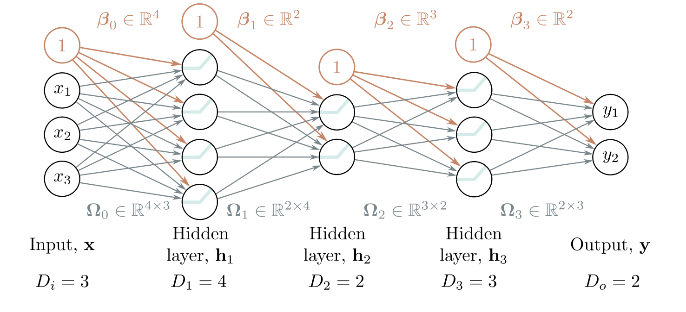
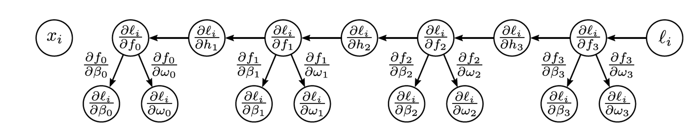
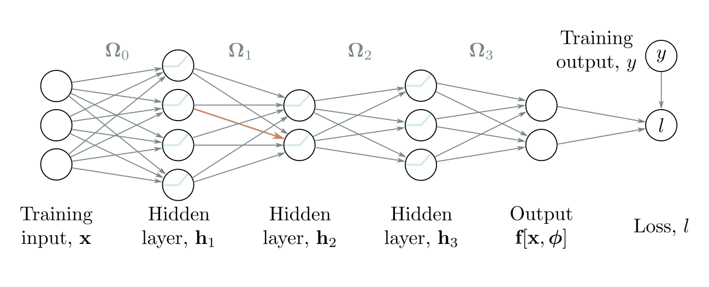
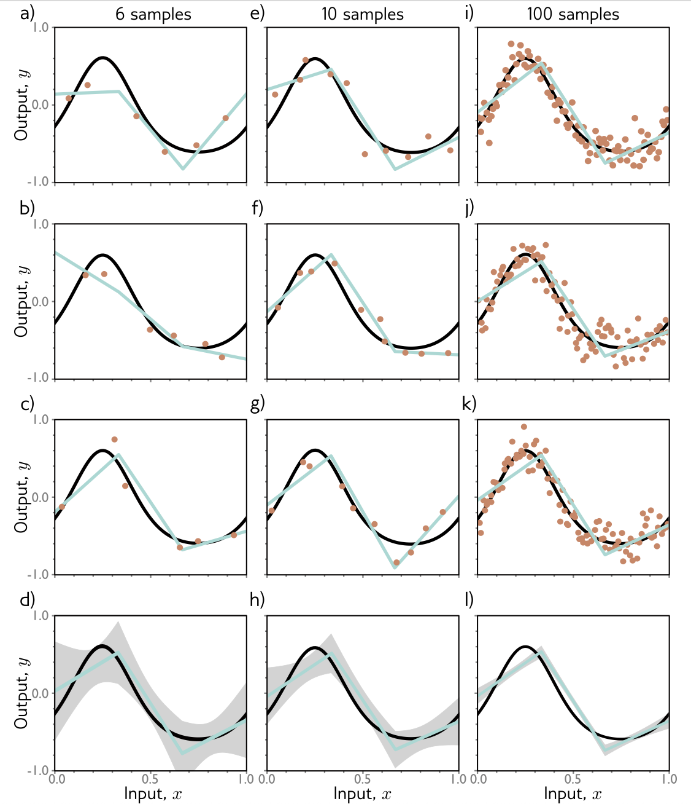
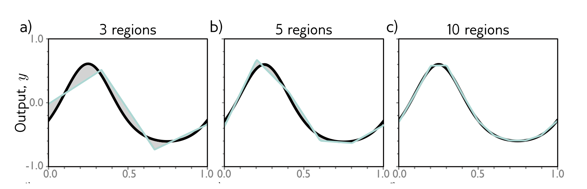
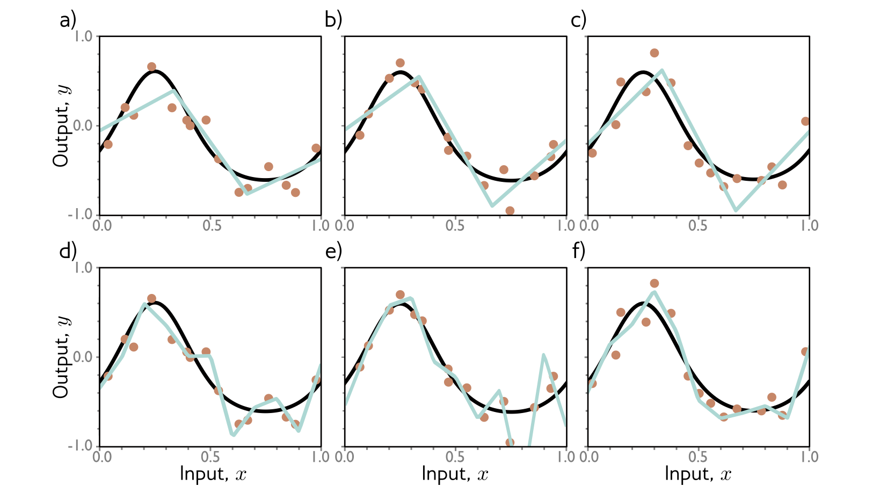
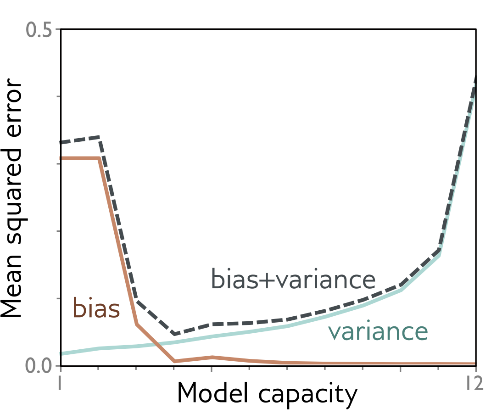
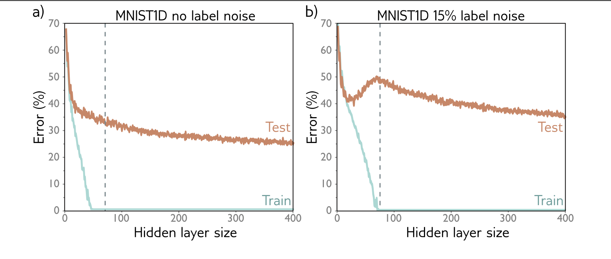

```{r setup, include=FALSE}
knitr::opts_chunk$set(echo = FALSE)
knitr::opts_chunk$set(message = FALSE, warning = FALSE)
knitr::opts_chunk$set(fig.width = 6.5, fig.height = 3.6, out.width = "70%", fig.align = "center", dev = "cairo_pdf")
```


# Gradientes


## Problemas entrenando RN 
- Para poder entrenar una red neuronal vamos a necesitar:  
1. Una manera eficiente de calcular gradientes, los LLMs tienen alrededor de $\sim 10^{12}$ parámetros
2. Una manera buena de inicializar los parámetros 


## El problema con los gradientes:
- Consideremos la siguiente red: 

{fig-align="center" width="80%"}


  
## El problema con los gradientes:
- La red anterior la podemos escribir como: 
    - $h_1 = a(\beta_0 + \Omega_0 x)$
    - $h_2 = a(\beta_1 + \Omega_2 h_1)$
    - $h_3 = a(\beta_2 + \Omega_2 h_2)$
    - $f(x, \phi) = \beta_3 + \Omega_3 h_3$
    
- ¿Qué necesitamos para entrenar esta red?
    - $L(\phi) = \sum_{i=1}^I l(f(x, \phi))$
    - $\phi_{t+1} \leftarrow \phi_t - \alpha \sum_{i \in B_t} \frac{\partial ℓ_i(\phi_t)}{\partial \phi}$
    - Necesitamos las parciales: $\frac{\partial ℓ_i(\phi_t)}{\beta_k}$ y $\frac{\partial ℓ_i(\phi_t)}{\Omega_k}$
    
    
    
## Gradientes
- Las parciales de la función de pérdida nos dicen como cambia la pérdida cuando cambiamos un poco los parámetros
- Los algoritmos de optimización aprovechan esta info para cambiar los parámetros y disminuir la pérdida 
- Cuando tenemos una red neuronal:
    - Cada $w_k \in \Omega_k$ esta en una regresión lineal que luego pasa por una activación y luego pasa a la siguiente capa
    - Entonces el $\Delta w_k$ es amplificado o atenuado por la red 
    - Este cambio puede tener efectos domino en la siguiente capa
    - Para saber como afecta $w_k$ la pérdida necesitamos saber como afecta a todas las capas 
    
    
## Recordemos:
- Forward pass (propagación hacia adelante): recorrer la red hacia adelante, dado un conjunto de parámetros y un ejemplo de entrenamiento $x$ obtenemos el output $\hat{y}$ y calculamos la función de pérdida para ver como lo hace en relación al y verdadero. 
- Backward pass (propagación hacia atrás): recorremos la red al revés utilizando la regla de la cadena, el objetivo es encontrar los gradientes para poder actualizar los pesos usando los algoritmos de optimización
    
    

## Ejemplo sencillo
- Tenemos la siguiente función: podemos pensar que es una red neuronal superficial con un solo input y un solo output  

$$f(x,\phi) = \beta_3 + \omega_3 cos(\beta_2 + \omega_2 e^{\beta_1+\omega_1sin(\beta_0 + \omega_0x)})$$

- Y una función de pérdida $L(\phi) = \sum_{i} ℓ_i$
- Donde $ℓ_i = (f(x,\phi) - y)^2$
- Si queremos por ejemplo saber como un pequeño cambio en $\beta_3$ afecta la función de pérdida necesitamos $\frac{\partial ℓ_i}{\partial \beta_3}$


## Ejemplo sencillo
- En este ejemplo podríamos calcular todas estas parciales a mano
- Pero.. algunas de estas expresiones son muy complicadas y además hay redundancia de la cual nos podemos aprovechar 
- Vamos a usar el algoritmo de propagación hacia atrás para solucionar esto: 
    - forward pass donde calculamos y guardamos los valores intermedios y la salida de la red
    - backward pass calculamos las parciales de cada parámetro y las reusamos para calcular las parciales mas complejas 

## Ejemplo sencillo: forward pass
1. Escribimos nuestra red como una serie de funciones intermedias
2. Calculamos estas en vez de la función super compleja 
    - $f_0 = \beta_0 +\omega_0 x_i$
    - $h_1 = sin(f_0)$
    - $f_1 = \beta_1 + \omega_1 h_1$
    - $h_2 = e^{f_1}$
    - $f_3 = \beta_2 + \omega_2 h_2$
    - $h_3 = cos(f_3)$
    - $f_3 = \beta_3 + \omega_3 h_3$
    - $ℓ_i = (f_3 - y_i)^2$
    
## Ejemplo sencillo: backward pass
1. Calculamos las parciales de la función de pérdida con respecto a estas funciones intermedias (de atrás hacia adelante)
- $\frac{\partial ℓ_i}{\partial f_3} = 2(f_3 - y_i)$
- $\frac{\partial ℓ_i}{\partial h_3} = \frac{\partial f_3}{\partial h_3} \frac{\partial ℓ_i}{\partial f_3}$
- Podemos seguir haciendo esto hasta llegar a: 
- $\frac{\partial ℓ_i}{\partial f_0} = \frac{\partial h_1}{\partial f_0} \frac{\partial f_1}{\partial h_1} \frac{\partial h_2}{\partial f_1} \frac{\partial f_2}{\partial h_2} \frac{\partial h_3}{\partial f_2} \frac{\partial f_3}{\partial h_3} \frac{\partial ℓ_i}{\partial f_3}$
- Tenemos todas las parciales necesarias porque las calculamos en el paso anterior 

## Ejemplo sencillo: backward pass
- Ok pero no queremos las parciales con respecto a estas funciones intermedias las que necesitamos son las de los pesos $\beta$ y $\omega$
- Podemos hacer lo mismo que antes: 
    - $\frac{\partial ℓ_i}{\partial \omega_k} = \frac{\partial f_k}{\partial \omega_k} \frac{\partial ℓ_i}{\partial f_k}$
- Hacer esto es más sencillo y eficiente que calcular las parciales de manera individual    
   
   
## Ejemplo sencillo: backward pass

{fig-align="center" width="80%"}


## Ejemplo en forma vectoria/matricial de backprop
- Tenemos la siguiente red

{fig-align="center" width="80%"}

## Ejemplo en forma vectoria/matricial de backprop
1. Forward pass: escribir la red como una serie de funciones intermedias
- $f_0 = \beta_0 + \Omega_0 x_i$
- $h_1 = a(f_0)$
- $f_1 = \beta_1 + \Omega_1 h_1$
- $h_2 = a(f_1)$
- $f_2 = \beta_2 + \Omega_2 h_2$
- $h_3 = a(f_3)$
- $f_3 = \beta_3 + \Omega_3 h_3$
- $ℓ_i = l(f_3,y_i)$

## Ejemplo en forma vectoria/matricial de backprop
2. Backward pass: encontramos las parciales en términos de otras parciales 
- $\frac{\partial ℓ_i}{\partial f_2} = \frac{\partial h_3}{\partial f_2}\frac{\partial f_3}{\partial h_3}\frac{\partial ℓ_i}{\partial f_3}$
- Pero casi todas estas parciales son relativamente sencillas: 
    - $\frac{\partial f_3}{\partial h_3} = \frac{\partial}{\partial h_3}(\beta_3 + \Omega_3 h_3) = \Omega_3^T$
    - Si las funciones de activación son ReLU $max(0,x)$ entonces $\frac{\partial h_3}{\partial f_2} = \frac{\partial a}{\partial f_2} = \mathbf{1}[f_2 >0]$


## Ejemplo en forma vectoria/matricial de backprop
- Nos faltan las derivadas con respecto a los parámetros
- $\frac{\partial ℓ_i}{\partial \beta_k} = \frac{\partial f_k}{\partial \beta_k}\frac{\partial ℓ_i}{\partial f_k} = \frac{\partial}{\partial \beta_k} (\beta_k +\Omega_k h_k) \frac{\partial ℓ_i}{\partial f_k} = \frac{\partial ℓ_i}{\partial f_k}$
- $\frac{\partial ℓ_i}{\partial \Omega_k} = \frac{\partial f_k}{\partial \Omega_k}\frac{\partial ℓ_i}{\partial f_k} = \frac{\partial}{\partial \Omega_k} (\beta_k +\Omega_k h_k) \frac{\partial ℓ_i}{\partial f_k} = \frac{\partial ℓ_i}{\partial f_k} h_k^T$


## Algoritmo de propagación hacia atrás
- Comenzamos con la parcial $\frac{\partial ℓ_i}{\partial f_k}$ y nos movemos en reversa sobre la red
    - $\frac{\partial ℓ_i}{\partial \beta_k} = \frac{\partial ℓ_i}{\partial f_k}$
    - $\frac{\partial ℓ_i}{\partial \Omega_k} = \frac{\partial ℓ_i}{\partial f_k}h_k^T$
    - $\frac{\partial ℓ_i}{\partial f_{k-1}} = \mathbf{1}[f_{k-1} >0] \odot \Omega_{k}^T \frac{\partial ℓ_i}{\partial f_k}$
    - Acá $\odot$ es la multiplicación punto por punto y $\mathbf{1}[f_{k-1} >0]$ es un vector con 1's donde $f_{k-1} >0$, 0 en todo lo demás


## Algoritmo de propagación hacia atrás
- Este algoritmo es extremadamente eficiente
    - Solo necesitas multiplicar matrices 
- Pero requiere mucha memoria, tenemos que guardar todas la parciales intermedias
- Secuencial:
    - podemos procesar distintos batches en paralelo
    - pero nos vamos a meter en problemas si el modelo completo no cabe en la máquina 
    
## Diferenciación algoritmica
- Los frameworks modernos de deep learning calculan las parciales automáticamente 
- Solo necesitas definir el modelo y la función de pérdida 
- ¿Cómo? usando diferenciación algorítmica 
    - Cada componente sabe su derivada
    - Por ejemplo $z_{out} = relu(z_{in})$ sabe la derivada de $z_{out}$ en relación a $z_{in}$
- Puede calcular el forward y el backward pass por batches en paralelo 
- Backprop va a funcionar siempre y cuando la gráfica computacional se acyclica (que no haya loops en la red, pero puede no ser secuencial)


# Inicialización 

## ¿Cómo inicializamos los parámetros?
- Donde comenzamos a buscar parámetros tiene efectos en como va a aprender la red y es crucial para la estabilidad numérica 
- ¿Por qué?
- Durante el forward pass cada $f_k$ está dada por: $f_k = \beta_k + \Omega_k h_k$, donde $h_k = a(f_{k-1})$ con a una función de activación ReLU
- Si inicializamos todas las $\beta_k$ en 0 y los pesos de $\Omega_k \sim N(0,\sigma^2)$
- Acá pueden pasar dos cosas dependiendo de como elegimos $\sigma$

## ¿Cómo inicializamos los parámetros?
1. Si $\sigma \approx 10^{-5}$: 
    - cada elemento de $\beta_k + \Omega_k h_k$ va a ser una suma ponderada de $h_k$ con pesos muy pequeños entonces el resultado probablemente sea mas pequeño que el input
    - como $a$ es ReLu nos deshacemos de los negativos y el rango de $h_k$ va a ser la mitad que el de $f_{k-1}$
    - las magnitudes de las pre-activaciones se van a hacer cada vez más pequeñas 
2. Si $\sigma \approx 10^{5}$:
    - los pesos van a ser muy grandes 
    - la suma ponderada va a ser mas grande que h 
    - ReLU divide el rango a la mitad igual que antes
    - las magnitudes se van a hacer cada vez más grandes 

## ¿Por qué esto es un problema?
- No pasa solo en el forward pass va a pasar en el backward pass
- Generando gradientes extremadamente pequeños o extremadamente grandes 
- Estos gradientes inestables son un problema para los algoritmos de optimización 


## ¿Por qué esto es un problema?
- Consideremos el siguiente paso en una red entre f y f'
    - $h = a(f)$
    - $f' = \beta + \Omega h$
- Donde $f_j$ tiene varianza $\sigma_f^2$
- Inicializamos las $\beta_i = 0$ y $\Omega_{ij} \sim N(0,\sigma_{\Omega}^2)$


## ¿Por qué esto es un problema?
- Podemos calcular $E[f'_i]$
$$E[f'_i] = E[\beta_i + \sum_{j=1}^{D_h} \Omega_{ij}h_j] = E[\beta_i] + \sum_{j=1}^{D_h}E[\Omega_{ij}h_j] = 0 + \sum_{j=1}^{D_h}E[\Omega_{ij}]E[h_j] = 0$$


## ¿Por qué esto es un problema?
- Podemos calcular $\sigma_{f'}$

$$\sigma_{f'}^2 = E[f_i^{'2}] - E[f_i']^2 = E[(\beta_i + \sum_{j=1}^{D_h} \Omega_{ij}h_j)^2] = E[(\sum_{j=1}^{D_h} \Omega_{ij}h_j)^2)]$$
$$= \sum_{j=1}^{D_h} E[\Omega_{ij}^2]E[h_j^2] = \sigma_{\Omega}^2\sum_{j=1}^{D_h}E[h_j^2]$$

- Si asumimos que las pre activación son simétricas alrededor del 0, entonces la mitad van a ser negativas y se van con la ReLU
- Entonces $\sigma_{f'}^2 = \sigma_{\Omega}^2\sum_{j=1}^{D_h}\frac{\sigma_f^2}{2} = \frac{1}{2}D_h\sigma_{\Omega}^2\sigma_f^2$ 

## ¿Por qué esto es un problema?
- Si queremos que la varianza de las siguientes pre activaciones f' sea la misma que la de f necesitamos 
$$\sigma_{\Omega}^2 = \frac{2}{D_h}$$

- Donde $D_h$ es la dimensionalidad de la capa original
- Esta se conoce como la incialización He

## ¿Por qué esto es un problema?
- Si hacemos lo mismo pero en el backward pass vamos a llegar a que si queremos preservar la varianza necesitamos que se cumpla lo siguiente 

$$\sigma_{\Omega}^2 = \frac{2}{D_h'}$$

- donde $D_{h'}$ es la dimensionalidad de la capa previa recorriendo de atrás hacia adelante 
- El problema es que si $\Omega$ no es cuadrada (la cantidad de neuronas es distinta entre capas adyacentes) no hay manera de satisfacer estas dos condiciones 


## Xavier Inicialization 
- Una opción que cumple las dos condiciones que necesitamos es esta: 

$$\sigma_{\Omega}^2 = \frac{4}{D_h + D_{h'}}$$

## Otras inicializaciones: 
- La inicialización es un área de open research en DL
- Hay muchas heuristicas
- Dependiendo de que tipo de red y problema quieres resolver tendras que buscar algo que funcione 


# Desempeño

## Desempeño 
- Con suficientes datos las redes neuronales por lo general lo van a hacer muy bien en los conjuntos de entrenamiento pero los errores que vamos a ver en los sets de prueba van a venir de: 
1. Incertidumbre inherente a lo que queremos resolver 
2. Cantidad de ejemplos de entrenamiento 
3. El modelo (hiperparámetros)


## Ruido, sesgo y varianza 

- Ruido: el proceso generador de los datos incluye ruido así que hay varias y's validas para cada input 
    - ruido en como medimos
    - variables no observadas
    - datos mal clasificados o con etiquetas erróneas 
    - casí siempre vamos a tener ruido (los problemas no son deterministicos)
    
- Sesgo: desviación sistemática de la media de la función que estamos modelando
    - el modelo no es lo suficientemente flexible 
    
- Varianza: la incertidumbre en el modelo ajustado que viene del conjunto de entrenamiento 
    - con distintos set de entrenamiento vamos a tener distintos modelos 
    - podemos tener varianza adicional por el algoritmo de optimización que seleccionemos 
    
## Reduciendo la varianza 
- Podemos reducir la varianza aumentando la cantidad de ejemplos de entrenamiento 


## Reduciendo la varianza     

{fig-align="center" width="60%"}

## Reduciendo el sesgo 
- Necesitamos hacer el modelo más flexible aumentando su capacidad 
- En las redes esto quiere decir agregar mas neuronas o mas capas intermedias 


## Reduciendo el sesgo

{fig-align="center" width="60%"}


## ¿Qué pasa si reducimos el sesgo? overfitting 
- Más capacidad describe mejor los ejemplos de entrenamiento pero no la función 

{fig-align="center" width="60%"}


## Sesgo vs Varianza 

{fig-align="center" width="60%"}


## ¿Qué es double descent?

- La itución de ML básico nos dice que a + capacidad + overfitting
- Esto no va a ser cierto con las redes (RF, ensambles)
- En esta región el modelo se memoriza los datos de entrenamiento pero puede encontrar soluciones que generalizen 
- Aumentamos aún más la capacidad del modelo, lo sobreparametrizamos y después el error de prueba vuelve a disminuir 
- Vamos a tener dos zonas con error bajo:
    - sub-parametrizada
    - sobre-parametrizada
- El umbral crítico acá es la capacidad mínima para lograr error de entrenamiento cercano a 0 
- Ojo: no es ley! depende de los datos, la optimización, regularización, etc 


## ¿Qué es double descent?

{fig-align="center" width="60%"}


## ¿Qué es double descent?
- Intuición: 
    - Región baja-capacidad: el modelo no puede representar la función + sesgo
    - Umbral de interpolación: el modelo puede ajustar los datos ruidosos + varianza
    - Región sobre-parametrizada: hay muchas soluciones que interpolan - error de prueba 
- Factores que afectan el dd: 
    - Tamaño del conjunto de entrenamiento 
    - Ruido en las etiquetas 
    - Regularización 
    - Arquitectura y algoritmo de optimización 


## ¿Qué es double descent?
- Esto se descubrio hace poco, es inesperado y algo desconcertante
- Desconcertante: 
    - El rendimiento en la prueba continua mejorando con la capacidad incluso después de que el rendimiento del conjunto de entrenamiento sea perfecto 
- Confuso: 
    - No es claro porque pasa esto
    - Un modelo sobre-parametrizado ya no tiene suficientes datos de entrenamiento para caracterizar los parámetros del modelo de forma única 
- Sesgo inductivo: la tendencia de un modelo a priorizar una solución sobre otra al interpolar entre puntos de datos 


## La maldición de la dimensionalidad 
- Cuando tenemos datos de alta dimensionalidad 
- Aunque tengamos muchos datos de entrenamiento 
- La dimensión del espacio de los ejemplos va a sobrepasar la cantidad de ejemplos que tenemos 
- En un espacio de inputs muy grande, los puntos de entrenamiento van a estar muy alejados entre si, aunque tengamos muchos 
- Para problemas de altas dimensiones vamos a tener lo siguiente: 
    - pequeñas regiones con ejemplos de entrenamiento
    - regiones grandes sin nada 


## La maldición de la dimensionalidad 
- La explicación de double descent con alta dimensionalidad 
- A medida que aumentamos la capacidad el modelo es capaz de interpolar los puntos más cercanos de manera suave 
- En ausencia de información sobre lo que sucede entre los puntos de entrenamiento, asumimos que la interpolacion suave tiene sentido y que probablemente va a generalizar bien a nuevos datos
- Cuando la cantidad de parametros es cercana a la cantidad de puntos en el set de entrenamiento, el modelo se ver forzado a contorcionarse para ajustar perfectamente estos datos, volviendolo erratico
 
 

## Double descent 
- Esto que acabamos de ver no explica porque un modelo sobre-parametrizado genera funciones más suaves 
- ¿Qué fomenta esta suavidad? hay dos posibles explicaciones 
    1. la inicialización puede fomentar la suavidad 
    2. el algoritmo de optimización puede que prefiera funciones mas suaves 


# Hiperparámetros 

## ¿Cómo los escogemos en la práctica? 

- La cantidad de capas, la cantidad de neuronas por capa, el algoritmo de aprendizaje, la tasa de aprendizaje, etc
- Normalmente los escogemos de manera empírica 
- Usando el conjunto de validación 
- Entrenamos modelos con distintos hiperparametros y los evaluamos en el conjunto de validación 
- Escogemos el que lo haga mejor en el test de validación y vemos como lo hace en el de prueba 
- Escoger hiperparametros es computacionalmente costoso 
 