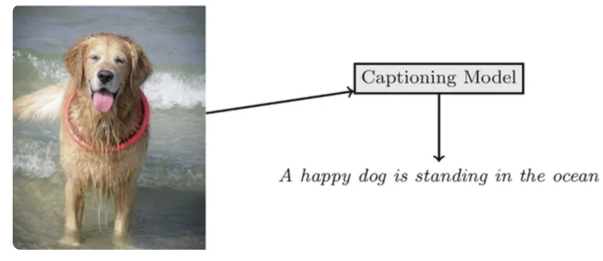
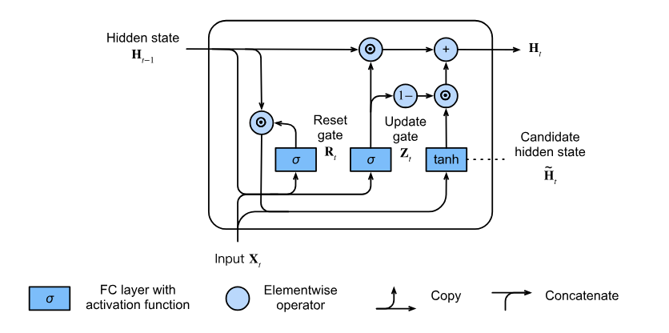

```{r setup, include=FALSE}
knitr::opts_chunk$set(echo = FALSE)
knitr::opts_chunk$set(message = FALSE, warning = FALSE)
knitr::opts_chunk$set(fig.width = 6.5, fig.height = 3.6, out.width = "70%", fig.align = "center", dev = "cairo_pdf")
```


# Introducción


## Podemos hacer lo siguiente con las redes que aprendimos hasta ahora 

{fig-align="center" width="75%"}


## Podemos hacer lo siguiente con las redes que aprendimos hasta ahora 

{fig-align="center" width="75%"}


## Podemos hacer lo siguiente con las redes que aprendimos hasta ahora 

{fig-align="center" width="75%"}


## ¿Qué es una RNN?

- RNN significa *Recurrent Neural Network*.
- Nos ayuda a trabajar con datos secuenciales.
- Puede usar secuencias como input, producir secuencias como output, o ambas cosas.
- La idea central es mantener un **estado oculto** que resume información del pasado.
- Las RNNs fueron muy importantes en NLP, speech y series de tiempo.
- Hoy, para muchas tareas de lenguaje, los Transformers suelen dominar, pero las RNNs siguen siendo útiles para entender modelos secuenciales y para escenarios donde importa la eficiencia.


## ¿Qué tipo de tareas nos ayudan a resolver?

- **Secuencia como output:** image captioning, generación de música, generación de texto.
- **Secuencia como input:** clasificación de textos, clasificación de audio, análisis de video, series de tiempo.
- **Secuencia como input y output:** traducción automática, transcripción, predicción de texto, diálogo.

La pregunta común es:

$$
\text{¿cómo usamos información pasada para predecir algo presente o futuro?}
$$


# ¿Cómo trabajamos con secuencias?

## Secuencias de inputs

Ahora nuestros inputs pueden ser listas ordenadas $x_1,x_2,\ldots,x_T$.

Donde:

- $x_t$ es el vector de características en el paso $t$.
- $T$ es la longitud de la secuencia.
- Diferentes ejemplos pueden tener diferentes longitudes $T_i$.

Ejemplos:

- un documento como secuencia de tokens;
- una estancia hospitalaria como secuencia de eventos clínicos;
- una serie financiera como secuencia de precios;
- un audio como secuencia de ventanas temporales.


## Secuencias de inputs

Cuando teníamos inputs individuales, muchas veces asumíamos que los ejemplos se sampleaban de manera independiente.

Con secuencias, normalmente asumimos algo distinto:

- cada secuencia completa puede tratarse como una observación;
- dentro de cada secuencia, los elementos suelen depender entre sí.

Por ejemplo, $x_t$ puede depender de $x_{t-1},x_{t-2},\ldots$

Ese es justamente el punto de usar modelos secuenciales.


## Secuencias de outputs

Dependiendo de la tarea, una secuencia de inputs puede generar:

- **un solo output**, por ejemplo clasificar un texto completo:

$$
(x_1,\ldots,x_T) \rightarrow y
$$

- **un output por cada paso**, por ejemplo etiquetado de palabras:

$$
(x_1,\ldots,x_T) \rightarrow (y_1,\ldots,y_T)
$$

- **otra secuencia**, posiblemente de longitud diferente, por ejemplo traducción:

$$
(x_1,\ldots,x_T) \rightarrow (y_1,\ldots,y_S)
$$

# Modelos autoregresivos

## Modelos autoregresivos

Si tenemos una serie temporal, podemos preguntarnos: **¿cómo predecimos el siguiente valor usando el pasado?** Por ejemplo, con precios diarios:

```{r, echo=FALSE, fig.height=3, out.width="60%"}
packages <- c("dplyr", "ggplot2", "scales")
invisible(lapply(packages, library, character.only = TRUE))

from <- as.Date("1984-01-01")
to   <- as.Date("2015-01-01")
ftse_csv <- "data/ftse.csv"

if (file.exists(ftse_csv)) {
  ftse <- read.csv(ftse_csv)
  ftse$Date <- as.Date(ftse$Date)
} else {
  library(quantmod)
  ftse_xts <- quantmod::getSymbols("^FTSE", src = "yahoo", from = from, to = to, auto.assign = FALSE)
  ftse <- data.frame(
    Date  = as.Date(index(ftse_xts)),
    Close = as.numeric(Cl(ftse_xts))
  )
  dir.create("data", showWarnings = FALSE)
  write.csv(ftse, ftse_csv, row.names = FALSE)
}

ftse <- ftse %>%
  dplyr::filter(Date >= from, Date <= to)

ggplot(ftse, aes(Date, Close)) +
  geom_line(linewidth = 0.6, color = "#3C6EB4") +
  scale_x_date(
    limits = c(from, to),
    breaks = seq(as.Date("1984-01-01"), as.Date("2014-12-31"), by = "2 years"),
    date_labels = "%Y"
  ) +
  scale_y_continuous(
    limits = c(0, 8000),
    breaks = seq(0, 8000, by = 1000),
    labels = scales::label_number()
  ) +
  labs(title = "FTSE 100 Index", x = NULL, y = NULL) +
  theme_minimal(base_size = 12) +
  theme(
    plot.title = element_text(hjust = 0.5, face = "bold", size = 16),
    panel.grid.minor = element_blank(),
    panel.grid.major = element_line(color = "grey80", linewidth = 0.4),
    axis.text.x = element_text(angle = 45, hjust = 1, vjust = 1, margin = margin(t = 4)),
    axis.text.y = element_text(margin = margin(r = 4)),
    plot.margin = margin(10, 20, 10, 20)
  )
```


## Modelos autoregresivos

Si solo tenemos el pasado de la serie, nos interesa algo como $P(x_t|x_{t-1},\ldots,x_1)$ o, si queremos una predicción puntual, $E[x_t|x_{t-1},\ldots,x_1]$.

Una opción sencilla sería usar una regresión sobre valores pasados.

Problema:

- si usamos todo el pasado, el número de inputs crece con $t$;
- secuencias de distinta longitud producen vectores de distinta dimensión.

Necesitamos una manera de controlar cuánta historia usa el modelo.


## Opción 1: ventana fija

Podemos usar solo los últimos $\tau$ pasos:

$$
P(x_t|x_{t-1},\ldots,x_{t-\tau})
$$

Ventajas:

- el input tiene dimensión fija;
- podemos usar modelos de ML tradicionales;
- es simple y muchas veces funciona razonablemente bien.

Desventaja:

- todo lo anterior a $t-\tau$ se ignora explícitamente.


## Opción 2: variable latente

Otra idea es guardar un resumen del pasado en una variable $h_t$.

Actualizamos ese resumen en cada paso:

$$
h_t = g(h_{t-1},x_t)
$$

Luego usamos ese estado para predecir $P(x_{t+1}|h_t)$.

El estado $h_t$ no se observa directamente; por eso lo llamamos **estado oculto** o **variable latente**.

Esta es la intuición detrás de las RNNs.


# Estacionariedad

## Estacionariedad

Cuando entrenamos modelos secuenciales, muchas veces creamos ejemplos tomando ventanas de una secuencia larga.

Esto supone, al menos aproximadamente, que los patrones aprendidos en unas partes de la secuencia siguen siendo útiles en otras partes.

A esta idea se le suele relacionar con la **estacionariedad**.

Cuidado:

- muchas secuencias reales no son perfectamente estacionarias;
- en deep learning normalmente no exigimos una definición estadística estricta;
- lo importante en la práctica es que train, validation y test tengan dinámicas compatibles.


## Dos nociones de estacionariedad

En estadística hay varias definiciones. Dos comunes son:

1. **Estacionariedad estricta:**

La distribución conjunta no cambia si desplazamos la secuencia en el tiempo.

$$
(X_{t_1},\ldots,X_{t_k})
\overset{d}{=}
(X_{t_1+h},\ldots,X_{t_k+h})
$$

2. **Estacionariedad débil:**

$$
E[X_t]=\mu,
\qquad
Var(X_t)=\sigma^2,
\qquad
Cov(X_t,X_{t+h})=\gamma(h)
$$


## ¿Por qué importa?

Si la dinámica cambia mucho entre entrenamiento y prueba, el modelo puede fallar.

Ejemplos:

- cambios de régimen en series económicas;
- cambios en lenguaje político a través del tiempo;
- protocolos médicos que cambian entre hospitales;
- drift (cambio en el input o en el ambiente de generación) en datos administrativos.

Algunas estrategias de preprocesamiento intentan reducir estos problemas:

- diferencias;
- quitar tendencias;
- ajustar estacionalidad;
- separar train/test respetando el tiempo;
- monitorear drift temporal.


# Modelos de secuencia y lenguaje

## Modelos secuenciales

Un modelo secuencial puede hacer distintas cosas:

- clasificar una secuencia completa;
- predecir un valor futuro;
- producir una secuencia nueva;
- estimar la probabilidad de una secuencia.

Cuando modelamos texto y queremos asignar probabilidades a secuencias de tokens, solemos hablar de **modelos del lenguaje**.

## Modelos del lenguaje

Un modelo del lenguaje asigna probabilidad a una secuencia:

$$
P(x_1,\ldots,x_T)
$$

Usando la regla de la cadena:

$$
P(x_1,\ldots,x_T)
=
P(x_1)\prod_{t=2}^{T}P(x_t|x_{t-1},\ldots,x_1)
$$

Esto convierte el problema en predecir el siguiente token dado el pasado.


## Modelos de Markov

Una simplificación clásica es asumir que el futuro depende solo de una historia reciente.

Para un modelo de Markov de primer orden:

$$
P(x_t|x_{t-1},\ldots,x_1)
=
P(x_t|x_{t-1})
$$

Entonces:

$$
P(x_1,\ldots,x_T)
=
P(x_1)\prod_{t=2}^{T}P(x_t|x_{t-1})
$$

Si usamos los últimos $k$ pasos, hablamos de un modelo de Markov de orden $k$.


## ¿Por qué de izquierda a derecha?

En muchos modelos de lenguaje usamos una factorización autoregresiva:

$$
P(x_t|x_{<t})
$$

Esto es útil porque:

- coincide con el orden natural de generación de texto en muchos idiomas;
- permite entrenar usando muchos pares contexto-siguiente token;
- permite generar texto un token a la vez.

No es la única posibilidad.

También existen modelos bidireccionales o masked language models que usan contexto de ambos lados, pero eso lo veremos más adelante.


# Texto como secuencia

## ¿Cómo transformamos texto en algo que la máquina pueda leer?

Una receta clásica:

1. Cargar el texto.
2. Dividirlo en tokens.
3. Construir un vocabulario.
4. Asociar cada token con un índice numérico.
5. Convertir el texto en secuencias de índices.

Después, esos índices se transforman normalmente en vectores mediante embeddings.

## Tokens

Los tokens son las unidades que el modelo procesa en cada paso.

Un token puede ser:

- una palabra;
- un carácter;
- una subpalabra;
- un byte o símbolo especial.

La tokenización no es un detalle menor: cambia la longitud de las secuencias, el tamaño del vocabulario y qué tan fácil es manejar palabras raras.


## Vocabulario

El vocabulario asocia tokens con índices numéricos.

En tokenización clásica por palabras, suele aparecer un token especial:

$$
\texttt{<unk>}
$$

para palabras nunca vistas.

En tokenizadores modernos basados en subpalabras o bytes, el problema de palabras fuera del vocabulario se reduce, aunque no desaparecen todos los problemas de segmentación.


## Estadísticas del lenguaje

Las frecuencias de palabras suelen seguir una distribución muy desigual.

Zipf's law dice aproximadamente que la frecuencia de la palabra con ranking $i$ sigue:

$$
n_i \propto \frac{1}{i^\alpha}
$$

o equivalentemente:

$$
\log n_i = -\alpha \log i + c
$$

Pocas palabras aparecen muchísimo.
Muchas palabras aparecen muy poco.

Ese desbalance es una de las razones por las que modelar lenguaje contando frecuencias es difícil.


## N-grams

Un **n-gram** es una secuencia de $n$ tokens consecutivos.

Por ejemplo, para:

> deep learning is fun

tenemos:

- **Unigramas**: `deep`, `learning`, `is`, `fun`
- **Bigramas**: `deep learning`, `learning is`, `is fun`
- **Trigramas**: `deep learning is`, `learning is fun`

La idea es estimar la probabilidad del siguiente token usando solo los últimos $n-1$ tokens.


## N-grams

Por ejemplo, con un modelo de **bigramas**, $P(x_t|x_{t-1})$ la estimamos contando cuántas veces aparece la pareja $(x_{t-1},x_t)$ dividido entre cuántas veces aparece $x_{t-1}$:

$$
\hat P(x_t|x_{t-1})
=
\frac{n(x_{t-1},x_t)}
{n(x_{t-1})}
$$

Ejemplo: si en el corpus `deep` aparece 100 veces y `deep learning` 40 veces, entonces $\hat P(\text{learning}|\text{deep})=40/100=0.4$.

## ¿Cómo aprenden los modelos del lenguaje?

Para una secuencia:

$$
\text{deep learning is fun}
$$

podemos escribir:

$$
P(\text{deep},\text{learning},\text{is},\text{fun})
$$

$$
= P(\text{deep})
P(\text{learning}|\text{deep})
P(\text{is}|\text{deep},\text{learning})
P(\text{fun}|\text{deep},\text{learning},\text{is})
$$

Un modelo del lenguaje aprende a asignar alta probabilidad al siguiente token correcto.


## Smoothing

Si estimamos probabilidades solo contando, algunos eventos tendrán probabilidad cero.

Por ejemplo, si nunca vimos el bigrama (`deep`, `tortilla`), el modelo clásico asigna $P(\text{tortilla}|\text{deep})=0$.

Smoothing agrega un poco de probabilidad a eventos raros o no observados.

Una versión simple es add-$\epsilon$ smoothing:

$$
\hat P(w|c)
=
\frac{n(c,w)+\epsilon}{n(c)+\epsilon |V|}
$$


## Limitaciones de n-grams

El smoothing evita probabilidades exactamente cero, pero no resuelve todo.

Problemas:

- no aprende significado;
- no generaliza bien a contextos largos;
- requiere almacenar muchas estadísticas;
- contextos casi iguales se tratan como completamente distintos.

Las redes neuronales intentan resolver parte de esto aprendiendo representaciones continuas de tokens y contextos.


# Evaluación de modelos del lenguaje

## Cross-entropy

Queremos medir qué tan bien el modelo predice el siguiente token observado.

Una medida estándar es la negative log-likelihood promedio:

$$
\frac{1}{n}
\sum_{t=1}^{n}
-
\log P(x_t|x_{<t})
$$

Esto es la cross-entropy empírica del modelo sobre la secuencia.

Mientras más baja, mejor asigna probabilidad a los tokens observados.


## Perplejidad

La perplejidad es una transformación de la cross-entropy:

$$
\exp\left(
\frac{1}{n}
\sum_{t=1}^{n}
-
\log P(x_t|x_{<t})
\right)
$$

Interpretación informal:

$$
\text{perplejidad}
\approx
\text{número efectivo de opciones entre las que el modelo duda}
$$

- Si el modelo asigna probabilidad $1$ al token correcto, la perplejidad es $1$.
- Si asigna probabilidades muy bajas, la perplejidad crece.
- Si predice uniformemente sobre un vocabulario de tamaño $|V|$, la perplejidad es $|V|$.


## Cuidado con perplejidad

La perplejidad es útil, pero no lo mide todo.

- Depende de la tokenización.
- No siempre se traduce directamente en calidad de generación.
- Dos modelos pueden tener perplejidades parecidas y comportamientos cualitativos distintos.

Aun así, es una métrica central para evaluar modelos autoregresivos.


## ¿Cómo creamos mini-batches?

Supongamos que tenemos una secuencia larga de tokens.

Para entrenar, solemos partirla en subsecuencias de longitud fija:

$$
(x_t,x_{t+1},\ldots,x_{t+n-1})
$$

La etiqueta es la misma secuencia desplazada un paso:

$$
(x_{t+1},x_{t+2},\ldots,x_{t+n})
$$

Así el modelo aprende $x_t \rightarrow x_{t+1}$ para muchos pasos a la vez.


# RNNs

## Estado oculto

Una RNN reemplaza el uso explícito de todo el pasado por un estado oculto:

$$
h_t
$$

Este estado intenta resumir la información relevante hasta el tiempo $t$.

En lugar de modelar directamente:

$$
P(x_{t+1}|x_t,x_{t-1},\ldots,x_1)
$$

aproximamos:

$$
P(x_{t+1}|h_t)
$$

## Estado oculto

La actualización general es $h_t = f(x_t,h_{t-1})$. En una RNN simple:

$$
H_t
=
\phi(X_tW_{xh}+H_{t-1}W_{hh}+b_h)
$$

donde:

- $X_t$ es el input en el tiempo $t$;
- $H_{t-1}$ es el estado oculto anterior;
- $W_{xh}$ transforma el input;
- $W_{hh}$ transforma el estado anterior;
- $\phi$ es una no linealidad.


## Hidden layer vs hidden state

No conviene confundir:

- **capa oculta/intermedia:** una capa dentro de la arquitectura;
- **estado oculto:** una variable que se actualiza a través del tiempo.

Una RNN tiene parámetros compartidos en el tiempo y produce una secuencia de estados ocultos:

$$
h_1,h_2,\ldots,h_T
$$

El estado oculto es la memoria interna del modelo.


## Output de una RNN

Una vez tenemos $H_t$, podemos calcular un output:

$$
O_t = H_tW_{hq}+b_q
$$

Si es clasificación sobre vocabulario, aplicamos softmax:

$$
P(x_{t+1}|h_t)
=
\text{softmax}(O_t)
$$

Los mismos parámetros se reutilizan para cada paso temporal.

Por eso el número de parámetros no crece con $T$.


## Hidden State

{fig-align="center" width="75%"}


## Profundidad en el tiempo

Una RNN puede verse como una red desenrollada en el tiempo:

$$
h_1 \rightarrow h_2 \rightarrow \cdots \rightarrow h_T
$$

Aunque usamos los mismos parámetros en cada paso, el cómputo tiene profundidad temporal.

Esto produce problemas parecidos a las redes profundas:

- gradientes que desaparecen;
- gradientes que explotan;
- dificultad para aprender dependencias largas.


# Gradientes en RNNs

## Propagación hacia atrás a través del tiempo

Para entrenar una RNN, desenrollamos la red paso a paso.

La RNN desenrollada es como una red profunda normal, pero con parámetros compartidos entre pasos temporales.

Luego aplicamos backpropagation sobre esa gráfica.

Esto se llama:

$$
\text{Backpropagation Through Time (BPTT)}
$$

El problema es que las secuencias pueden ser largas, así que la gráfica también puede volverse muy larga.


## Gradientes

Supongamos:

$$
h_t=f(x_t,h_{t-1},w_h),
\qquad
o_t=g(h_t,w_o)
$$

y pérdida promedio:

$$
L
=
\frac{1}{T}
\sum_{t=1}^{T}
\ell(y_t,o_t)
$$

Para entrenar necesitamos gradientes como $\partial L/\partial w_h$.

El problema es que $w_h$ afecta a muchos estados futuros, no solo al estado actual.


## Gradientes recurrentes

La dependencia se calcula recursivamente:

$$
\frac{\partial h_t}{\partial w_h}
=
\frac{\partial f(x_t,h_{t-1},w_h)}{\partial w_h}
+
\frac{\partial f(x_t,h_{t-1},w_h)}{\partial h_{t-1}}
\frac{\partial h_{t-1}}{\partial w_h}
$$

Esto significa que los gradientes contienen muchos productos a través del tiempo.

Si esos productos se hacen muy pequeños: **vanishing gradients**. Si se hacen muy grandes: **exploding gradients**.

## Intuición de vanishing/exploding gradients

Cuando hacemos backpropagation por muchos pasos, multiplicamos muchos términos.

Si muchos términos tienen magnitud menor que $1$:

$$
0.9^{100}\approx 0.00003
$$

el gradiente desaparece.

Si muchos términos tienen magnitud mayor que $1$:

$$
1.1^{100}\approx 13780
$$

el gradiente explota.


## ¿Cómo calculamos el gradiente?

Tres opciones conceptuales:

1. **BPTT completo**
   - Usa toda la secuencia.
   - Puede ser costoso e inestable.

2. **BPTT truncado**
   - Solo retropropaga $\tau$ pasos.
   - Es una aproximación del gradiente completo.
   - Es mucho más usado en la práctica.

3. **Truncamiento aleatorio**
   - Usa longitudes aleatorias.
   - Puede producir estimadores insesgados bajo ciertas condiciones.
   - Es menos común en implementaciones estándar.


## BPTT truncado

En lugar de hacer backpropagation por toda la secuencia $1,2,\ldots,T$, usamos ventanas más cortas $1,\ldots,\tau$.

Esto reduce:

- memoria;
- costo computacional;
- problemas con gradientes muy largos.

Pero también limita qué tan directamente el modelo aprende dependencias de largo plazo.


# Gradient clipping

## Recortar gradientes

Gradient clipping ayuda principalmente con gradientes que explotan.

Si el gradiente es $g$ y su norma es demasiado grande, lo reescalamos:

$$
g
\leftarrow
\min\left(1,\frac{\theta}{\|g\|}\right)g
$$

Esto garantiza que $\|g\|\leq \theta$.


## ¿Qué logra gradient clipping?

Gradient clipping:

- evita actualizaciones enormes;
- mantiene la dirección del gradiente original;
- puede hacer el entrenamiento de RNNs más estable;
- no resuelve por sí solo el problema de vanishing gradients.

Es una heurística muy útil.

Pero no garantiza encontrar el mínimo global. 


# Long Short-Term Memory (LSTM)

## ¿De dónde vienen?

Las RNNs simples tienen dificultades con dependencias largas.

LSTM introduce una célula de memoria y varios gates que controlan:

- qué información mantener;
- qué información borrar;
- qué información escribir;
- qué parte de la memoria exponer como output.

La idea no es “resolver mágicamente” todos los problemas de gradientes, sino facilitar que cierta información se mantenga estable durante muchos pasos.


## Memory cell y gates

Cada paso temporal mantiene dos vectores principales:

- **cell state** $c_t$: memoria interna de la célula;
- **hidden state** $h_t$: estado que se expone hacia la siguiente capa o salida.

Los gates son vectores con valores entre $0$ y $1$.

Valores cercanos a $0$ bloquean información.
Valores cercanos a $1$ dejan pasar información.


## Gates de una LSTM

$$
\begin{aligned}
\text{Forget gate:}\quad & f_t=\sigma(x_tW_{xf}+h_{t-1}W_{hf}+b_f)\\[4pt]
\text{Input gate:}\quad & i_t=\sigma(x_tW_{xi}+h_{t-1}W_{hi}+b_i)\\[4pt]
\text{Candidato de memoria:}\quad & \tilde c_t=\tanh(x_tW_{xc}+h_{t-1}W_{hc}+b_c)\\[4pt]
\text{Output gate:}\quad & o_t=\sigma(x_tW_{xo}+h_{t-1}W_{ho}+b_o)
\end{aligned}
$$

## Memory cell y gates

{fig-align="center" width="75%"}


## Actualización de la memoria

La célula se actualiza como:

$$
c_t
=
f_t\odot c_{t-1}
+
i_t\odot \tilde c_t
$$

Donde $\odot$ es multiplicación elemento por elemento.

Interpretación:

- $f_t\odot c_{t-1}$ decide qué parte de la memoria anterior conservar;
- $i_t\odot \tilde c_t$ decide qué información nueva escribir.

Si $f_t\approx 1$ e $i_t\approx 0$, la memoria puede permanecer casi constante.

## Hidden state

El hidden state se calcula como:

$$
h_t=o_t\odot \tanh(c_t)
$$

El output gate $o_t$ decide qué parte de la memoria se expone.

Esto permite que una LSTM:

- mantenga información en $c_t$;
- decida cuándo usarla en $h_t$;
- ignore información irrelevante para el output actual.

## Hidden state

{fig-align="center" width="75%"}


# Gated Recurrent Units (GRU)

## GRU

Las GRUs son una arquitectura recurrente con gates, pero más simple que LSTM.

En vez de mantener explícitamente un cell state separado, actualizan directamente el hidden state.

Comparadas con LSTM:

- tienen menos gates;
- suelen tener menos parámetros;
- pueden ser más rápidas;
- su desempeño relativo depende de la tarea y los datos.

No hay una ley universal de “GRU siempre igual a LSTM pero más rápida”.


## Gates de una GRU

$$
\begin{aligned}
\text{Reset gate:}\quad & r_t=\sigma(x_tW_{xr}+h_{t-1}W_{hr}+b_r)\\[4pt]
\text{Update gate:}\quad & z_t=\sigma(x_tW_{xz}+h_{t-1}W_{hz}+b_z)\\[4pt]
\text{Candidato:}\quad & \tilde h_t=\tanh(x_tW_{xh}+(r_t\odot h_{t-1})W_{hh}+b_h)\\[4pt]
\text{Estado actualizado:}\quad & h_t=z_t\odot h_{t-1}+(1-z_t)\odot \tilde h_t
\end{aligned}
$$

## Intuición de las gates

- Si $r_t$ está cerca de $0$, el candidato ignora gran parte del estado anterior.
- Si $r_t$ está cerca de $1$, el candidato usa más información pasada.
- Si $z_t$ está cerca de $1$, el modelo conserva más del estado anterior.
- Si $z_t$ está cerca de $0$, el modelo reemplaza más del estado anterior por el candidato nuevo.

Así la GRU decide cuánto recordar y cuánto actualizar.

## GRU

{fig-align="center" width="75%"}


# RNNs bidireccionales

## RNNs bidireccionales

Hasta ahora hemos usado solo el contexto anterior:

$$
x_1,\ldots,x_{t-1}
$$

Esto tiene sentido si estamos generando el siguiente token.

Pero en otras tareas ya tenemos toda la secuencia completa y queremos usar contexto de ambos lados.

Ejemplos:

- etiquetado de palabras;
- clasificación de audio o texto completo;
- completar palabras faltantes;
- algunas tareas de reconocimiento de voz offline.


## RNNs bidireccionales

Una RNN bidireccional combina dos RNNs:

- una procesa la secuencia hacia adelante;
- otra procesa la secuencia hacia atrás.

Estados:

$$
\begin{aligned}
\overrightarrow h_t &= \phi(x_tW_{xh}^{(f)}+\overrightarrow h_{t-1}W_{hh}^{(f)}+b_h^{(f)})\\[4pt]
\overleftarrow h_t &= \phi(x_tW_{xh}^{(b)}+\overleftarrow h_{t+1}W_{hh}^{(b)}+b_h^{(b)})
\end{aligned}
$$

Luego concatenamos: $h_t=[\overrightarrow h_t;\overleftarrow h_t]$.


## ¿Cuándo no podemos usar bidireccionalidad?

Por ejemplo, para predecir el siguiente token en tiempo real:

$$
P(x_{t+1}|x_1,\ldots,x_t)
$$

no deberíamos usar:

$$
x_{t+2},x_{t+3},\ldots
$$

Las RNNs bidireccionales son útiles cuando toda la secuencia está disponible desde el inicio.


## ¿Cómo se ven estas redes?

{fig-align="center" width="75%"}


# RNNs hoy

## RNNs hoy

Para muchas tareas modernas de NLP, los Transformers desplazaron a las RNNs porque permiten paralelizar mejor el entrenamiento y modelar dependencias largas mediante atención.

Pero las ideas de esta clase siguen importando: estado oculto, procesamiento secuencial, backpropagation through time, vanishing/exploding gradients, truncamiento, memoria y dependencia temporal.

Además, las RNNs siguen siendo útiles en problemas donde importan: inferencia online, baja latencia, memoria constante, secuencias muy largas y recursos limitados.


## Más allá de RNNs clásicas

Hay arquitecturas recientes que recuperan ideas recurrentes o de estado, pero con diseños más escalables.

Ejemplos: modelos tipo RWKV, State Space Models como S4 y modelos selectivos tipo Mamba.

No necesitamos estudiarlos a fondo aquí.

La idea importante es:

$$
\boxed{
\text{secuencias largas requieren mecanismos eficientes de memoria}
}
$$

Los Transformers son los mas usados pero no son el único camino para modelar secuencias.


# Secuencias y políticas públicas

## Texto legislativo como datos

Todo lo de hoy aparece en análisis de texto político y legal a escala:

- tokenización;
- vocabulario;
- secuencias;
- modelos de lenguaje;
- clasificación de documentos;
- diagnóstico de sobreajuste con pocos datos.

Ejemplos de tareas:

- clasificación multi-etiqueta de leyes;
- predicción de votos desde texto legislativo;
- revisión automática de documentos legales;
- análisis de discursos o debates parlamentarios.


## Otras secuencias en política pública

No todo es texto!

También hay secuencias en:

- demanda de servicios públicos;
- trayectorias de pacientes;
- expedientes administrativos;
- llamadas de emergencia;
- movilidad urbana;
- series de crimen o empleo;
- monitoreo ambiental.

En todos estos casos importa el orden temporal.


# Referencias

## Referencias

- Hochreiter & Schmidhuber (1997), *Long Short-Term Memory*.
- Cho et al. (2014), *Learning Phrase Representations using RNN Encoder-Decoder for Statistical Machine Translation*.
- Bengio, Simard & Frasconi (1994), *Learning Long-Term Dependencies with Gradient Descent is Difficult*.
- Pascanu, Mikolov & Bengio (2013), *On the difficulty of training recurrent neural networks*.
- Graves (2013), *Generating Sequences With Recurrent Neural Networks*.
- Vaswani et al. (2017), *Attention Is All You Need*.
- Gu et al. (2021), *Efficiently Modeling Long Sequences with Structured State Spaces*.
- Peng et al. (2023), *RWKV: Reinventing RNNs for the Transformer Era*.
- Gu & Dao (2023), *Mamba: Linear-Time Sequence Modeling with Selective State Spaces*.


