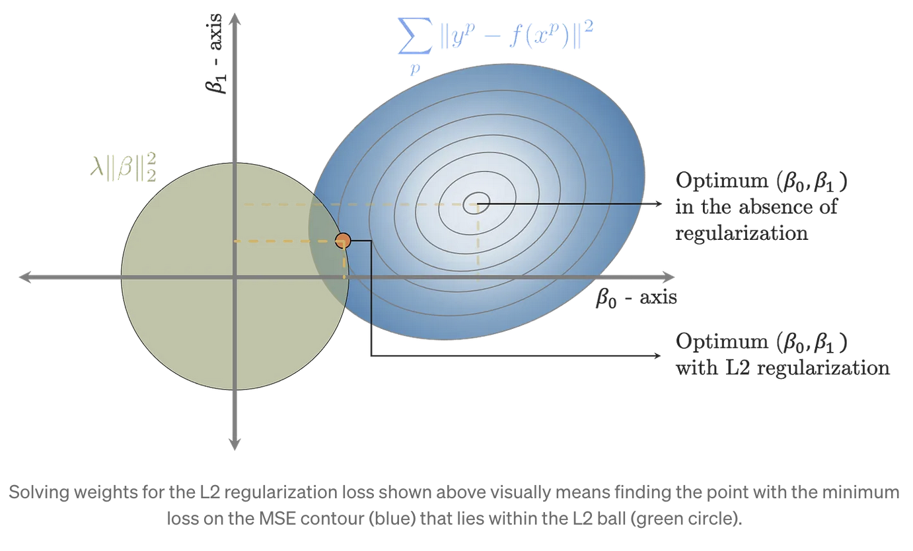
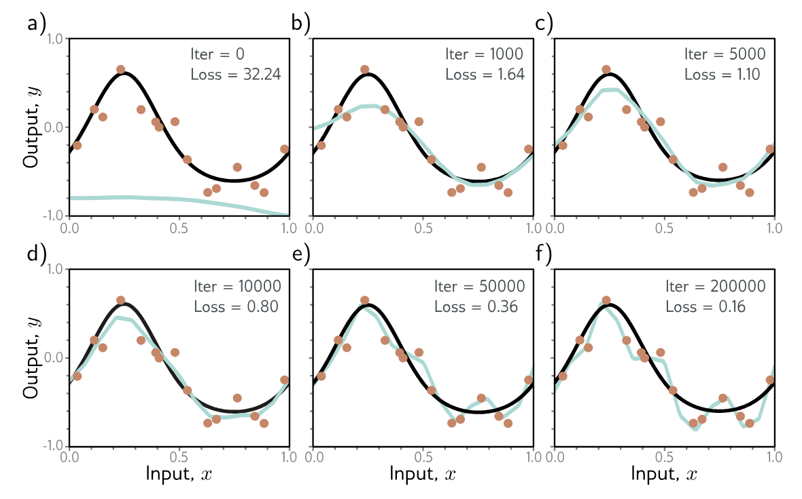
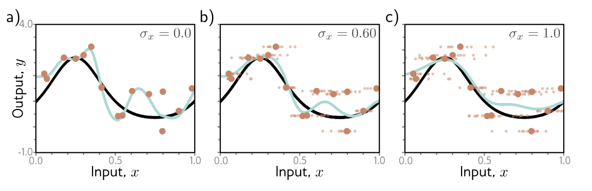
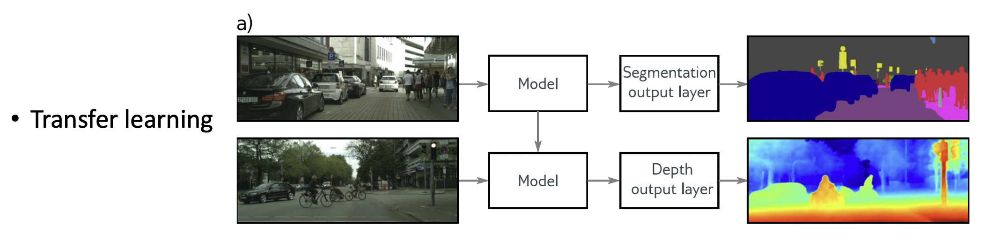
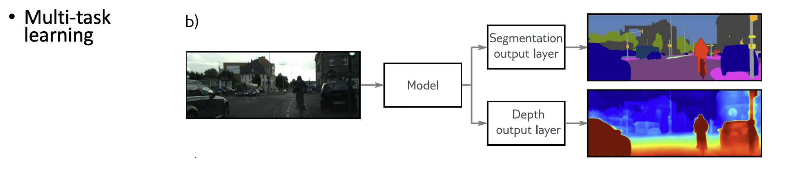

```{r setup, include=FALSE}
knitr::opts_chunk$set(echo = FALSE)
knitr::opts_chunk$set(message = FALSE, warning = FALSE)
knitr::opts_chunk$set(fig.width = 6.5, fig.height = 3.6, out.width = "70%", fig.align = "center", dev = "cairo_pdf")
```


## Regularización

- ¿Por qué puede existir una brecha entre el error de entrenamiento y el error de prueba?
    - El modelo puede sobreajustarse al conjunto de entrenamiento
    - El modelo debe hacer predicciones en regiones donde no tenemos ejemplos observados
    - El conjunto de entrenamiento puede no representar perfectamente la distribución de prueba
- Regularización: conjunto de métodos que buscan mejorar el desempeño fuera de muestra, no solamente reducir la pérdida de entrenamiento

# Regularización Explícita 


## Regularización explícita

- Función de pérdida estándar: $\hat{\phi} = \arg\min_{\phi} L(\phi)$

- Donde, por ejemplo: $L(\phi)=\sum_{i=1}^I\ell_i(x_i,y_i,\phi)$

- Con regularización agregamos un término extra:

$$\hat{\phi}=\arg\min_{\phi}\left[\sum_{i=1}^I\ell_i(x_i,y_i,\phi) + \lambda g(\phi) \right]$$

- $g(\phi)$ penaliza ciertos tipos de soluciones
- $\lambda$ controla qué tanto pesa la regularización relativo a la pérdida original


## Regularización Explícita: visualización

{fig-align="center" width="80%"}

## Interpretación probabilística

- Recordemos que muchas funciones de pérdida se pueden construir usando máxima verosimilitud
- Sin regularización, buscamos los parámetros que maximicen la probabilidad de los datos observados:

$$ \hat{\phi} = \arg\max_{\phi} \prod_{i=1}^I P(y_i|x_i,\phi) $$

- Con regularización podemos interpretar que además tenemos una creencia previa sobre los parámetros: $P(\phi)$

- Esta distribución se llama **prior**


## ¿Qué es una prior?

- En estadística bayesiana, una prior representa lo que asumimos sobre una variable o parámetro antes de observar los datos
- Puede reflejar conocimiento experto o simplemente una preferencia por ciertas soluciones
- Por ejemplo, podemos preferir parámetros de menor magnitud
- Después de observar los datos, combinamos:

$$
\text{prior}
+
\text{verosimilitud}
$$

para obtener una distribución posterior


## Interpretación probabilística

- Usando $P(\phi)$ como prior, podemos buscar el máximo de la posterior:

$$
\hat{\phi}
=
\arg\max_{\phi}
\left[
\prod_{i=1}^I
P(y_i|x_i,\phi)
\right]
P(\phi)
$$

- Esto se conoce como estimación MAP: $\text{Maximum A Posteriori}$

- Si minimizamos el negativo del logaritmo:

$$
\hat{\phi}
=
\arg\min_{\phi}
\left[
-
\sum_{i=1}^I
\log P(y_i|x_i,\phi)
-
\log P(\phi)
\right]
$$

- El término de regularización puede verse como: $\lambda g(\phi) \approx - \log P(\phi)$


## Regularización $L_2$

- La regularización $L_2$ penaliza pesos con magnitud grande:

$$\hat{\phi} = \arg\min_{\phi} \left[ \sum_{i=1}^I \ell_i(x_i,y_i,\phi) + \lambda \sum_j \phi_j^2 \right]$$

- En redes neuronales normalmente la aplicamos a los pesos, pero no a los biases
- Para SGD estándar, esta penalización está relacionada con **weight decay**
- Intuición: preferimos soluciones con pesos más pequeños


## Regularización L2 

{fig-align="center" width="80%"}


## Regularización $L_2$

- Ya la habíamos visto con ridge regression
- $L_2$ encoge los pesos hacia cero
- Cuando hay variables correlacionadas, puede repartir peso entre ellas de forma más estable
- En muchos problemas esto puede hacer al modelo menos sensible a pequeñas variaciones del conjunto de entrenamiento

Pero:

$$
\boxed{
L_2 \text{ no garantiza mejor generalización en todos los problemas}
}
$$

## ¿Por qué puede ayudar weight decay?

- Si la red está sobreajustando, la regularización obliga a equilibrar:

$$
\text{ajustar bien entrenamiento}
\quad vs \quad
\text{mantener pesos pequeños}
$$

- Esto puede reducir varianza, aunque puede aumentar sesgo
- En redes sobreparametrizadas, weight decay introduce una preferencia por soluciones de menor norma
- Esta preferencia puede ayudar a elegir entre muchas soluciones que ajustan bien el conjunto de entrenamiento

No es una garantía universal: depende de los datos, arquitectura, optimizador y fuerza de regularización.


# Regularización Implícita 

## Regularización implícita

- Los algoritmos de optimización no siempre son neutrales: pueden favorecer ciertos tipos de soluciones
- Aunque no agreguemos explícitamente un término $g(\phi)$, el proceso de entrenamiento puede introducir sesgos
- Este efecto se conoce como **regularización implícita**

Por ejemplo, Gradient Descent actualiza:

$$
\phi_{t+1}
=
\phi_t
-
\alpha
\nabla_\phi L(\phi_t)
$$

- El learning rate, batch size, inicialización y optimizador pueden afectar qué solución encontramos


## Regularización Implícita

{fig-align="center" width="80%"}


## Regularización implícita en GD

- Bajo ciertas aproximaciones, el GD discreto puede interpretarse como una dinámica continua sobre una pérdida modificada:

$$
\tilde{L}_{GD}(\phi)
=
L(\phi)
+
\frac{\alpha}{4}
\left\|
\frac{\partial L}{\partial \phi}
\right\|^2
$$

- Este término penaliza regiones donde la norma del gradiente es grande
- Los puntos con gradiente cero de $L$ también son puntos críticos de este término adicional
- Pero la trayectoria de optimización puede cambiar
- Por eso GD puede favorecer algunas soluciones sobre otras

Esta es una aproximación útil, no una ley exacta para cualquier red y cualquier learning rate.


## Regularización implícita en SGD

- Para SGD, también aparece el efecto del ruido introducido por los mini-batches
- Una forma aproximada de verlo es mediante una pérdida modificada:

$$
\tilde{L}_{SGD}(\phi)
=
\tilde{L}_{GD}(\phi)
+
\frac{\alpha}{4M}
\sum_{m=1}^M
\left\|
\frac{\partial L_m}{\partial \phi}
-
\frac{\partial L}{\partial \phi}
\right\|^2
$$

$$
=
L(\phi)
+
\frac{\alpha}{4}
\left\|
\frac{\partial L}{\partial \phi}
\right\|^2
+
\frac{\alpha}{4M}
\sum_{m=1}^M
\left\|
\frac{\partial L_m}{\partial \phi}
-
\frac{\partial L}{\partial \phi}
\right\|^2
$$

- $L_m$ es la pérdida del mini-batch $m$
- $M$ es el número de mini-batches considerados
- El término extra mide qué tanto varían los gradientes entre mini-batches


## Regularización implícita en SGD

- SGD introduce ruido porque cada mini-batch produce una estimación distinta del gradiente
- Ese ruido puede cambiar la trayectoria de optimización
- En algunos casos, SGD puede favorecer regiones donde los gradientes de distintos mini-batches son más consistentes
- El mínimo encontrado puede depender de: learning rate, batch size, inicialización, optimizador y schedule del learning rate

La idea clave:

$$
\boxed{
\text{optimización también puede actuar como regularización}
}
$$


# Heurísticas de regularización 


## Batch Normalization (BN)

- Idea: normalizar activaciones usando estadísticas del mini-batch
- Restamos la media y dividimos por la desviación estándar:

$$
\hat{x}
=
\frac{x-\mu_B}{\sqrt{\sigma_B^2+\epsilon}}
$$

- Después aprendemos una escala y un desplazamiento:

$$
y
=
\gamma \hat{x}+\beta
$$

- BN puede reducir la sensibilidad a la inicialización
- A menudo permite usar learning rates más grandes
- En algunos casos actúa como regularizador implícito


## Batch Normalization (BN)

- Durante entrenamiento usamos estadísticas del mini-batch
- Durante inferencia normalmente usamos estadísticas acumuladas durante entrenamiento
- BN suele funcionar bien en muchas CNNs
- Pero si los batches son muy pequeños, sus estimaciones pueden ser ruidosas
- En esos casos a veces se usan alternativas como:
    - LayerNorm
    - GroupNorm


## Early Stopping

- Durante entrenamiento, la pérdida de entrenamiento puede seguir bajando mientras la pérdida de validación deja de mejorar
- Early stopping detiene el entrenamiento usando una métrica de validación
- Esto puede evitar que el modelo se ajuste demasiado a detalles del training set
- También ahorra tiempo de entrenamiento

La idea:

$$
\boxed{
\text{paramos antes de optimizar demasiado el training set}
}
$$


## Early Stopping

{fig-align="center" width="80%"}


## Early Stopping

- Una regla común es monitorear la pérdida de validación
- Terminamos cuando no mejora más que cierta tolerancia durante varias épocas
- Hiperparámetros típicos:
    - métrica monitoreada
    - paciencia
    - tolerancia mínima
    - frecuencia de evaluación
- Puede mejorar generalización, pero no está garantizado
- Es especialmente útil cuando entrenar hasta convergencia empieza a degradar validación


## Ensambles

- En ML básico vimos modelos de ensamble como Random Forests o Extra Trees
- En redes neuronales también podemos entrenar varios modelos y combinar sus predicciones
- Para regresión podemos promediar predicciones
- Para clasificación podemos promediar probabilidades o votar por clase
- Muchas veces reducen error fuera de muestra, pero el costo es entrenar y evaluar varios modelos

Opciones comunes:

- misma arquitectura con distintas inicializaciones
- distintos subconjuntos de datos
- distintos checkpoints del entrenamiento


## Ensambles 

{fig-align="center" width="80%"}


## Dropout

- Dropout inyecta ruido durante el forward pass
- Durante entrenamiento apagamos aleatoriamente algunas activaciones
- Con probabilidad de dropout $p$, cada activación $h$ se reemplaza por:

$$
h'
=
\begin{cases}
0 & \text{con probabilidad } p\\
\frac{h}{1-p} & \text{con probabilidad } 1-p
\end{cases}
$$

- Esta versión se llama **inverted dropout**
- Mantiene la esperanza:

$$
E[h'] = h
$$  


## Dropout

- Durante entrenamiento usamos dropout
- Durante inferencia normalmente apagamos dropout
- Como usamos inverted dropout, no necesitamos reescalar en inferencia
- Dropout puede verse como entrenar muchas subredes que comparten pesos
- También se puede usar Monte Carlo dropout:
    - mantenemos dropout activo en inferencia
    - corremos la red varias veces
    - combinamos los resultados

MC dropout se parece a un ensamble aproximado.


## Dropout 

{fig-align="center" width="80%"}


## Agregar ruido

- Podemos interpretar dropout como ruido Bernoulli multiplicativo sobre las activaciones
- También podemos agregar ruido controlado a:
    - pesos
    - inputs
    - representaciones intermedias
    - etiquetas

Pero hay que tener cuidado:

- ruido en inputs puede ayudar si preserva la etiqueta
- ruido en etiquetas suele ser dañino si no está controlado


## Agregar ruido

{fig-align="center" width="80%"}


## Transfer Learning

- Cuando tenemos pocos ejemplos de entrenamiento, podemos usar un modelo preentrenado en otra tarea o dataset
- La idea es aprovechar representaciones aprendidas previamente
- Después adaptamos el modelo a la tarea original

Formas comunes:

- reemplazar la última capa y entrenar solo esa parte
- fine-tuning parcial
- fine-tuning de toda la red

Transfer learning suele ayudar cuando la tarea fuente y la tarea objetivo están suficientemente relacionadas.


## Transfer Learning

- La lógica es que el modelo preentrenado ya aprendió representaciones útiles
- Estas representaciones pueden reutilizarse en una tarea nueva
- También puede verse como una forma de inicialización informativa
- Si el dominio fuente y el dominio objetivo son muy diferentes, el beneficio puede ser menor o incluso negativo


## Transfer Learning

{fig-align="center" width="80%"}

- Tenemos pocos datos de entrenamiento para depth estimation, pero muchos para segmentation
- Entrenamos un modelo para segmentation
- Quitamos o reemplazamos las últimas capas
- Entrenamos las nuevas capas o hacemos fine-tuning de toda la red


## Multi-task learning

- Entrenamos una red para resolver varias tareas al mismo tiempo
- Por ejemplo, una red puede tomar una imagen y simultáneamente:
    - segmentarla
    - estimar profundidad
    - generar una descripción
- La esperanza es que las tareas compartan representaciones útiles

Pero:

$$
\boxed{
\text{multi-task learning no siempre mejora todas las tareas}
}
$$

Si las tareas compiten entre sí, puede haber transferencia negativa.


## Multi-task learning

{fig-align="center" width="80%"}


## Self-supervised learning

- En self-supervised learning construimos una tarea auxiliar usando los propios datos
- No necesitamos etiquetas humanas explícitas para esa tarea auxiliar

Ejemplos:

- **Masked prediction:** escondemos partes del input y entrenamos al modelo a predecirlas
- **Next-token prediction:** entrenamos al modelo a predecir el siguiente token
- **Contrastive learning:** acercamos representaciones de ejemplos relacionados y alejamos ejemplos no relacionados

Después podemos adaptar el modelo a una tarea supervisada mediante fine-tuning.


## Self-supervised learning

{fig-align="center" width="95%"}


## Augmentation

- En algunos casos podemos transformar ejemplos de entrenamiento sin cambiar su etiqueta
- En imágenes, a veces podemos usar:
    - flips
    - crops
    - cambios de color
    - pequeñas rotaciones
- En texto, algunas transformaciones pueden cambiar el significado, así que hay que tener cuidado
- En audio, podemos usar transformaciones como ruido, cambios de volumen o pequeñas deformaciones temporales

Data augmentation ayuda cuando las transformaciones preservan la etiqueta relevante.


## Catálogo rápido de técnicas de regularización

- **Regularización explícita**
  - $L_2$ / weight decay, $L_1$
  - penalizan la magnitud de los pesos
  - pueden interpretarse como priors bajo ciertas condiciones

- **Ruido / stochasticidad**
  - Dropout
  - input noise
  - noise injection en activaciones o pesos
  - label smoothing

- **Arquitectura**
  - modelos más pequeños
  - weight sharing
  - convoluciones en vez de capas totalmente conectadas


## Catálogo rápido de técnicas de regularización

- **Datos**
  - data augmentation
  - recolección y curación de datos
  - synthetic data
  - transfer learning

- **Entrenamiento**
  - early stopping
  - learning-rate schedules
  - batch size
  - elección del optimizador

Estos últimos no siempre son “regularización” en sentido explícito, pero pueden afectar la generalización.


## Catálogo rápido de técnicas de regularización

- **Post-hoc / ensamblado**
  - ensembles
  - model averaging
  - MC dropout

- **Pretraining / tareas auxiliares**
  - self-supervised pretraining
  - masked modeling
  - contrastive learning
  - multi-task learning

Estas técnicas suelen combinarse en modelos modernos.


## Tips

- Estas categorías no son mutuamente excluyentes
- Empieza simple:
    - weight decay
    - augmentation si las transformaciones preservan la etiqueta
    - monitoreo claro de train/validation
- Si hay pocos datos, suele ser mejor priorizar:
    - data augmentation
    - transfer learning
    - modelos preentrenados
- Añadir capacidad sin más datos o inductive bias puede empeorar la generalización


## Tips

- Dropout puede ser útil en capas densas grandes
- En CNNs modernas, muchas veces se combina con otras técnicas y no siempre es la primera herramienta
- BatchNorm permite a menudo learning rates más grandes
- Si el batch es muy pequeño, considera GroupNorm o LayerNorm
- Medir siempre:
    - train loss
    - validation loss
    - métricas relevantes
    - ejemplos cualitativos de errores
- Balancea desempeño con costo computacional e interpretabilidad

