```{r setup, include=FALSE}
knitr::opts_chunk$set(echo = FALSE)
knitr::opts_chunk$set(message = FALSE, warning = FALSE)
knitr::opts_chunk$set(fig.width = 6.5, fig.height = 3.6, out.width = "70%", fig.align = "center", dev = "cairo_pdf")
```


# Arquitectura encoder-decoder

## Motivación 
- En problemas como traducir de un idioma a otro 
- Los inputs y los outputs van a ser de distinto tamaño 
- Las RNNs que vimos hasta ahora no necesariamente resuelven este problema
- Al menos no sin modificarlas
- Necesitamos algo como un encoder-decoder


## Encoder-decoder
- Encoder: 
     - una RNN que procesa el input paso a paso
     - cada token en la secuencia de entrada $x_t$ se actualiza en el hidden state $h_t$
     - después el último input token el hidden state $h_T$ es considerado un context vector
     - context vector: representación comprimida de toda la secuencia 


## Encoder-decoder
- Decoder: 
    - RNN que genera la secuencia de salida paso a paso 
    - Empieza con el context vector que le pasó el encoder + un token para empezar la secuencia de salida
    - En cada paso predice que token $y_t$ sigue condicionado al hidden state del paso anterior y al token generado antes 
    - Continua hasta que genera un token de fin de secuecia 


## Intuitivamente
- Encoder: lee la secuencia y comprime toda su información en un vector de tamaño fijo, el context vector
- Decoder: escribe la secuencia de salida basada en el context vector 
- Esto va a funcionar más o menos bien pero tiene el problema de que vamos a aplastar toda la secuencia en un solo vector de tamaño fijo
- Si las secuencias son muy largas vamos a perder información 
- Tratamos el context vector como un estadistico suficiente de la señal de todo el input 


## Encoder-Decoder 

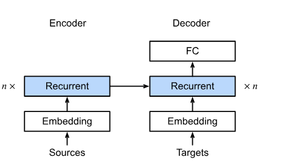{fig-align="center" width="75%"}


# Atención 

## ¿Por qué queremos algo más que RNNs?
- Secuenciales: son computacionalmente muy costosas
- Gradientes que desaparecen: si tenemos secuencias muy largas no hay muchas maneras de resolver esto 
- Con secuencias muy largas vamos a perder información :(


## Atención 
- El context vector del encoder-decoder de RNN va a perder información 
- Queremos que el decoder pueda mirar todos los estados ocultos del encoder
- Para que en cada paso pueda enfocarse en la parte relevante de la secuencia de entrada 
- Para lograrlo necesitamos un mecanismo que compare lo que el decoder “quiere” generar con la información almacenada en el encoder


## ¿Cómo logramos esto? Queries, Keys y Values
- Inspiración: mecanismos de búsqueda y recuperación de información
    - Query $q$: lo que estamos buscando → estado actual del decoder
    - Keys $k$: representaciones de cada token del encoder (las “etiquetas”)
    - Values $v$: información contenida en esos tokens (los mismos estados del encoder)
- La atención compara la Query con todas las Keys, y obtiene un peso de relevancia para cada Value
- De esta forma, el decoder recibe un vector de contexto dinámico que resalta justo la parte de la secuencia que necesita


## Intuición de q,k y v
- Piensa en una biblioteca: 
    - Query: tu pregunta (“quiero información sobre gatos”)
    - Keys: los temas/indeces de cada libro
    - Values: el contenido de los libros
- El sistema busca qué Keys se parecen más a la query y devuelve los values más relevantes


## ¿Qué beneficios tiene pensar en términos de q,k y v?
- Podemos designar queries $q$ que operen en pares $(k,v)$ de tal manera que sean válidas independientemente del tamaño de los datos
- La misma query puede recibir diferentes respuestas, según el contenido de la base de datos.
- El código detrás para buscar en un espacio muy grande puede ser bastante simple
- No es necesario comprimir ni simplificar la base de datos para que las operaciones sean efectivas


## Atención 
- Si tenemos una base de datos $D = \{(k_1,v_1),...,(k_m,v_m)\}$ de m tuplas de keys y values
- Y un vector de queries $q$
- Podemos definir la atención sobre $D$ como:

$$Attention(q,D) = \sum_{i=1}^m \alpha(q,k_i)v_i$$

- Donde $\alpha(q,k_i)$ son los pesos de atención 
- Y esta operación se conoce como attention pooling


## ¿Qué nos dice esta función de atención?
- Si los pesos $\alpha(q,k_i) > 0$ el resultado vive en un cono convexo de los valores de $v_i$
- Los pesos van a formar una combinación convexa si $\sum_{i} \alpha(q,k_i) = 1$ y $\alpha(q,k_i) \geq 0$, normalmente vamos a asumir esto
- Si solo un $\alpha(q,k_i) = 1$ y los demás son cero solo prestamos atención a un valor
- Si $\alpha(q,k_i) = \frac{1}{m}$ vamos a tener average pooling, le prestamos la misma atención a todos los tokens 


## ¿Qué nos dice esta función de atención?
- Por lo general vamos a usar como mecanismo de atención 
$$\alpha(q,k_i) = \frac{e^{a(q,k_i)}}{\sum_j e^{a(q,k_j)}}$$

- Esta función tiene varias propiedades que nos van a ayudar en DL: 
    - los pesos suman 1
    - son no negativos 
    - es diferenciable 
    - el gradiente nunca desaparece 
- El mecanismo de atención es una operación relativamente sencilla a pesar de las dimensiones de las matrices     
    
## ¿Qué nos dice esta función de atención? 

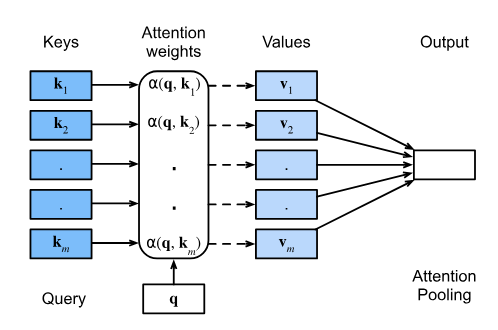{fig-align="center" width="75%"}


# Distintas funciones de atención 

## Ejemplo de attention pooling

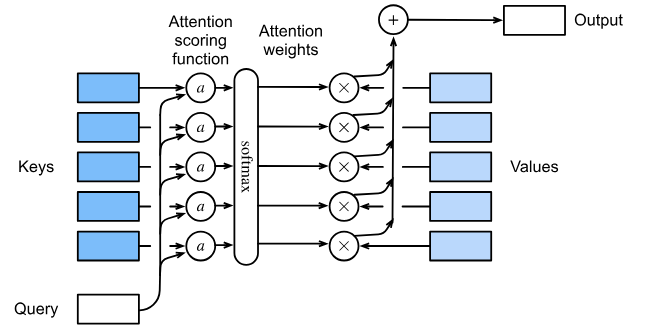{fig-align="center" width="75%"}


## Atención producto punto 
$$ a(q,k_i) = \frac{q^{T}k_i}{\sqrt{d}}$$

- Donde $d$ es la dimensión de $q$ y $k_i$
- Esta es nuestra función $a$ pero necesitamos $\alpha$

$$\alpha(q,k_i) = softmax(a) = \frac{e^{q^{T}k_{i}/\sqrt{d}}}{\sum_j e^{q^{T}k_j/\sqrt{d}}}$$

## Atención producto punto 
- Requiere que tanto $q$ como $k_i$ sean de la misma dimensión $d$
- Si tenemos queries y keys en distintos espacios podriamos solucionar el problema con una matriz $M$
- Esta matriz $M$ es una transformación lineal que proyecta uno de los espacios para que sean compatibles en dimensiones 
- En la practica no vamos a hacer esto 

## Atención aditiva 
- Esta va a funcionar sin importar si $q$ y $k_i$ tienen la misma dimensión
- Como es aditiva puede ser más rapida y eficiente computacionalmemte que otras atenciones

$$ a(q,k) = w_v^{T}tanh(W_qq + W_kk)$$

- Donde $w_v, W_q$ y $W_k$ son parametros que va a aprender el modelo
- Esto lo metemos en una softmax


## Ventajas de la atención aditiva
- Flexibilidad dimensional: no requiere que queries y keys estén en el mismo espacio de dimensión
- Mayor expresividad: la combinación no lineal con $\tanh$ permite capturar relaciones más complejas entre $q$ y $k$
- Estabilidad numérica: menos sensible a valores muy grandes que pueden ocurrir en el producto punto
- Buen desempeño en práctica: funciona bien cuando las dimensiones de $q$ y $k$ son muy distintas o pequeñas
- Forma original de atención propuesta en Bahdanau et al. (2014) para traducción automática


# Mecanismo de atención 

## Introducción  
- La solución al problema de los encoder-decoders de RNN es la atención
- Bahdanau et al. (2014) propusieron:
    - Para predecir un token, no todos los tokens de entrada son igualmente relevantes
    - El modelo aprende a poner más peso (atención) en las partes relevantes de la secuencia de entrada para la predicción actual
    - Este mecanismo actualiza dinámicamente la representación usada por el decoder antes de generar el siguiente token
- Aunque la idea es sencilla, revolucionó el deep learning → es la base de los modelos modernos de NLP y LLMs
   
   
   
## Modelo
- La idea clave es que la context variable $c$ no está fija como en el encoder-decoder clásico, sino que se actualiza dinámicamente en cada paso
- En el paso $t'$ del decoder:

$$c_{t'} = \sum_{t=1}^T \alpha(s_{t'-1},h_t)h_t$$

- Donde: 
    - $s_{t'-1}$ = estado oculto del decoder en el paso anterior (query)
    - $h_t$ = estado oculto del encoder en el tiempo $t$ (key y value)
    - $\alpha(s_{t'-1}, h_t)$ = peso de atención que indica la relevancia de $h_t$ para la predicción en $t'$
    


## Intuición
- En lugar de un solo context vector fijo, ahora tenemos un contexto adaptado a cada paso de generación
- Esto permite que el decoder consulte directamente las partes relevantes del input en cada momento
- Ejemplo: al traducir “The cat sat on the mat”, al predecir “gato” el modelo pondrá más atención en el hidden state correspondiente a “cat”

## ¿Cómo se ve?

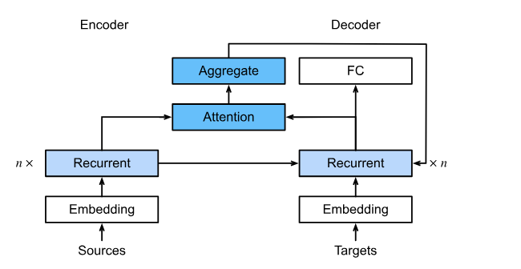{fig-align="center" width="75%"}


## Pasos del mecanismo de atención 
1. Queries (Q): vector que representa lo que busca el decoder en este paso.
2. Keys (K): representaciones de cada token de entrada.
3. Values (V): la información asociada a cada token de entrada.
4. Cálculo de scores: se mide la similitud entre la query y cada key, generando $a(q,k_i)$.
5. Normalización (softmax): los scores se convierten en pesos $\alpha(q,k_i)$ que suman 1.
6. Combinación ponderada: el contexto $c$ se obtiene como la suma de los values, cada uno multiplicado por su peso de atención.


# Multi-Head Attention

## Motivación 
- Una sola atención puede ser limitada: solo aprende un tipo de relación entre tokens.
- Queremos que el modelo pueda poner atención en paralelo a distintos aspectos de la secuencia:
    - Relaciones de largo alcance
    - Relaciones locales
    - Diferentes tipos de dependencias semánticas o sintácticas
    
    


## Idea clave
- En vez de calcular una única atención, calculamos varias en paralelo.
- Cada atención es una cabeza (head).
- Cada cabeza tiene sus propias matrices de proyección $W^Q, W^K, W^V$.
- El resultado final concatena todas las cabezas y se proyecta de vuelta al espacio original.


## Definición: 
- Si tenemos $h$ cabezas de atención 
- Cada cabeza de atención la calculamos como 

$$h_i = f(W_i^{(q)}q, W_i^{(k)}k, W_i^{(v)}v)$$

- La multi-head se compone: 

$$[h_1,....,h_h]W_o$$

- Donde vamos a aprender todas las matrices $W_i^Q, W_i^K, W_i^V$ y $W^O$ que mezcla las salidas de todas las cabezas


## ¿Por qué querriamos usar esto?
- Intuición: 
    - Cada cabeza aprende a mirar la secuencia de una manera diferente.
    - Ejemplo: una cabeza puede enfocarse en concordancia sujeto-verbo, otra en dependencias largas, otra en entidades.
    - Juntas, proveen una representación más rica y robusta.
- Ventajas:
    - Permite capturar múltiples relaciones en paralelo
    - Mejora la capacidad del modelo para aprender estructuras complejas del lenguaje.
    - Hace al modelo más expresivo sin incrementar demasiado la complejidad.
    
    

## ¿Cómo se ve esto? 

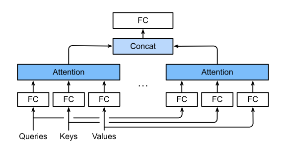{fig-align="center" width="75%"}


## Comparación Self-Attention vs Multi-Head Attention
\small

| Aspecto                | Self-Attention                                    | Multi-Head Attention                                        |
|------------------|----------------------|----------------------|
| **Definición**          | Cada token atiende a todos los demás en una sola matriz de atención | Ejecuta varias auto-atenciones en paralelo con diferentes proyecciones |
| **Perspectiva**         | Una sola “vista” de la secuencia                 | Varias “vistas” simultáneas que capturan distintos patrones |
| **Capacidad expresiva** | Limitada: puede pasar por alto ciertas relaciones| Más rica: cada cabeza puede enfocarse en dependencias diferentes |
| **Ejemplo**   | Una lupa única para leer la secuencia            | Muchas lupas que enfocan en diferentes detalles a la vez     |
| **Uso práctico**     | Base del mecanismo de atención                   | Núcleo de los Transformers modernos                         |

\normalsize


# Self-Attention y Positional Encoding

## Self-Attention en Transformers
- En los Transformers, cada token se representa como un embedding.
- Self-Attention: cada token pone atención a todos los demás tokens de la misma secuencia.
- Esto permite que cada representación incorpore contexto global desde el inicio.
- Diferencia clave con la atención encoder-decoder:
    - Encoder-decoder attention: conecta entre secuencias distintas (input → output).
    - Self-attention: conecta dentro de la misma secuencia (input → input).
    

## Limitación de Self-Attention
- La operación de self-attention es invariante al orden de los tokens.
- Ejemplo: “el gato come pescado” vs “pescado come el gato” → self-attention sin más no distingue el orden.
- Necesitamos introducir información sobre la posición de los tokens en la secuencia.


## ¿Cómo se ve esto?

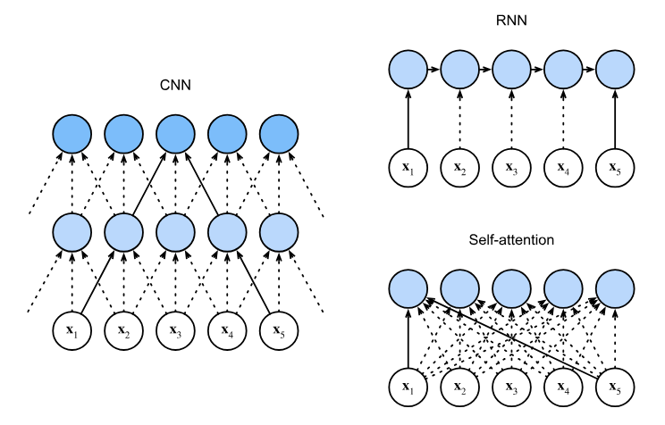{fig-align="center" width="75%"}


## Positional Encoding
- Solución: añadir codificación posicional a cada embedding antes de aplicar self-attention.
- Dos enfoques: 
    - Sinusoidal (fija): usa senos y cosenos con diferentes frecuencias.
    - Aprendida: posiciones como vectores entrenables
- Fórmulas sinusoidales:
    - $PE_{(pos,2i)} = \sin\left(\frac{pos}{10000^{2i/d}}\right)$
    - $PE_{(pos,2i+1)} = \cos\left(\frac{pos}{10000^{2i/d}}\right)$
- Permite que el modelo capture orden y distancia relativa entre tokens


## Intuición de Positional Encoding
- Cada posición se representa como un patrón de ondas senoidales.
- Propiedades:
    - Diferentes dimensiones codifican distintas escalas de posición.
    - Tokens cercanos tienen codificaciones similares.
    - Funciona para secuencias más largas que las vistas en entrenamiento.
- Intuición: similar a dar coordenadas a cada palabra en la secuencia.


## Comparación de codificaciones posicionales

\footnotesize

| Aspecto                  | Sinusoidal (fija)                                                                 | Aprendida                                                   |
|------------------|----------------------|----------------------|
| **Definición**            | Vectores generados con senos y cosenos de distintas frecuencias                   | Vectores de posición entrenables como embeddings            |
| **Generalización**        | Funciona para secuencias más largas que las vistas en entrenamiento               | Limitada a longitudes de secuencia vistas en entrenamiento  |
| **Interpretabilidad**     | Fácil de visualizar → posiciones cercanas tienen representaciones similares       | Más difícil de interpretar                                  |
| **Parámetros adicionales**| No añade parámetros → eficiente                                                   | Añade parámetros proporcionales a la longitud máxima de secuencia |
| **Uso práctico**          | Se usa en el Transformer original (Vaswani et al., 2017)                          | Ampliamente usada en modelos modernos (BERT, GPT, etc.)     |

\normalsize


# Transformers


## Idea general
- Propuesto en “Attention is All You Need” (Vaswani et al., 2017).
- Reemplaza la recurrencia y convoluciones con solo mecanismos de atención.
- Compuesto por:
    - Un encoder (procesa la secuencia de entrada).
    - Un decoder (genera la secuencia de salida).
- Totalmente paralelizable, eficiente y capaz de modelar dependencias largas.


## Bloques del Transformer
- Encoder: 
    - Embeddings + codificación posicional.
    - Varias capas de:
        1. Multi-head self-attention.
        2. Red neuronal feed-forward posición a posición.
        3. Normalización y conexiones residuales.
- Decoder: 
    - Similar al encoder, pero incluye:
        - Masked self-attention (para no mirar tokens futuros).
        - Atención encoder-decoder (usa salidas del encoder).
        
        
## Encoder: detalles
- Cada capa del encoder contiene:
1. Multi-head self-attention: cada token atiende a todos los demás tokens de entrada.
2. Feed-forward network: dos capas lineales con activación intermedia (ReLU o GELU).
3. Residual + LayerNorm: ayuda al entrenamiento estable.
- Replicado $N$ veces (por ejemplo, $N=6$ en el Transformer original).


## Decoder: detalles
- Cada capa del decoder contiene:
1. Masked multi-head self-attention: cada posición solo atiende a posiciones previas (autoregresivo).
2. Multi-head encoder-decoder attention: conecta las representaciones del encoder con el decoder.
3. Feed-forward network.
4. Residual + LayerNorm.
- También replicado $N$ veces


## Normalización y Residuales
- Residual connections: $x + \text{Sublayer}(x)$.
- Layer Normalization: aplicada después de cada subcapa.
- Beneficios:
    - Evita que los gradientes desaparezcan/exploten.
    - Facilita entrenar arquitecturas muy profundas.
    
    
## Embeddings y salida
- Tokens → vectores mediante word embeddings.
- Se suman con la codificación posicional antes de entrar al encoder/decoder.
- Al final, el decoder usa una capa lineal + softmax para predecir el próximo token.


## Transformer 

{fig-align="center" width="75%"}


## Flujo completo
1. Input embeddings + positional encoding → encoder.
2. Encoder produce representaciones contextuales.
3. Decoder recibe embeddings + positional encoding y va generando la secuencia:
    - Self-attention mira solo el pasado.
    - Cross-attention consulta al encoder.
4. Capa final: predicción del siguiente token.


# Transformers para NLP

## Pipeline general 
- Texto → tokenización → IDs → embeddings (token + posición [+ segmento]) → Transformer → cabeza de tarea → pérdida/decodificación.
- Un estructura básica simple sirve para muchas tareas cambiando solo la cabeza o el esquema de decodificación.
- Dos fases típicas: preentrenamiento (auto-supervisado en corpora grandes) → fine-tuning (tarea específica).


## Tokenización
- Por qué no caracteres ni palabras completas:
    - Palabras → vocab enorme y OOV(out-of-vocabulary); caracteres → secuencias largas y menos semántica.
- Subpalabras (BPE/WordPiece/Unigram): compromisos robustos OOV ↔ longitud de secuencia.
- Detalles prácticos:
    - Tokens especiales: `[CLS]`, `[SEP]`, `[PAD]`, `<s>`, `</s>`, etc.
    - Padding/Truncation a `max_len` y máscara de atención para ignorar padding.
    - Casing, normalización, y manejo de signos.
    
    
    
## Tokenización

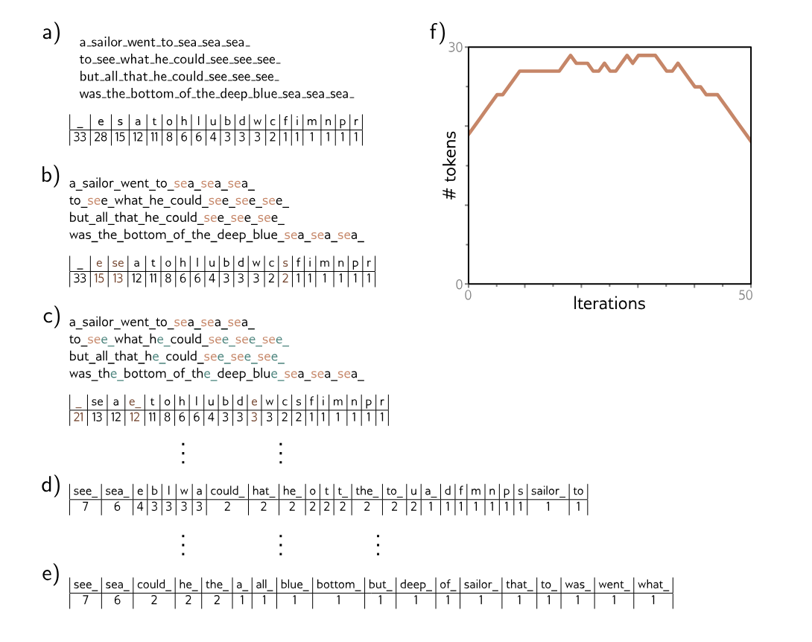{fig-align="center" width="75%"}


## Tokenización
- ¿Qué hay en la imagen?
- Vemos la frecuencia de los tokens en el párrafo
- En cada iteración busca por los tokens que aparecen mas juntos y los concatena, creando menos tokens 
- Después de muchas iteraciones los tokens son una combinación de letras, pedazos de palabras y algunas palabras muy usadas. 
- Si seguimos haciendo esto terminamos con palabras completas


## ¿Qué es OOV?
- Out-Of-Vocabulary
- En NLP tradicional, los modelos trabajan con un vocabulario fijo de palabras o subpalabras.
- Cuando aparece una palabra en el texto que no estaba en ese vocabulario durante el entrenamiento, se considera OOV.
- Problemas: 
    - Los modelos no saben cómo representar esa palabra.
    - Antes se usaban tokens especiales como `<unk>` (unknown) → pero esto pierde información.
- Solución: algo como subword tokenization 


## Embeddings que entran al modelo
- Token embeddings + positional encoding (fijo sinusoidal o aprendido).
- Segment/Type embeddings (BERT) para pares de secuencias (ej. premisa/hipótesis).
- Input final = suma (o concat) de estos componentes → pasa a la primera capa del Transformer.


## Máscaras de atención: ¿qué estamos enmascarando?

Recordemos que self-attention calcula primero un score entre cada par de tokens, $S = QK^T/\sqrt{d_k}$. Cada elemento $S_{ij}$ responde: *¿cuánta atención debería poner el token $i$ sobre el token $j$?*

Antes de aplicar softmax podemos agregar una máscara $M$, $A = \text{softmax}(S + M)$, donde:

$$
M_{ij} =
\begin{cases}
0 & \text{si } i \text{ puede atender a } j \\
-\infty & \text{si } i \text{ NO puede atender a } j
\end{cases}
$$

Después del softmax, $M_{ij}=-\infty \Rightarrow A_{ij}=0$.

**La máscara no cambia los parámetros del modelo: controla qué información puede circular entre tokens.**


# Tipos de máscaras de atención

## Padding mask

Las secuencias de un batch pueden tener diferentes longitudes y agregamos tokens `[PAD]` para igualarlas.

Ejemplo:

`el gato duerme [PAD] [PAD]`

No queremos que los demás tokens presten atención a `[PAD]`.

$$
\text{attention hacia [PAD]} = 0
$$

## Causal mask

En un modelo autoregresivo queremos predecir $P(x_t|x_1,\ldots,x_{t-1})$. Por lo tanto, durante entrenamiento el token en posición $t$ **no puede mirar tokens futuros**. Para una secuencia de cuatro tokens:

$$
\begin{array}{c|cccc}
 & x_1 & x_2 & x_3 & x_4\\
\hline
x_1 & \checkmark & \times & \times & \times\\
x_2 & \checkmark & \checkmark & \times & \times\\
x_3 & \checkmark & \checkmark & \checkmark & \times\\
x_4 & \checkmark & \checkmark & \checkmark & \checkmark
\end{array}
$$

Esto evita que durante entrenamiento el modelo "haga trampa" viendo la respuesta futura.


## Objetivos de preentrenamiento (pretraining)
- Encoder-only (BERT):
    - MLM (Masked Language Modeling): enmascara ~15% de tokens y predice.
    - NSP/SOP: tareas de relación entre oraciones (históricamente usadas; hoy menos críticas).
- Decoder-only (GPT):
    - Causal LM: predecir el siguiente token (entrenamiento autoregresivo).
- Encoder–Decoder (T5/BART):
    - Denoising Seq2Seq: corromper entrada (masking, permutar, eliminar spans) y reconstruir.
- Nota: todos crean representaciones ricas reutilizables para muchas tareas.


## BERT

{fig-align="center" width="75%"}

## GPT

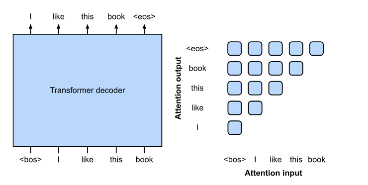{fig-align="center" width="75%"}


## T5 

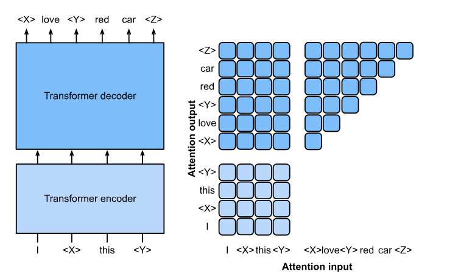{fig-align="center" width="75%"}


    
       
## Patrones de arquitectura según tarea
- Encoder-only (BERT, RoBERTa, etc.)
    - Clasificación (sentiment, topic): usar `[CLS]` → capa lineal.
    - Etiquetado de secuencia (NER, PoS): proyección por token.
    - QA extractivo (SQuAD): cabezas de start/end sobre la secuencia.
- Decoder-only (GPT, etc.)
    - Generación libre/condicionada: diálogo, story, code → causal LM + muestreo.
- Encoder–Decoder (T5, BART)
    - Seq2Seq: traducción, summarization, paraphrase, style transfer.
    
      
## Fine-tuning: cabezas y adaptaciones
- Heads: clasificación (softmax), regresión (MSE), marcaje por token, span prediction, LM.
- Estrategias: congelar parte de la arquitectura básica, layer-wise learning rates, early stopping.
- Parámetros eficientes (mención breve): adapters, LoRA, prompt tuning (útil cuando hay pocos datos).


## BERT + sentiment analysis

{fig-align="center" width="75%"}


## GPT context learning

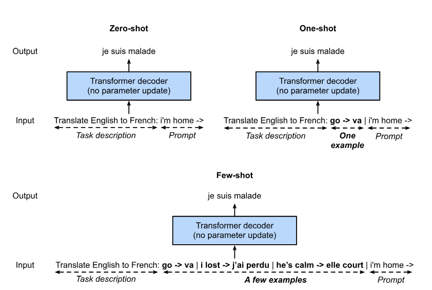{fig-align="center" width="75%"}   


## T5: generación de imágenes 

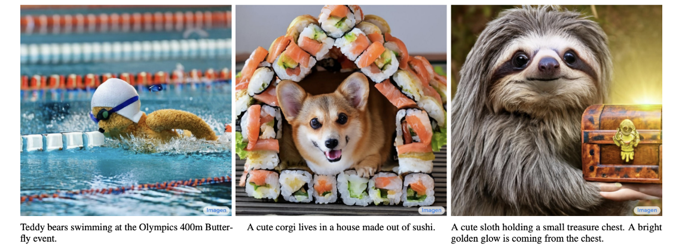{fig-align="center" width="75%"}   

    

## Métricas típicas en NLP
- Clasificación/NER: Accuracy, Precision/Recall/F1 (micro/macro), span-F1.
- QA extractivo: Exact Match (EM), F1 de tokens.
- Traducción/Resumen: BLEU, ROUGE (n-gramas; limita semántica perfecta).
- LM: Perplexity (perplejidad) como proxy de calidad del modelo.


# Large Language Models (LLMs)


## ¿Qué son? 
- Extensión de los Transformers a escalas masivas
- Modelo de lenguaje entrenado para predecir el siguiente token en un texto
- Entrenados en enormes cantidades de texto (cientos de miles de millones de tokens)
- Ejemplos: GPT-3, GPT-4, PaLM, LLaMA, etc.


## GPT-3 (Brown et al., 2020)
- 175B parámetros
- 96 capas Transformer
- 96 cabezas de atención
- 300B tokens de entrenamiento
- Secuencias de hasta 2048 tokens
- Entrenado con cómputo distribuido masivo
- **Ojo (2026):** estos números ya son históricos — los modelos actuales manejan contextos de cientos de miles o millones de tokens y corpora de decenas de billones; la escala de GPT-3 hoy es la de un modelo "pequeño"


## Tamaño de los LLMs (la era 2018-2022)

{fig-align="center" width="75%"}

- Esta gráfica cuenta la historia *hasta* Chinchilla: crecer parámetros era la receta


## ¿Dónde se gasta el cómputo? (2026)

El desempeño de un LLM depende del cómputo utilizado en distintas etapas:

1. **Preentrenamiento:** aprender los parámetros usando grandes cantidades de datos y cómputo.
2. **Post-entrenamiento:** SFT, preferencias y RL para modificar el comportamiento del modelo.
3. **Inferencia o test-time compute:** gastar más cómputo después del entrenamiento para resolver una pregunta particular.


## ¿Dónde se gasta el cómputo? (2026)

Durante inferencia podemos aumentar el cómputo mediante más pasos/tokens de razonamiento, múltiples soluciones candidatas, verificación o búsqueda, y uso iterativo de herramientas.

Más test-time compute $\Rightarrow$ potencialmente mejor respuesta, pero también $\Rightarrow$ más latencia y costo.

Por eso un mismo modelo puede operar con distintos **reasoning budgets**:
rápido y barato para tareas sencillas, o con más cómputo para tareas difíciles.


## Mixture-of-Experts (MoE): la arquitectura dominante

- En 2026 casi todos los modelos de frontera son **MoE**: la capa MLP del bloque se reemplaza por muchos "expertos" y un router
- Por cada token se activan solo los top-$k$ expertos (por ejemplo 2 de 64)
- Consecuencia clave: el número total de parámetros se desacopla del costo por token
    - un modelo de cientos de miles de millones de parámetros puede costar como uno de decenas
- Por eso las comparaciones de proveedores por "tamaño del modelo" ya no significan lo que significaban: pregunten por parámetros activos y costo por token, no por parámetros totales


## Más allá del texto: modelos multimodales

- **ViT** (Vision Transformer): la imagen se corta en parches y se trata como una secuencia de tokens — el mismo Transformer de este deck, aplicado a visión
- **CLIP**: alinea imágenes y texto en un espacio común entrenando con pares (imagen, descripción) — la base de "buscar imágenes con palabras"
- Los modelos de frontera de 2026 son nativamente multimodales: un solo modelo lee texto, imágenes y documentos


## Few-shot, Zero-shot y Prompting
- Prompting
    - Interactuamos con LLMs mediante prompts (instrucciones en texto)
    - Zero-shot: sin ejemplos, solo la instrucción
    - Few-shot: damos algunos ejemplos de entrada-salida
    - Chain-of-thought prompting: pedimos razonamiento intermedio


# De LLM base a asistente


## El problema del modelo base
- Un LLM base solo hace una cosa: predecir el siguiente token
- Completar texto $\neq$ ser útil: puede continuar tu pregunta con más preguntas
- Tampoco tiene noción de "no sé" o "eso no lo debería contestar"
- Los asistentes que usamos (ChatGPT, Claude, Gemini) son LLMs base + etapas adicionales de entrenamiento


## Instruction tuning (SFT)
- *Supervised fine-tuning*: seguir entrenando el modelo base con pares (instrucción, respuesta deseada) escritos/curados por humanos
- Mismo objetivo de siempre (predecir el siguiente token), datos distintos
- El modelo aprende el formato de ser asistente: responder, no continuar
- Pocos datos comparado con el preentrenamiento (miles vs. billones de tokens)


## RLHF: aprendizaje por refuerzo con retroalimentación humana
- Problema: es fácil juzgar cuál de dos respuestas es mejor; es difícil escribir la respuesta perfecta
- Receta (InstructGPT, Ouyang et al. 2022):
    1. Humanos comparan pares de respuestas del modelo
    2. Con esas comparaciones se entrena un modelo de recompensa que predice la preferencia humana
    3. El LLM se optimiza (RL) para maximizar esa recompensa
- Variante más simple y muy usada hoy: **DPO** (Direct Preference Optimization) (Rafailov et al. 2023) — optimiza directamente sobre las comparaciones, sin modelo de recompensa
- Ojo acá: esto es *alineación como técnica*; los problemas normativos (¿preferencias de quién?) siguen abiertos

## RLVR: RL con recompensas verificables

- El paso siguiente a RLHF/DPO: en dominios donde el éxito se puede verificar mecánicamente, no necesitas modelo de recompensa ni preferencias humanas
    - matemáticas: ¿la respuesta final es correcta?
    - código: ¿pasan los tests?
- Se entrena con RL directamente contra esa señal verificable (la receta de DeepSeek-R1, 2025)
- El modelo aprende solo a pensar más — cadenas largas de razonamiento — porque pensar más gana más recompensa
- Por eso el progreso 2024-2026 fue más rápido en matemáticas y código que en juicio abierto: avanza más rápido donde hay verificador. 


## Modelos de razonamiento (2024–)
- Idea: gastar más cómputo en inferencia — el modelo genera cadenas largas de razonamiento antes de responder
- Entrenados con RL sobre problemas verificables (matemáticas, código)
- Mejoras grandes en tareas de razonamiento; costo y latencia mayores
- Moraleja del escalamiento: ya no solo "más parámetros y más datos", también "más pensamiento por pregunta"


# ¿Prompt, RAG o fine-tuning?


## Fine-tuning eficiente: LoRA
- Fine-tuning completo de un modelo de miles de millones de parámetros: caro y delicado
- **LoRA** (Hu et al. 2021): congela los pesos $W$ y aprende una corrección de rango bajo $\Delta W = AB$ con $A, B$ diminutas
- Entrena <1% de los parámetros; rendimiento cercano al fine-tuning completo
- Combinado con cuantización (QLoRA): fine-tuning de modelos grandes en una sola GPU


## RAG: generación aumentada con recuperación
- Problema: el conocimiento del LLM está congelado en sus pesos (fecha de corte, sin documentos internos, alucina)
- **RAG** (Lewis et al. 2020): antes de generar, se buscan los documentos relevantes (embeddings + búsqueda semántica) y se pegan al prompt
- El modelo responde citando el corpus: verificable y actualizable sin reentrenar
- Para gobierno es el patrón dominante: leyes, expedientes, normas — corpus que cambian y donde la trazabilidad de la fuente es obligatoria


## Agentes y uso de herramientas
- Un LLM que además puede actuar: llamar funciones, buscar, ejecutar código, leer archivos — en un ciclo de razonar → actuar → observar (ReAct, Yao et al. 2022)
- Ojo: ReAct es el patrón de prompting original (2022) — la línea base conceptual; los agentes de frontera de 2026 además entrenan la política de uso de herramientas con RL sobre tareas completas
- El modelo decide qué herramienta usar y cuándo; el sistema alrededor decide qué le está permitido
- Cambia la habilidad que importa: de escribir el código a especificar y verificar el trabajo del agente


## ¿Qué opción elegir?
\small

| Necesitas... | Opción |
|--------------------|----------------------|
| Cambiar el formato o el tono, tarea estándar | Prompting (zero/few-shot) |
| Responder sobre documentos propios/cambiantes, con fuentes | RAG |
| Comportamiento especializado consistente, mucho volumen, datos etiquetados | Fine-tuning (LoRA) |
| Tareas de varios pasos con acciones | Agente + herramientas |

\normalsize

- En la práctica se combinan; empezar siempre por lo más barato (prompting) y escalar solo si la evaluación lo justifica


# Evaluación de LLMs


## ¿Cómo evaluamos texto generado?

- **BLEU**: mide cuánto se parecen los n-grams de la respuesta generada a los de una respuesta de referencia.
    - Se usó mucho en traducción automática.
    - Más coincidencias de palabras o frases cortas $\Rightarrow$ mayor BLEU.

- **ROUGE**: también compara n-grams con una referencia, pero enfatiza cuánto contenido de la referencia fue recuperado.
    - Se usa mucho en resumen automático.

- **Perplejidad**: mide qué tan bien un modelo de lenguaje predice los tokens observados.
    - Menor perplejidad $\Rightarrow$ el modelo asigna mayor probabilidad al texto observado.


## ¿Por qué no bastan estas métricas para evaluar LLMs?

**BLEU y ROUGE** comparan la respuesta contra una o varias respuestas de referencia. Problema: en generación abierta puede haber muchas respuestas correctas escritas de formas muy distintas. Por ejemplo, *"París es la capital de Francia"* y *"La capital francesa es París"* dicen prácticamente lo mismo, pero tienen pocas coincidencias exactas de n-grams.


**Perplejidad** mide qué tan bien el modelo predice texto, pero no mide directamente si la respuesta es verdadera, si sigue correctamente una instrucción, si resuelve el problema, o si es segura o útil. Un modelo puede asignar alta probabilidad a texto muy fluido y aun así producir información falsa.

$$
\boxed{
\text{fluidez}
\neq
\text{veracidad}
\neq
\text{utilidad}
}
$$

## Benchmarks y sus trampas
- Baterías estándar (conocimiento, razonamiento, código) permiten comparar modelos...
- ...pero: contaminación (el test estaba en los datos de entrenamiento), saturación, y teaching to the test
- Regla práctica: un benchmark público mide lo que el benchmark mide, no tu caso de uso
- Respuesta del campo (2026): benchmarks que solo puntúan problemas fechados después del corte de entrenamiento del modelo, y evals privados donde solo se publica el agregado
- Para decisiones de despliegue: construir un conjunto de evaluación propio, con datos reales del problema y que el proveedor nunca haya visto


## LLM-as-judge y evaluación humana
- Evaluación humana: el estándar de oro, cara y lenta
- LLM-as-judge: usar otro LLM para calificar respuestas contra una rúbrica
    - Escalable y barato; útil como primer filtro
    - Sesgos conocidos: prefiere respuestas largas, prefiere su propio estilo, sensible al orden
- Buena práctica: validar al juez contra una muestra calificada por humanos antes de confiar en él


## Alucinaciones, calibración y red-teaming
- **Alucinación**: afirmación fluida y falsa; se mide con conjuntos de verificación factual y tasa de citas correctas (crítico en RAG)
- **Calibración**: ¿la confianza expresada corresponde a la tasa de acierto? (el ECE que calcularon en la tarea de regularización, ahora sobre texto)
- **Red-teaming**: buscar activamente cómo hacer fallar al modelo (jailbreaks, sesgos, fugas de datos) *antes* que los usuarios lo hagan


## Evaluación para despliegue público
- Si una agencia va a desplegar un LLM, el mínimo exigible:
    1. Conjunto de evaluación propio y fuera del alcance del proveedor
    2. Métricas por subgrupo (¿funciona igual para todos los ciudadanos?)
    3. Tasa de alucinación / citas verificables si informa decisiones
    4. Monitoreo continuo post-despliegue (los modelos y los datos cambian)
    5. Ruta de escalamiento a un humano y responsabilidad clara
- "Salió bien en el benchmark" no es una evaluación de despliegue


# Transformers y políticas públicas


## Texto legislativo y legal
- Clasificación multi-etiqueta de legislación de la UE con BERT y variantes (Chalkidis et al. 2019)
- Predicción de votos nominales desde el texto de las iniciativas (Korn & Newman 2020)
- Revisión de documentos legales a escala (Wei et al. 2019)
- Todo lo que vimos hoy (tokenización → embeddings → atención → fine-tuning) es exactamente el pipeline de estos papers


## LLMs como herramienta de investigación social
- Gilardi, Alizadeh & Kubli (2023, *PNAS*): ChatGPT supera a anotadores de crowdsourcing en tareas de clasificación de texto político — cambia la economía de etiquetar datos
- Ziems et al. (2024, *Computational Linguistics*): ¿pueden los LLMs transformar la ciencia social computacional? — panorama de usos y límites
- Dell (2025, *Journal of Economic Literature*): *Deep Learning for Economists* — guía de estas herramientas para investigación económica aplicada
- Patrón común: el LLM como instrumento de medición — y entonces su sesgo es sesgo de medición: hay que validarlo como cualquier instrumento


